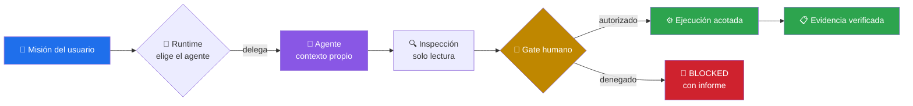
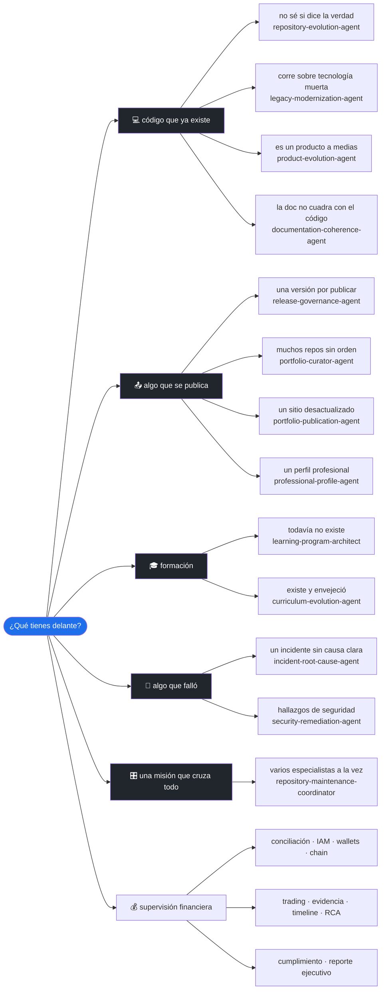
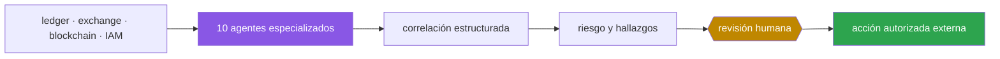
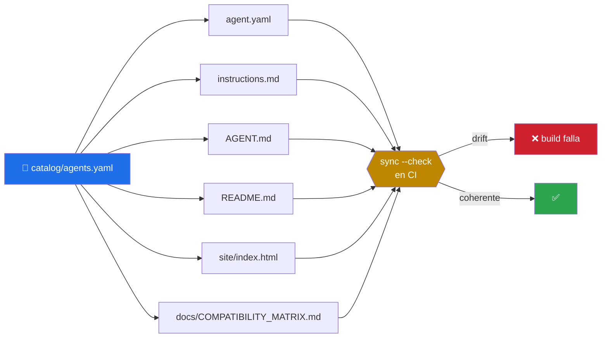

<div align="center">

# 🤖 operational-ai-agents

### ⚡ Agentes operativos con contrato, gates humanos y evidencia verificable para [Claude Code](https://claude.com/claude-code) y runtimes compatibles

Trabajadores digitales que reciben una **misión completa** — ingeniería, producto, formación, publicación, seguridad y control financiero sin autoridad autónoma sobre activos.
**Cero dependencias de runtime** — la CLI usa solo Python stdlib.

[](LICENSE)
[](CHANGELOG.md)
[](pyproject.toml)
[](#-catálogo)
[](docs/COMPATIBILITY_MATRIX.md)
[](#-instalación)
[](https://github.com/vladimiracunadev-create/operational-ai-agents/actions/workflows/ci.yml)
[](https://github.com/vladimiracunadev-create/operational-ai-agents/actions/workflows/codeql.yml)
[](tests/)
[](docs/EVALUATION.md)
[](docs/MATURITY_MODEL.md)
[](SECURITY.md)
[](CONTRIBUTING.md)
[](https://github.com/vladimiracunadev-create)

[**🌐 Sitio del proyecto**](https://vladimiracunadev-create.github.io/operational-ai-agents/) · [**📦 Instalación**](#-instalación) · [**📚 Catálogo**](#-catálogo) · [**🚀 Uso**](#-uso) · [**🧭 Diseño**](#-diseño) · [**🔒 Seguridad**](#-seguridad) · [**📖 Documentación**](#-documentación) · [**🤝 Contribuir**](CONTRIBUTING.md)

</div>

---

## 💡 ¿Qué es un "agente"?

Un **agente** es un contrato declarado del que se derivan un paquete instalable y un comportamiento acotado:

```text
agents/<id>/
├── agent.yaml                 # Manifiesto · vista del contrato canónico     (generado)
├── instructions.md            # Sistema de trabajo vendor-neutral            (generado)
├── AGENT.md                   # Definición instalable en Claude Code         (generado)
├── README.md                  # Ficha humana del contrato                    (generado)
├── policies/policy.yaml       # Límites, gates y política de datos
├── schemas/                   # Contrato de entrada y de salida
└── evals/cases.jsonl          # Casos de evaluación determinista
```

El runtime lee `delegate_when` para decidir **cuándo** delegarle una misión. A partir de ahí el agente abre su **propio contexto**, recorre sus fases, se detiene en los gates humanos y responde por el resultado completo.



> [!IMPORTANT]
> **Skill ≠ agente.** Un **skill** es *conocimiento empaquetado* que el modelo carga **en su propio contexto** y ejecuta él mismo — una receta con su caja de herramientas. Un **agente** es *una instancia que corre por separado*, con contexto y permisos propios, a la que se **delega** una misión completa — un ayudante al que le encargas el plato entero. Un agente puede *usar* skills. **Este repo colecciona agentes, no skills** — los skills viven en [`claude-skills-toolkit`](https://github.com/vladimiracunadev-create/claude-skills-toolkit). Ver [Qué es y qué no es este repo](#-qué-es-y-qué-no-es-este-repo).

### Lo que un agente declara y un skill no

| | Skill | Agente operativo |
|---|---|---|
| **Contexto** | el de la sesión actual | separado y propio |
| **Alcance** | una capacidad concreta | una misión completa |
| **Decide** | quien lo invoca | el agente, dentro de límites declarados |
| **Permisos** | heredados | allowlist por contrato + `permissionMode` + aislamiento |
| **Se detiene** | no aplica | en gates humanos explícitos |
| **Responde por** | devolver un resultado | evidencia, verificaciones y riesgo residual |

---

## 📚 Catálogo

**23 agentes operacionales**, agrupados por el tipo de trabajo del que responden. La fuente canónica es **[`catalog/agents.yaml`](catalog/agents.yaml)**: los manifiestos, las instrucciones, las definiciones de Claude Code, las fichas y la landing page se generan desde ahí, y CI rechaza cualquier divergencia.

### ¿Cuál necesito?

Empieza por lo que tienes delante, no por lo que el agente sabe hacer. Cada ficha abre con **tres casos trabajados**: el contexto concreto, el mensaje literal que le escribes, lo que hace paso a paso y la forma exacta de lo que te devuelve.



> [!TIP]
> Si dudas entre dos, elige el que describa tu **situación**, no el que suene más potente. Un agente que no encaja te devuelve `NO_CHANGE` con el motivo, que también es información.

### Repositorios y sistemas

Trabajan sobre código que ya existe y no puede dejar de funcionar.

<table>
<thead>
<tr>
<th width="24%">Agente</th>
<th width="36%">Qué resuelve</th>
<th width="22%">Cuándo lo necesitas</th>
<th width="18%">Se detiene ante</th>
</tr>
</thead>
<tbody>
<tr>
<td>

### 🧭 [repository-evolution-agent](agents/repository-evolution-agent/README.md)

<sub>9 fases · default · worktree</sub>


</td>
<td>

Analiza un repositorio real, separa hechos de promesas y conduce su evolución incremental con pruebas y evidencia.

**Misión —** Convertir una intención amplia de mejora en cambios acotados, verificables y coherentes con el estado real del repositorio.

</td>
<td>

🎯 El README promete más de lo que el código hace<br>🎯 Quieres mejorarlo y no sabes por dónde empezar<br>🎯 Vas a enseñarlo mañana y no quieres sorpresas<br><br>💬 «Examina este repositorio y dime qué afirma el README que el código no sostiene.»<br><br>[Los 3 casos trabajados →](agents/repository-evolution-agent/README.md#ejemplos-de-uso)

</td>
<td>

🚦 `scope_expansion`<br>🚦 `destructive_change`<br>🚦 `external_publish`<br>🚦 `credential_or_paid_service`

</td>
</tr>
<tr>
<td>

### 🏗️ [legacy-modernization-agent](agents/legacy-modernization-agent/README.md)

<sub>9 fases · default · worktree</sub>


</td>
<td>

Diseña y ejecuta modernizaciones incrementales de sistemas legacy preservando continuidad, contratos y rollback.

**Misión —** Reducir riesgo y deuda técnica mediante una migración gradual respaldada por pruebas de caracterización, observabilidad y reversión.

</td>
<td>

🎯 Una versión del lenguaje que ya nadie soporta<br>🎯 Cambiar el motor de datos sin romper a quien lo consume<br>🎯 Nadie se atreve a tocar ese módulo<br><br>💬 «Diseña la migración de PHP 5.4 a PHP 8.3 sin interrumpir el servicio.»<br><br>[Los 3 casos trabajados →](agents/legacy-modernization-agent/README.md#ejemplos-de-uso)

</td>
<td>

🚦 `data_migration`<br>🚦 `contract_break`<br>🚦 `production_cutover`<br>🚦 `dependency_removal`

</td>
</tr>
<tr>
<td>

### 🎛️ [repository-maintenance-coordinator](agents/repository-maintenance-coordinator/README.md)

<sub>9 fases · plan · solo lectura</sub>


</td>
<td>

Coordina especialistas para una misión de mantenimiento amplia, conserva decisiones humanas y consolida una entrega verificable.

**Misión —** Descomponer una misión transversal, delegar solo lo necesario, resolver dependencias y entregar una visión unificada sin diluir responsabilidades.

</td>
<td>

🎯 Una tarea que no cabe en un solo especialista<br>🎯 Dos análisis que se contradicen<br>🎯 Una modernización demasiado grande<br><br>💬 «Coordina una revisión integral del repositorio y prepara el próximo release.»<br><br>[Los 3 casos trabajados →](agents/repository-maintenance-coordinator/README.md#ejemplos-de-uso)

</td>
<td>

🚦 `specialist_scope_expansion`<br>🚦 `mutation_start`<br>🚦 `external_publish`<br>🚦 `release_or_deploy`

</td>
</tr>
</tbody>
</table>

### Producto y formación

Llevan algo parcial hacia su siguiente incremento verificable.

<table>
<thead>
<tr>
<th width="24%">Agente</th>
<th width="36%">Qué resuelve</th>
<th width="22%">Cuándo lo necesitas</th>
<th width="18%">Se detiene ante</th>
</tr>
</thead>
<tbody>
<tr>
<td>

### 🚀 [product-evolution-agent](agents/product-evolution-agent/README.md)

<sub>9 fases · default · worktree</sub>


</td>
<td>

Evalúa productos parciales, alinea producto y arquitectura y convierte brechas en entregas evolutivas verificables.

**Misión —** Llevar un producto desde su estado comprobable hacia el siguiente incremento de valor, manteniendo honestidad entre roadmap, documentación y código.

</td>
<td>

🎯 Diez frentes abiertos y ninguna prioridad<br>🎯 El roadmap dice una cosa y el código otra<br>🎯 Añadir algo sin romper a quien ya lo usa<br><br>💬 «Examina este producto parcial y construye el siguiente incremento útil.»<br><br>[Los 3 casos trabajados →](agents/product-evolution-agent/README.md#ejemplos-de-uso)

</td>
<td>

🚦 `scope_expansion`<br>🚦 `breaking_change`<br>🚦 `external_integration`<br>🚦 `release`

</td>
</tr>
<tr>
<td>

### 🎓 [learning-program-architect](agents/learning-program-architect/README.md)

<sub>9 fases · default · worktree</sub>


</td>
<td>

Diseña y mantiene programas educativos evolutivos con progresión, laboratorios, evaluaciones y trazabilidad curricular.

**Misión —** Transformar un dominio en una experiencia formativa completa, verificable y mantenible, evitando carpetas vacías y contenido ornamental.

</td>
<td>

🎯 Un dominio en la cabeza y ningún curso<br>🎯 Un curso que se lee bien pero no se practica<br>🎯 Saber qué falta antes de prometer fechas<br><br>💬 «Crea un programa de agentes de IA desde fundamentos hasta producción.»<br><br>[Los 3 casos trabajados →](agents/learning-program-architect/README.md#ejemplos-de-uso)

</td>
<td>

🚦 `scope_or_duration_change`<br>🚦 `licensed_dataset`<br>🚦 `paid_dependency`<br>🚦 `publication`

</td>
</tr>
<tr>
<td>

### 📡 [curriculum-evolution-agent](agents/curriculum-evolution-agent/README.md)

<sub>11 fases · default · worktree</sub>


</td>
<td>

Mantiene un programa formativo al día con su campo: investiga novedades, verifica fuentes, distingue brecha real de cambio de terminología y republica el material con sus artefactos regenerados.

**Misión —** Incorporar a un programa formativo existente solo las novedades que superen el umbral de relevancia curricular, con fuentes verificadas y artefactos regenerados y comprobados.

</td>
<td>

🎯 Un curso que envejeció mientras no mirabas<br>🎯 Incorporar lo nuevo sin reescribir el curso<br>🎯 Saber si está desactualizado, sin tocarlo<br><br>💬 «Revisa si hubo novedades en el campo de este curso e incorpora solo las que lo ameriten.»<br><br>[Los 3 casos trabajados →](agents/curriculum-evolution-agent/README.md#ejemplos-de-uso)

</td>
<td>

🚦 `scope_expansion`<br>🚦 `curriculum_restructure`<br>🚦 `version_or_release_change`<br>🚦 `external_publish`

</td>
</tr>
</tbody>
</table>

### Entrega y coherencia

Deciden qué se publica y hacen que lo publicado diga la verdad.

<table>
<thead>
<tr>
<th width="24%">Agente</th>
<th width="36%">Qué resuelve</th>
<th width="22%">Cuándo lo necesitas</th>
<th width="18%">Se detiene ante</th>
</tr>
</thead>
<tbody>
<tr>
<td>

### 🏷️ [release-governance-agent](agents/release-governance-agent/README.md)

<sub>9 fases · default · worktree</sub>


</td>
<td>

Prepara releases coherentes y auditables, valida versiones, pruebas, seguridad, artefactos y rollback antes de publicar.

**Misión —** Convertir un conjunto de cambios en una decisión de release explícita, reproducible y segura.

</td>
<td>

🎯 Publicar sin saber si está listo<br>🎯 Dejarlo todo listo y decidir tú cuándo sale<br>🎯 Un artefacto que compila pero llega vacío<br><br>💬 «Evalúa si el repositorio está listo para release y entrega un go/no-go.»<br><br>[Los 3 casos trabajados →](agents/release-governance-agent/README.md#ejemplos-de-uso)

</td>
<td>

🚦 `version_change`<br>🚦 `tag_or_release_publish`<br>🚦 `registry_upload`<br>🚦 `production_deploy`

</td>
</tr>
<tr>
<td>

### 📚 [documentation-coherence-agent](agents/documentation-coherence-agent/README.md)

<sub>9 fases · default · worktree</sub>


</td>
<td>

Reconcilia documentación, arquitectura, ejemplos y métricas con las fuentes de verdad del repositorio.

**Misión —** Hacer que la documentación sea una interfaz fiable del sistema, preservando el contexto histórico y explicitando incertidumbres.

</td>
<td>

🎯 Números que dejaron de ser ciertos<br>🎯 Corregir el presente sin reescribir el pasado<br>🎯 Un diagrama que ya no representa el sistema<br><br>💬 «Audita si la documentación coincide con el repositorio y corrige el drift.»<br><br>[Los 3 casos trabajados →](agents/documentation-coherence-agent/README.md#ejemplos-de-uso)

</td>
<td>

🚦 `historical_rewrite`<br>🚦 `public_claim_change`<br>🚦 `generated_docs_overwrite`

</td>
</tr>
</tbody>
</table>

### Portafolio y publicación

Clasifican un conjunto de repositorios y sincronizan lo que se afirma sobre ellos.

<table>
<thead>
<tr>
<th width="24%">Agente</th>
<th width="36%">Qué resuelve</th>
<th width="22%">Cuándo lo necesitas</th>
<th width="18%">Se detiene ante</th>
</tr>
</thead>
<tbody>
<tr>
<td>

### 🗂️ [portfolio-curator-agent](agents/portfolio-curator-agent/README.md)

<sub>8 fases · plan · solo lectura</sub>


</td>
<td>

Clasifica y audita un portafolio de repositorios, detecta solapamientos y produce una narrativa profesional respaldada por evidencia.

**Misión —** Mantener una visión coherente del portafolio distinguiendo aprendizaje, skills, agentes, casos de referencia y productos.

</td>
<td>

🎯 Veinte repositorios y ninguna historia<br>🎯 Dos repositorios que hacen lo mismo<br>🎯 Preparar la conversación con un reclutador<br><br>💬 «Clasifica mis repositorios en aprendizaje, skills, agentes, casos y productos.»<br><br>[Los 3 casos trabajados →](agents/portfolio-curator-agent/README.md#ejemplos-de-uso)

</td>
<td>

🚦 `profile_edit`<br>🚦 `repository_archive`<br>🚦 `external_publication`

</td>
</tr>
<tr>
<td>

### 🌐 [portfolio-publication-agent](agents/portfolio-publication-agent/README.md)

<sub>10 fases · default · worktree</sub>


</td>
<td>

Reconcilia una superficie publicada —sitio, API, documentos generados y perfiles— con el estado real de los repositorios que la alimentan, sin destruir contenido curado a mano.

**Misión —** Hacer que todas las superficies publicadas afirmen lo mismo que demuestran los repositorios de origen, integrando en vez de sobrescribir y publicando solo tras aprobación humana.

</td>
<td>

🎯 La web dice una versión y el release otra<br>🎯 Hace meses que no actualizas lo publicado<br>🎯 Sin destruir lo que escribiste a mano<br><br>💬 «Sincroniza el sitio publicado con el estado real de estos repositorios y muéstrame las brechas antes de aplicar.»<br><br>[Los 3 casos trabajados →](agents/portfolio-publication-agent/README.md#ejemplos-de-uso)

</td>
<td>

🚦 `scope_expansion`<br>🚦 `destructive_change`<br>🚦 `external_publish`<br>🚦 `profile_or_description_edit`

</td>
</tr>
<tr>
<td>

### 👤 [professional-profile-agent](agents/professional-profile-agent/README.md)

<sub>10 fases · default · worktree</sub>


</td>
<td>

Audita y mejora un perfil profesional público alojado en un servicio de terceros, contrastándolo con la evidencia real del portafolio y publicando solo los textos aprobados.

**Misión —** Hacer que un perfil público afirme exactamente lo que la evidencia sostiene, integrando sobre el texto existente y sin convertir el acceso a la cuenta en autorización para publicar.

</td>
<td>

🎯 El perfil no cuenta lo que ya construiste<br>🎯 Actualizarlo sin perder tu voz<br>🎯 Prepararlo antes de postular<br><br>💬 «Audita mi perfil profesional contra mi portafolio y muéstrame las brechas antes de tocar nada.»<br><br>[Los 3 casos trabajados →](agents/professional-profile-agent/README.md#ejemplos-de-uso)

</td>
<td>

🚦 `scope_expansion`<br>🚦 `destructive_change`<br>🚦 `external_publish`<br>🚦 `identity_or_contact_change`

</td>
</tr>
</tbody>
</table>

### Fiabilidad y seguridad

Reducen incertidumbre y riesgo real, sin confundir ausencia de señal con ausencia de problema.

<table>
<thead>
<tr>
<th width="24%">Agente</th>
<th width="36%">Qué resuelve</th>
<th width="22%">Cuándo lo necesitas</th>
<th width="18%">Se detiene ante</th>
</tr>
</thead>
<tbody>
<tr>
<td>

### 🩺 [incident-root-cause-agent](agents/incident-root-cause-agent/README.md)

<sub>9 fases · plan · solo lectura</sub>


</td>
<td>

Investiga incidentes técnicos con línea temporal, hipótesis falsables, evidencia y acciones correctivas sin culpar personas.

**Misión —** Reducir incertidumbre hasta identificar causas contribuyentes demostrables y prevenir recurrencias mediante acciones verificables.

</td>
<td>

🎯 Un error que aparece y desaparece<br>🎯 El CI falla solo a veces<br>🎯 Ya se arregló, pero nadie sabe por qué<br><br>💬 «Investiga por qué este servicio produce 504 de forma intermitente.»<br><br>[Los 3 casos trabajados →](agents/incident-root-cause-agent/README.md#ejemplos-de-uso)

</td>
<td>

🚦 `production_command`<br>🚦 `data_export`<br>🚦 `service_restart`<br>🚦 `configuration_change`

</td>
</tr>
<tr>
<td>

### 🛡️ [security-remediation-agent](agents/security-remediation-agent/README.md)

<sub>10 fases · default · worktree</sub>


</td>
<td>

Convierte hallazgos de seguridad en remediaciones priorizadas, compatibles y verificadas, con cobertura y riesgo residual explícitos.

**Misión —** Reducir riesgo real sin confundir ausencia de hallazgos con ausencia de vulnerabilidades ni aplicar actualizaciones ciegas.

</td>
<td>

🎯 Un scan con cincuenta alertas<br>🎯 ¿Este hallazgo es real o es ruido?<br>🎯 «Cero vulnerabilidades» que no significa nada<br><br>💬 «Remedia estos CVE y verifica que el sistema siga funcionando.»<br><br>[Los 3 casos trabajados →](agents/security-remediation-agent/README.md#ejemplos-de-uso)

</td>
<td>

🚦 `credential_rotation`<br>🚦 `breaking_dependency_upgrade`<br>🚦 `security_control_disable`<br>🚦 `production_change`

</td>
</tr>
</tbody>
</table>

### Control, auditoría y reconciliación financiera

Supervisan sistemas financieros con herramientas de solo lectura. No tienen shell, claves privadas, firma, permisos de retiro, permisos de trading ni capacidad de mutación productiva. Sus hallazgos usan mensajes estructurados y terminan en revisión humana. Ver la [arquitectura y los contratos de interoperabilidad](docs/FINANCIAL_CONTROL_AGENTS.md).



| Agente | Qué responde | Entrega |
|---|---|---|
| ⚖️ [reconciliation-agent](agents/reconciliation-agent/README.md) | ledger ↔ exchange ↔ blockchain | conciliación y excepciones |
| 🔐 [iam-audit-agent](agents/iam-audit-agent/README.md) | permisos, cuentas stale, escalada y SoD | hallazgos IAM |
| 👛 [wallet-risk-agent](agents/wallet-risk-agent/README.md) | dirección, importe, velocidad y conducta | riesgo de wallet |
| ⛓️ [blockchain-monitoring-agent](agents/blockchain-monitoring-agent/README.md) | estado y confirmaciones on-chain | verificación de transacciones |
| 📉 [trading-risk-agent](agents/trading-risk-agent/README.md) | exposición, PnL y límites | reporte de riesgo de trading |
| 🗃️ [evidence-agent](agents/evidence-agent/README.md) | integridad y procedencia | manifiesto de evidencia |
| 🕒 [timeline-agent](agents/timeline-agent/README.md) | orden temporal y precisión | línea temporal normalizada |
| 🔬 [financial-root-cause-agent](agents/financial-root-cause-agent/README.md) | mecanismo causal y factores | análisis de causa raíz |
| 📋 [compliance-evidence-agent](agents/compliance-evidence-agent/README.md) | cobertura control-evidencia | matriz de cumplimiento |
| 📊 [executive-reporting-agent](agents/executive-reporting-agent/README.md) | impacto, confianza y decisión | resumen ejecutivo trazable |

> [!NOTE]
> Los 23 agentes declaran `IMPLEMENTED`: contrato completo y validado, **no** adopción productiva. Ver [Madurez](#-madurez).

---

## 📦 Instalación

**Requisitos:** Python 3.11+ · Claude Code *(solo para ejecución real)* · sin clave API para validar, planificar, evaluar o explorar.

### ⚡ Instalación completa

```bash
git clone https://github.com/vladimiracunadev-create/operational-ai-agents.git
cd operational-ai-agents
python -m pip install -e .
operational-agents validate     # OK: 23 agentes válidos
```

### 🔌 Instalar los agentes en Claude Code

```bash
./scripts/install.sh            # Linux, macOS, Git Bash
```

```powershell
.\scripts\install.ps1           # Windows PowerShell
```

### 🔍 Qué hace el instalador

- Crea enlaces en `~/.claude/agents/`; en Windows copia si el enlace simbólico no está permitido.
- Es **idempotente**: ejecutarlo dos veces no duplica nada.
- **Nunca sobrescribe un agente que no administra.** Si ya tienes uno con el mismo nombre sin la marca `managed-by: operational-ai-agents`, falla y conserva tu archivo.
- Al desinstalar, elimina **solo** los nombres administrados.

<details>
<summary><b>🧩 Variante con skills precargados</b></summary>

Los agentes funcionan de forma autónoma. Si además tienes [`claude-skills-toolkit`](https://github.com/vladimiracunadev-create/claude-skills-toolkit), puedes generar definiciones que declaren esos skills:

```bash
operational-agents doctor --skills-dir ~/.claude/skills
operational-agents export claude --preload-skills --target ~/.claude/agents
```

`doctor` informa qué skills faltan antes de precargar. Ningún agente deja de funcionar si el toolkit no está instalado.

</details>

<details>
<summary><b>🐳 Docker</b></summary>

```bash
docker compose up --build       # panel local en http://127.0.0.1:8765
```

El contenedor corre sin privilegios, con sistema de archivos de solo lectura, y Compose publica el puerto únicamente en loopback del host.

</details>

Instalación por proyecto, actualización, desinstalación y problemas frecuentes en **[INSTALL.md](INSTALL.md)**.

---

## 🚀 Uso

### 1 · Explorar sin gastar un solo token

Todo el contrato es inspeccionable offline, sin clave API y sin costo:

```bash
operational-agents list
operational-agents inspect repository-evolution-agent
operational-agents plan repository-evolution-agent \
  --task "Examina este repositorio y propone una evolución verificable"
operational-agents eval --all
```

`plan` genera la secuencia completa de fases y gates **sin invocar ningún modelo**, y es determinista: la misma pareja agente/tarea produce siempre el mismo `execution_id`.

### 2 · Delegar dentro de Claude Code

```text
> Usa repository-evolution-agent para examinar este repositorio.

> @curriculum-evolution-agent revisa si el temario quedó desactualizado.
```

O abrir toda la sesión con el agente:

```bash
claude --agent repository-evolution-agent
```

### 3 · Ejecutar desde la CLI

```bash
operational-agents run repository-evolution-agent \
  --runtime claude \
  --cwd /ruta/al/repositorio \
  --task "Detecta brechas y prepara un plan; no publiques cambios"
```

> [!WARNING]
> La CLI **nunca** habilita bypass de permisos: invoca con lista de argumentos, sin `shell=True`, y no añade banderas que omitan confirmaciones. Publicar, desplegar, borrar y rotar credenciales siguen exigiendo aprobación humana.

### 4 · Ejecutar sin proveedor: el runtime `manual`

Cuando el entorno es producción, infraestructura crítica o datos regulados, la pregunta no es si una herramienta *puede* actuar sola, sino si *debe*. El runtime `manual` prepara el trabajo y lo ejecuta una persona:

```bash
operational-agents run incident-root-cause-agent \
  --runtime manual \
  --task "Investiga la caída del checkout de anoche" \
  --evidence evidence/executions/checkout.json
```

Devuelve el paquete portable completo y cierra en `NOT_EXECUTED` — la descripción honesta de lo que pasó. Sin clave API, sin red y sin tokens, recorriendo el mismo contrato, la misma resolución de capacidades y la misma evidencia que Claude Code.

### 5 · Saber qué encaja con qué

```bash
operational-agents runtimes                                     # qué hay instalado aquí
operational-agents capabilities                                 # matriz agente × runtime
operational-agents capabilities incident-root-cause-agent --runtime claude
```

```text
filesystem.read            SUPPORTED    El runtime la ofrece de forma nativa
shell.execute              SUPPORTED    El runtime la ofrece de forma nativa
filesystem.write           BLOCKED      El runtime la ofrece, pero el contrato del agente no la autoriza
```

Esa última línea es el modelo entero en una frase: **acceso no es autorización**. Ver [docs/CAPABILITY_MODEL.md](docs/CAPABILITY_MODEL.md).

### 6 · Panel local

```bash
operational-agents serve --host 127.0.0.1 --port 8765
```

### 🛠 Los dieciséis comandos

| Comando | Qué hace |
|---|---|
| `list` | lista los agentes del catálogo (`--json`) |
| `inspect <id>` | muestra el contrato completo de un agente |
| `validate` | valida la integridad del catálogo y de cada paquete |
| `sync [--check]` | regenera las vistas derivadas; `--check` falla ante drift |
| `plan <id> --task` | genera un plan determinista sin invocar un modelo |
| `packet <id> --task` | produce un paquete de prompt portable |
| `eval [<id>\|--all]` | ejecuta las evaluaciones deterministas |
| `export claude --target` | exporta las definiciones a `.claude/agents/` |
| `uninstall claude --target` | elimina solo los agentes administrados |
| `doctor [--skills-dir]` | diagnostica entorno, runtimes, integraciones y skills |
| `runtimes` | lista los runtimes registrados y su disponibilidad |
| `runtime inspect <id>` | capacidades declaradas y límites de un runtime |
| `capabilities [<id>]` | resuelve agente × runtime; sin agente, la matriz completa |
| `run <id> --runtime <rt>` | ejecuta mediante un runtime (`--dry-run`, `--evidence`) |
| `serve` | levanta el panel local en loopback |
| `scaffold <id> --name` | crea un borrador no catalogado |

Referencia completa con flags, endpoints y códigos de retorno en **[docs/CLI.md](docs/CLI.md)**.

---

## 🧭 Diseño

### 🎯 Principios

- **Vendor-neutral en el núcleo** — catálogo, políticas, schemas y evaluaciones no dependen de un proveedor.
- **Agente ≠ runtime** — el contrato describe una misión; quién la ejecuta es problema de un adaptador intercambiable.
- **Capacidad disponible ≠ autorización** — la allowlist es exhaustiva: lo que el contrato no autoriza queda `BLOCKED` aunque el runtime lo ofrezca.
- **Degradación declarada, nunca simulada** — si falta una capacidad requerida, se dice cuál y no se ejecuta.
- **Claude Code como primer adaptador** — exportación oficial a `.claude/agents/`, sin imponer modelo (`model: inherit`).
- **Skills opcionales** — los agentes funcionan solos y mejoran si el toolkit está instalado.
- **Read-only primero** — las fases iniciales inspeccionan; las mutaciones llegan tras alcance y plan.
- **Acceso ≠ autorización** — poder leer no es poder publicar.
- **Aprobación real** — otro agente no puede aprobar en tu lugar.
- **Evidencia sobre apariencia** — toda conclusión separa lo observado, lo inferido y lo pendiente.
- **Cero dependencias runtime** — solo la biblioteca estándar de Python.

### 🧬 Una sola fuente de verdad

`catalog/agents.yaml` manda. De él se generan cuatro vistas por agente, **la landing page y la matriz de compatibilidad**; editarlas a mano hace fallar la build:



Esto convierte «la documentación está actualizada» —una promesa— en una propiedad que el sistema garantiza.

### 📁 Estructura

```text
operational-ai-agents/
├── catalog/                 # fuente única de verdad
├── agents/                  # un paquete autocontenido por agente
├── src/operational_agents/  # CLI, validación, planner, exporter, renderers y servidor
│   ├── runtimes/            # adaptadores: claude, manual y registro extensible
│   └── capabilities.py      # capacidades, efectos y resolución vendor-neutral
├── shared/                  # contratos, guardrails, memoria y telemetría
├── integrations/            # Claude Code, skills, MCP, GitHub y modelos locales
├── control-center/          # API y panel local
├── deployments/             # local, Docker y ejecución programada
├── site/                    # landing page (generada)
├── evidence/                # ejecuciones, evaluaciones y casos sanitizados
└── tests/                   # pruebas deterministas sin API
```

Detalle en **[docs/ARCHITECTURE.md](docs/ARCHITECTURE.md)** y **[docs/AGENT_CONTRACT.md](docs/AGENT_CONTRACT.md)**.

---

## 🔒 Seguridad

Cada garantía está cubierta por una prueba que corre en cada push. No son promesas de documentación:

| Control | Garantía | Prueba |
|---|---|---|
| Ejecución de procesos | sin `shell=True` ni flags que omitan permisos | `test_cli_adds_no_permission_bypass` |
| Agentes que mutan | `permissionMode: default` + `isolation: worktree` | `test_mutating_agents_do_not_bypass_permissions` |
| Agentes de solo lectura | `Write` y `Edit` denegados explícitamente | `test_read_only_agents_deny_writes` |
| Gates humanos | todo agente declara al menos uno | `test_every_agent_has_human_gates` |
| Panel local | loopback; salir exige opt-in explícito | `test_server_refuses_non_loopback_bind_without_optin` |
| Evidencia | redacción de secretos antes de persistir | `test_redaction` |
| Instalación | nunca sobrescribe agentes ajenos | `test_export_preserves_unmanaged_agent` |
| Catálogo público | sin datos personales ni rutas locales | `test_agents_carry_no_personal_data` |
| Adaptadores de runtime | ninguno amplía permisos por su cuenta | `test_no_runtime_adds_permission_bypass` |
| Capacidad no autorizada | `BLOCKED` aunque el runtime la ofrezca | `test_offered_but_unauthorized_capability_is_blocked` |
| Capacidad ausente | se declara y no se ejecuta nada | `test_run_refuses_when_a_required_capability_is_missing` |
| Runtime desconocido | falla; nunca cae en otro proveedor | `test_unknown_runtime_fails_instead_of_falling_back` |

Modelo de amenazas, límites conocidos y política de reporte en **[docs/SECURITY_MODEL.md](docs/SECURITY_MODEL.md)** y **[SECURITY.md](SECURITY.md)**.

---

## 📈 Madurez

Ningún agente se presenta como productivo solo porque su Markdown sea válido:

| Estado | Requisito mínimo | Hoy |
|---|---|:-:|
| `DRAFT` | diseño incompleto; no instalable | — |
| `IMPLEMENTED` | contrato, instrucciones, schemas y evals disponibles | **23** |
| `OPERATIONAL_LOCAL` | usado en una tarea real con evidencia sanitizada | 0 |
| `INTEGRATED` | conectado a servicios reales y probado end-to-end | 0 |
| `PRODUCTION_OBSERVED` | uso recurrente con trazas, métricas y revisión humana | 0 |

> [!NOTE]
> Los 23 agentes declaran `IMPLEMENTED`. Eso demuestra **integridad del paquete**, no adopción productiva. Los criterios de promoción están en **[docs/MATURITY_MODEL.md](docs/MATURITY_MODEL.md)** y el formato de evidencia en **[docs/EVIDENCE_GUIDE.md](docs/EVIDENCE_GUIDE.md)**.

---

## ✅ Calidad

Cada push ejecuta la misma verificación en Linux, macOS y Windows sobre Python 3.11, 3.12 y 3.13:

```bash
make check
```

O paso a paso:

```bash
ruff check .
operational-agents sync --check     # sin drift respecto del catálogo
operational-agents validate         # integridad de los paquetes
operational-agents eval --all       # 69 evaluaciones deterministas
operational-agents capabilities     # resolución de capacidades por runtime
python -m unittest discover -s tests -v
```

CI además construye el wheel con instalación limpia, levanta la imagen Docker y comprueba el panel en vivo, analiza el código con CodeQL y despliega la landing page.

---

## 🆕 Crear un agente nuevo

```bash
operational-agents scaffold mi-agente --name "Mi Agente"
```

Luego registra la entrada canónica en `catalog/agents.yaml`, escribe políticas, schemas y al menos tres evaluaciones, y ejecuta `operational-agents sync`.

> [!TIP]
> Prueba rápida: si puedes describirlo como «una función que hace X», es un **skill**. Si tienes que describirlo como «alguien que se encarga de X y responde por el resultado», es un **agente**.

Criterios de aceptación completos en **[CONTRIBUTING.md](CONTRIBUTING.md)**.

---

## 📖 Documentación

| Documento | Para qué |
|---|---|
| 📘 [README.md](README.md) | Entry point · catálogo + quick start *(estás aquí)* |
| 🗂️ [docs/README.md](docs/README.md) | Índice de la documentación · por dónde empezar según lo que busques |
| 📦 [INSTALL.md](INSTALL.md) | Instalación por usuario y por proyecto · actualización · problemas frecuentes |
| 🛠 [docs/CLI.md](docs/CLI.md) | Los dieciséis comandos · flags, endpoints y códigos de retorno |
| 📜 [docs/AGENT_CONTRACT.md](docs/AGENT_CONTRACT.md) | Qué declara un agente campo a campo · las diez invariantes |
| 🏛 [docs/ARCHITECTURE.md](docs/ARCHITECTURE.md) | Límites del sistema · fuente de verdad · flujo de mutación |
| 🔐 [docs/SECURITY_MODEL.md](docs/SECURITY_MODEL.md) | Amenazas, controles y gates · qué garantía cubre cada prueba |
| ✅ [docs/EVALUATION.md](docs/EVALUATION.md) | Las seis capas · qué demuestra y qué **no** demuestra cada una |
| 📈 [docs/MATURITY_MODEL.md](docs/MATURITY_MODEL.md) | Los cinco estados · qué evidencia exige cada promoción |
| 🔍 [docs/EVIDENCE_GUIDE.md](docs/EVIDENCE_GUIDE.md) | Qué se registra, cómo se sanitiza y qué no se guarda nunca |
| 🔌 [docs/RUNTIME_CONTRACT.md](docs/RUNTIME_CONTRACT.md) | Qué debe cumplir un runtime · cómo se añade uno · por qué no hay fallback |
| 🧮 [docs/CAPABILITY_MODEL.md](docs/CAPABILITY_MODEL.md) | Capacidades, efectos y autorización · los cuatro estados de resolución |
| 🧭 [docs/COMPATIBILITY_MATRIX.md](docs/COMPATIBILITY_MATRIX.md) | Qué agente opera bajo qué runtime **(generado)** |
| 🤖 [docs/CLAUDE_CODE.md](docs/CLAUDE_CODE.md) | Frontmatter generado · instalación sin pisar tus propios agentes |
| 🧩 [docs/SKILLS_INTEGRATION.md](docs/SKILLS_INTEGRATION.md) | Integración opcional con el toolkit · skill vs agente |
| 📋 [CHANGELOG.md](CHANGELOG.md) | Historial de versiones (Keep a Changelog + SemVer) |
| 🗺 [ROADMAP.md](ROADMAP.md) | Próximos hitos y no-objetivos explícitos |
| 🤝 [CONTRIBUTING.md](CONTRIBUTING.md) | Cómo proponer un agente nuevo · criterios de aceptación |
| 🔧 [AGENTS.md](AGENTS.md) | Instrucciones para agentes que mantienen este repo · trampas conocidas |
| 🏛️ [GOVERNANCE.md](GOVERNANCE.md) | Quién decide qué · cambios que exigen revisión explícita |
| 🆘 [SUPPORT.md](SUPPORT.md) | Canales por tipo de problema · cómo pedir ayuda |
| 🔒 [SECURITY.md](SECURITY.md) | Política de seguridad y reporte privado de vulnerabilidades |
| 🤗 [CODE_OF_CONDUCT.md](CODE_OF_CONDUCT.md) | Código de conducta de la comunidad |
| 💼 [RECRUITER.md](RECRUITER.md) | Para reclutadores · qué demuestra y qué **no** afirma este proyecto |

### 📎 Referencias oficiales

- [Claude Code — custom subagents](https://code.claude.com/docs/en/sub-agents)
- [Claude Code — skills](https://code.claude.com/docs/en/skills)
- [Model Context Protocol](https://modelcontextprotocol.io/docs/getting-started/intro)

---

## 🗺 Roadmap

Resumen — versión completa con no-objetivos en [ROADMAP.md](ROADMAP.md).

**v0.1.0 · ✅ publicada 2026-08-13** — 🤖 diez agentes con contrato, CI multiplataforma, panel local y landing page.

**v0.2.0 · ✅ publicada 2026-08-13** — 📡 `curriculum-evolution-agent` + 🌐 `portfolio-publication-agent`, fases explicadas y revisión completa de la documentación.

**v0.3.0 · ✅ publicada 2026-08-17** — 🔌 capa de runtime y de capacidades: el contrato deja de estar atado a un único ejecutor.

- [x] 👤 `professional-profile-agent` — audita un perfil profesional público contra la evidencia y publica solo lo aprobado
- [x] 📖 `phase_details` — cada fase declara qué ocurre en ella; el validador rechaza una fase sin explicar
- [x] 🔗 Validación de anclas Markdown con el algoritmo de slug de GitHub
- [x] 🧩 `AgentRuntime` + registro extensible, con entry point para plugins de terceros
- [x] 🙋 Runtime `manual` de ejecución humana asistida — sin proveedor, sin clave, sin red
- [x] 🧮 Modelo de capacidades y efectos, con `SUPPORTED` · `DEGRADED` · `UNSUPPORTED` · `BLOCKED`
- [x] 🧭 [Matriz de compatibilidad](docs/COMPATIBILITY_MATRIX.md) generada desde el código, sin drift posible
- [x] 📦 Sobre de evidencia portable, comparable entre runtimes

**v0.4.0 · uso real y evidencia:**

- [ ] 🧪 Ejecutar cada agente sobre una tarea real controlada *(progreso: 0/23)*
- [ ] 📂 Incorporar casos sanitizados y promover solo los que cumplan `OPERATIONAL_LOCAL`
- [ ] 📊 Métricas de éxito, duración, costo, intervención humana y retrabajo
- [ ] 🎯 Evaluaciones model-graded versionadas por runtime y modelo

**v0.5.0 · integraciones:**

- [ ] 🖥️ Segundo runtime autónomo real (Codex CLI o Gemini CLI), con sus evaluaciones
- [ ] 🦙 Adaptador local con Ollama, declarando capacidades y degradación
- [ ] 🔗 Integraciones MCP declarativas como proveedores de capacidad
- [ ] 📦 Exportador de plugin de Claude Code
- [ ] 📡 Sink de evidencia opcional vía OpenTelemetry

**v1.0.0 · operación observada:**

- [ ] 📜 Contratos estables con migraciones documentadas
- [ ] 🏅 Tres o más agentes con uso recurrente y evidencia
- [ ] 🧭 Compatibilidad demostrada con ejecuciones reales por runtime, no solo resuelta
- [ ] 🔐 Auditoría de seguridad y prueba de recuperación end-to-end

¿Sugerencias? 💬 Abre un [issue](https://github.com/vladimiracunadev-create/operational-ai-agents/issues) o una [propuesta de agente](https://github.com/vladimiracunadev-create/operational-ai-agents/issues/new?template=agent_proposal.yml).

---

## 🤝 Contribuir

PRs bienvenidos. Antes de abrir uno, revisa [CONTRIBUTING.md](CONTRIBUTING.md). Reglas mínimas:

1. 🎯 Debe ser un **agente**, no un skill: misión completa, decisiones acotadas y responsabilidad por el resultado.
2. 📓 Se registra en `catalog/agents.yaml` — **nunca** editando las vistas generadas.
3. 📖 Cada fase con su `phase_details`. Una fase sin explicar produce instrucciones que no dicen nada.
4. 🚦 Gates humanos para publicar, desplegar, borrar, credenciales y ampliación de alcance.
5. 🧪 Mínimo tres evaluaciones que prueben **propiedades distintas**, no tres copias del mismo caso.
6. 🧼 Sin secretos, sin datos personales y sin rutas del autor — una prueba lo verifica.
7. 🏷️ Estado inicial `IMPLEMENTED`: nunca declares una madurez que no puedas respaldar.

```bash
operational-agents scaffold mi-agente --name "Mi Agente"
make check
```

---

## 🎯 Qué es y qué no es este repo

<table>
<tr>
<td valign="top" width="50%">

### ✅ Lo que este repo sí es

- 🤖 una colección de **agentes operativos** que reciben una misión completa y responden por el resultado;
- 📜 un **núcleo contractual vendor-neutral**: catálogo, políticas, schemas y evaluaciones no dependen de un proveedor;
- 🔁 un sistema donde la documentación **no puede contradecir** al contrato, porque se genera de él y CI rechaza el drift;
- 🚦 un diseño donde **acceso ≠ autorización**: publicar, desplegar, borrar y rotar credenciales pasan siempre por un humano;
- 🪶 **cero dependencias de runtime**: la CLI corre con la biblioteca estándar de Python;
- 🎓 un proyecto **honesto sobre su madurez**: `IMPLEMENTED` significa contrato validado, no producción.

</td>
<td valign="top" width="50%">

### ❌ Lo que este repo no es

- 🚫 una colección de **skills** — un agente no es una capacidad dentro de tu contexto (ver [Skill ≠ agente](#-qué-es-un-agente) arriba); esos viven en [`claude-skills-toolkit`](https://github.com/vladimiracunadev-create/claude-skills-toolkit);
- 🚫 un **framework de agentes** ni un motor de inferencia: no implementa un bucle de LLM, el razonamiento vive en el runtime;
- 🚫 un catálogo de **casos sectoriales** atados a un cliente o a un dominio: esos viven en [`langgraph-realworld`](https://github.com/vladimiracunadev-create/langgraph-realworld);
- 🚫 **material formativo** — la enseñanza vive en [`artificial-intelligence-evolution-program`](https://github.com/vladimiracunadev-create/artificial-intelligence-evolution-program);
- 🚫 un repo de **agentes personales** atados a las rutas, los repositorios o el nombre de una persona: aquí todo se parametriza por patrón;
- 🚫 una demo que afirme **adopción empresarial** ni métricas de uso que todavía no existen.

</td>
</tr>
</table>

## 💡 Idea fuerza

> El valor de esta colección no está en acumular agentes, sino en **declarar por contrato de qué responde cada uno y dónde se detiene a preguntar**. Un agente que no puede convertir su acceso en autorización, que entrega evidencia en lugar de apariencia y que declara honestamente lo que no ha demostrado, es más útil que uno que promete autonomía total. Agentes, no prompts; contratos, no promesas.

---

## 📄 Licencia

Código, contratos y documentación original bajo [MIT](LICENSE). Los runtimes, los
modelos, los skills opcionales y cualquier servicio externo que un agente utilice
conservan sus propias licencias, términos y costos — este repositorio no los
redistribuye ni los presupone gratuitos.

---

<div align="center">

**Hecho para quien quiere delegar un trabajo completo, no autocompletar una línea.**

[⬆️ Empezar por el catálogo](#-catálogo) ·
[🌐 Sitio del proyecto](https://vladimiracunadev-create.github.io/operational-ai-agents/) ·
[🛠 Referencia de CLI](docs/CLI.md) ·
[📜 Contrato de agente](docs/AGENT_CONTRACT.md) ·
[🔐 Modelo de seguridad](docs/SECURITY_MODEL.md) ·
[🗺️ Roadmap](ROADMAP.md)

<br>

**¿Te resulta útil? ⭐ Dale una estrella al repo.**

[](https://github.com/vladimiracunadev-create/operational-ai-agents/stargazers)
[](https://github.com/vladimiracunadev-create/operational-ai-agents/network/members)
[](https://github.com/vladimiracunadev-create)

<br>

### 🌟 Otros proyectos del autor

[🧰 claude-skills-toolkit](https://github.com/vladimiracunadev-create/claude-skills-toolkit) ·
[🔗 langgraph-realworld](https://github.com/vladimiracunadev-create/langgraph-realworld) ·
[🎓 artificial-intelligence-evolution-program](https://github.com/vladimiracunadev-create/artificial-intelligence-evolution-program) ·
[🗄️ gabysql](https://github.com/vladimiracunadev-create/gabysql) ·
[🧪 problem-driven-systems-lab](https://github.com/vladimiracunadev-create/problem-driven-systems-lab) ·
[🔍 universal-code-scanner](https://github.com/vladimiracunadev-create/universal-code-scanner) ·
[🐳 docker-labs](https://github.com/vladimiracunadev-create/docker-labs)

---

Hecho con 🧠 y ☕ por [Vladimir Acuña](https://github.com/vladimiracunadev-create)

</div>
