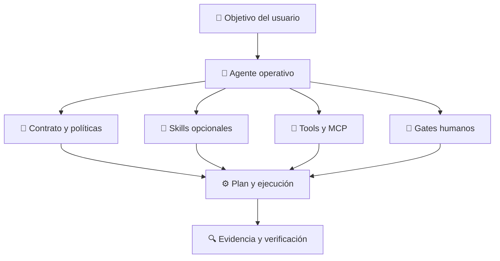
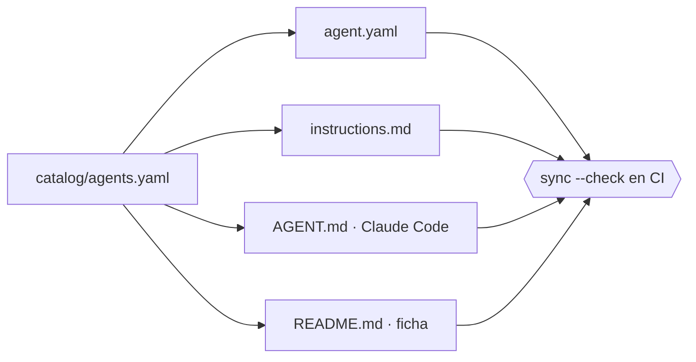

<div align="center">

# 🤖 operational-ai-agents

**Agentes operativos reutilizables para trabajos completos de ingeniería, producto, educación y gobernanza.**

*Un agente recibe una misión, decide una secuencia, usa capacidades dentro de límites explícitos, se detiene en gates humanos y entrega evidencia verificable.*

[](https://github.com/vladimiracunadev-create/operational-ai-agents/actions/workflows/ci.yml)
[](https://github.com/vladimiracunadev-create/operational-ai-agents/actions/workflows/codeql.yml)
[](CHANGELOG.md)
[](pyproject.toml)
[](LICENSE)

[](#-catálogo)
[](docs/EVALUATION.md)
[](tests/test_repository.py)
[](pyproject.toml)
[](docs/MATURITY_MODEL.md)

### [🌐 &nbsp;Ver el sitio del proyecto](https://vladimiracunadev-create.github.io/operational-ai-agents/)

[**Instalación**](#-instalación) · [**Catálogo**](#-catálogo) · [**Uso**](#-uso) · [**CLI**](#-cli) · [**Arquitectura**](#-arquitectura) · [**Seguridad**](#-seguridad-y-límites) · [**Madurez**](#-madurez-y-evidencia) · [**Docs**](#-documentación)

</div>

---

## 📌 Qué es

Una colección de **agentes** —no de prompts— que reciben una misión completa, deciden una secuencia de trabajo, usan tools y skills dentro de límites explícitos, se detienen en gates humanos y entregan evidencia verificable.

> [!IMPORTANT]
> **Skill ≠ agente.** Un *skill* aporta una capacidad acotada dentro del contexto actual. Un *agente* opera en un contexto separado, mantiene una misión, selecciona capacidades, respeta permisos y responde por un resultado integral.

<table>
<tr><th>Dimensión</th><th>Skill</th><th>Agente operativo</th></tr>
<tr><td>Contexto</td><td>el de la sesión actual</td><td>separado y propio</td></tr>
<tr><td>Alcance</td><td>una capacidad concreta</td><td>una misión completa</td></tr>
<tr><td>Decisión</td><td>la toma quien lo invoca</td><td>la toma el agente dentro de límites</td></tr>
<tr><td>Permisos</td><td>heredados</td><td>allowlist declarada por contrato</td></tr>
<tr><td>Cierre</td><td>devuelve un resultado</td><td>responde por evidencia y riesgos residuales</td></tr>
</table>

### Lugar en el portafolio

| Repositorio | Unidad principal | Propósito |
|---|---|---|
| [`artificial-intelligence-evolution-program`](https://github.com/vladimiracunadev-create/artificial-intelligence-evolution-program) | clase / laboratorio | aprender la evolución e ingeniería de IA |
| [`claude-skills-toolkit`](https://github.com/vladimiracunadev-create/claude-skills-toolkit) | skill | capacidades operativas reutilizables |
| **`operational-ai-agents`** | **agente** | **trabajadores digitales que el propietario instala y utiliza** |
| [`langgraph-realworld`](https://github.com/vladimiracunadev-create/langgraph-realworld) | caso / sistema | procesos profesionales y empresariales de referencia |

---

## ⚡ Instalación

**Requisitos:** Python 3.11+ · Claude Code *(solo para ejecución real)* · sin clave API para validar, planificar o explorar.

```bash
git clone https://github.com/vladimiracunadev-create/operational-ai-agents.git
cd operational-ai-agents
python -m pip install -e .
operational-agents validate && operational-agents list
```

Instalar los diez agentes en el perfil de Claude Code:

```bash
./scripts/install.sh      # Linux, macOS, Git Bash
```

```powershell
.\scripts\install.ps1     # Windows PowerShell
```

<details>
<summary><b>Variante con skills precargados</b></summary>

Los agentes funcionan de forma autónoma. Si además tienes instalado [`claude-skills-toolkit`](https://github.com/vladimiracunadev-create/claude-skills-toolkit), puedes generar definiciones que declaren esos skills:

```bash
operational-agents doctor --skills-dir ~/.claude/skills
operational-agents export claude --preload-skills --target ~/.claude/agents
```

`doctor` informa qué skills faltan antes de precargar. Ningún agente deja de funcionar si el toolkit no está instalado.

</details>

<details>
<summary><b>Docker</b></summary>

```bash
docker compose up --build
# panel local en http://127.0.0.1:8765
```

El contenedor corre como usuario sin privilegios y Compose publica el puerto únicamente en loopback del host.

</details>

Instalación por proyecto, actualización y desinstalación en **[INSTALL.md](INSTALL.md)**.

---

## 📚 Catálogo

Diez agentes transversales. La fuente canónica es **[`catalog/agents.yaml`](catalog/agents.yaml)**: manifiestos, instrucciones, definiciones Claude y fichas se generan desde ahí y CI falla ante cualquier drift.

| | Agente | Misión | Riesgo | Permisos |
|:-:|---|---|:-:|:-:|
| 🧭 | **[repository-evolution-agent](agents/repository-evolution-agent/README.md)** | Analiza un repositorio real, separa hechos de promesas y conduce su evolución incremental con pruebas y evidencia. | `medium` | `default` |
| 🏗️ | **[legacy-modernization-agent](agents/legacy-modernization-agent/README.md)** | Diseña y ejecuta modernizaciones incrementales de sistemas legacy preservando continuidad, contratos y rollback. | `high` | `default` |
| 🎓 | **[learning-program-architect](agents/learning-program-architect/README.md)** | Diseña y mantiene programas educativos evolutivos con progresión, laboratorios, evaluaciones y trazabilidad curricular. | `medium` | `default` |
| 🚀 | **[product-evolution-agent](agents/product-evolution-agent/README.md)** | Evalúa productos parciales, alinea producto y arquitectura y convierte brechas en entregas evolutivas verificables. | `medium` | `default` |
| 🗂️ | **[portfolio-curator-agent](agents/portfolio-curator-agent/README.md)** | Clasifica y audita un portafolio de repositorios, detecta solapamientos y produce una narrativa profesional respaldada por evidencia. | `low` | `plan` |
| 🏷️ | **[release-governance-agent](agents/release-governance-agent/README.md)** | Prepara releases coherentes y auditables, valida versiones, pruebas, seguridad, artefactos y rollback antes de publicar. | `high` | `default` |
| 📚 | **[documentation-coherence-agent](agents/documentation-coherence-agent/README.md)** | Reconcilia documentación, arquitectura, ejemplos y métricas con las fuentes de verdad del repositorio. | `medium` | `default` |
| 🩺 | **[incident-root-cause-agent](agents/incident-root-cause-agent/README.md)** | Investiga incidentes técnicos con línea temporal, hipótesis falsables, evidencia y acciones correctivas sin culpar personas. | `medium` | `plan` |
| 🛡️ | **[security-remediation-agent](agents/security-remediation-agent/README.md)** | Convierte hallazgos de seguridad en remediaciones priorizadas, compatibles y verificadas, con cobertura y riesgo residual explícitos. | `high` | `default` |
| 🎛️ | **[repository-maintenance-coordinator](agents/repository-maintenance-coordinator/README.md)** | Coordina especialistas para una misión de mantenimiento amplia, conserva decisiones humanas y consolida una entrega verificable. | `medium` | `default` |

<div align="center"><sub>Los diez agentes declaran estado <code>IMPLEMENTED</code>. Ver <a href="#-madurez-y-evidencia">Madurez y evidencia</a>.</sub></div>

---

## 🚀 Uso

### 1 · Explorar sin modelo

Todo el contrato es inspeccionable offline, sin clave API y sin coste:

```bash
operational-agents list
operational-agents inspect repository-evolution-agent
operational-agents plan repository-evolution-agent \
  --task "Examina este repositorio y propone una evolución verificable"
operational-agents eval --all
```

### 2 · Usar dentro de Claude Code

```text
> Usa repository-evolution-agent para examinar este repositorio.

> @repository-evolution-agent comprueba si README y código coinciden.
```

O iniciar toda la sesión con el agente:

```bash
claude --agent repository-evolution-agent
```

### 3 · Ejecutar desde la CLI

```bash
operational-agents run repository-evolution-agent \
  --runtime claude \
  --cwd /ruta/al/repositorio \
  --task "Detecta brechas y prepara un plan; no publiques cambios"
```

> [!WARNING]
> La CLI **nunca** habilita bypass de permisos. Las acciones destructivas, la publicación, el despliegue y el manejo de credenciales permanecen sujetos a aprobación humana explícita.

### 4 · Panel local

```bash
operational-agents serve --host 127.0.0.1 --port 8765
```

Abre `http://127.0.0.1:8765` para explorar contratos y generar planes deterministas desde el navegador.

---

## 🛠️ CLI

Trece comandos, cero dependencias runtime, solo Python stdlib.

| Comando | Qué hace |
|---|---|
| `list` | lista los agentes del catálogo (`--json`) |
| `inspect <id>` | muestra el contrato completo de un agente |
| `validate` | valida integridad del catálogo y de cada paquete |
| `sync [--check]` | regenera las vistas derivadas; `--check` falla ante drift |
| `plan <id> --task` | genera un plan determinista sin invocar un modelo |
| `packet <id> --task` | produce un paquete de prompt portable |
| `eval [<id>\|--all]` | ejecuta las evaluaciones deterministas |
| `export claude --target` | exporta las definiciones a `.claude/agents/` |
| `uninstall claude --target` | elimina solo los agentes administrados |
| `doctor [--skills-dir]` | diagnostica entorno, Claude CLI y skills |
| `run <id> --runtime claude` | ejecuta mediante un runtime externo |
| `serve` | levanta el panel local en loopback |
| `scaffold <id> --name` | crea un borrador no catalogado |

Referencia completa con flags, salidas y códigos de retorno en **[docs/CLI.md](docs/CLI.md)**.

---

## 🏛️ Arquitectura



Una única fuente de verdad alimenta todas las proyecciones:



```text
operational-ai-agents/
├── catalog/                 # fuente única de verdad
├── agents/                  # un paquete autocontenido por agente
├── src/operational_agents/  # CLI, validación, planner, exporter y servidor
├── shared/                  # contratos, guardrails, memoria y telemetría
├── integrations/            # Claude Code, skills, MCP, GitHub y modelos locales
├── control-center/          # API y panel local
├── deployments/             # local, Docker y ejecución programada
├── evidence/                # ejecuciones, evaluaciones y casos sanitizados
└── tests/                   # pruebas deterministas sin API
```

Cada paquete de agente contiene `AGENT.md`, `agent.yaml`, `instructions.md`, `README.md`, políticas, schemas y evals. Detalle en **[docs/ARCHITECTURE.md](docs/ARCHITECTURE.md)**.

---

## 🔒 Seguridad y límites

| Control | Garantía |
|---|---|
| Ejecución de procesos | la CLI no usa `shell=True` ni añade flags para omitir permisos |
| Agentes mutantes | `permissionMode: default` e `isolation: worktree` en el adaptador Claude |
| Agentes de solo lectura | `Write` y `Edit` en la lista de tools denegadas |
| Panel local | escucha en loopback; el bind externo exige variable explícita |
| Evidencia | opt-in y con redacción de secretos antes de persistir |
| Autorización | publicar, desplegar, borrar y rotar credenciales siempre pasan por un humano |

Estas garantías están cubiertas por pruebas automatizadas, no solo documentadas. Modelo de amenazas completo en **[docs/SECURITY_MODEL.md](docs/SECURITY_MODEL.md)** y política de reporte en **[SECURITY.md](SECURITY.md)**.

---

## 📈 Madurez y evidencia

Ningún agente se presenta como productivo solo porque su Markdown sea válido:

| Estado | Requisito mínimo | Hoy |
|---|---|:-:|
| `DRAFT` | diseño incompleto; no instalable | — |
| `IMPLEMENTED` | contrato, instrucciones, schemas y evals disponibles | **10** |
| `OPERATIONAL_LOCAL` | usado en una tarea real con evidencia sanitizada | 0 |
| `INTEGRATED` | conectado a servicios reales y probado end-to-end | 0 |
| `PRODUCTION_OBSERVED` | uso recurrente con trazas, métricas y revisión humana | 0 |

> [!NOTE]
> Esta entrega declara sus diez agentes como `IMPLEMENTED`. La validación local demuestra **integridad del paquete**, no adopción productiva. Los criterios de promoción están en **[docs/MATURITY_MODEL.md](docs/MATURITY_MODEL.md)** y el formato de evidencia en **[docs/EVIDENCE_GUIDE.md](docs/EVIDENCE_GUIDE.md)**.

---

## 🧭 Principios

- **Vendor-neutral en el núcleo** — catálogo, políticas, schemas y evaluaciones no dependen de un proveedor.
- **Claude Code como primer adaptador** — exportación oficial a `.claude/agents/`.
- **Skills opcionales** — los agentes funcionan solos y mejoran si el toolkit está instalado.
- **Read-only primero** — las fases iniciales inspeccionan; las mutaciones llegan después del alcance y del plan.
- **Aprobación real** — otro agente no puede aprobar acciones por el usuario.
- **Evidencia sobre apariencia** — toda conclusión separa lo observado, lo inferido y lo pendiente.
- **Sin secretos en trazas** — el registro de evidencia es opt-in y sanitizado.
- **Cero dependencias runtime** — la CLI utiliza únicamente la stdlib de Python.

---

## ✅ Calidad

Cada push ejecuta la misma verificación en Linux, macOS y Windows sobre Python 3.11, 3.12 y 3.13:

```bash
operational-agents sync --check     # sin drift respecto del catálogo
operational-agents validate         # integridad de los 10 paquetes
operational-agents eval --all       # 30 evaluaciones deterministas
python -m unittest discover -s tests -v
```

O con `make`:

```bash
make check
```

---

## 📖 Documentación

| Documento | Contenido |
|---|---|
| [INSTALL.md](INSTALL.md) | instalación, actualización y desinstalación |
| [docs/CLI.md](docs/CLI.md) | referencia completa de los trece comandos |
| [docs/ARCHITECTURE.md](docs/ARCHITECTURE.md) | límites, componentes y flujos |
| [docs/AGENT_CONTRACT.md](docs/AGENT_CONTRACT.md) | contrato canónico y anatomía de un agente |
| [docs/SECURITY_MODEL.md](docs/SECURITY_MODEL.md) | permisos, amenazas y gates humanos |
| [docs/EVALUATION.md](docs/EVALUATION.md) | evals deterministas y model-graded |
| [docs/MATURITY_MODEL.md](docs/MATURITY_MODEL.md) | criterios de promoción de estados |
| [docs/EVIDENCE_GUIDE.md](docs/EVIDENCE_GUIDE.md) | qué evidencia se registra y cómo se sanitiza |
| [docs/CLAUDE_CODE.md](docs/CLAUDE_CODE.md) | adaptación e invocación en Claude Code |
| [docs/SKILLS_INTEGRATION.md](docs/SKILLS_INTEGRATION.md) | integración opcional con el toolkit |
| [CONTRIBUTING.md](CONTRIBUTING.md) | cómo proponer un agente nuevo |
| [ROADMAP.md](ROADMAP.md) | de `IMPLEMENTED` a operación observada |
| [RECRUITER.md](RECRUITER.md) | lectura profesional del proyecto |

### Referencias oficiales

- [Claude Code — custom subagents](https://code.claude.com/docs/en/sub-agents)
- [Claude Code — skills](https://code.claude.com/docs/en/skills)
- [Model Context Protocol](https://modelcontextprotocol.io/docs/getting-started/intro)

---

## 🤝 Contribuir

Un elemento nuevo debe ser un **agente**: misión completa, decisiones acotadas, permisos declarados, gates humanos y evidencia. Lee **[CONTRIBUTING.md](CONTRIBUTING.md)** y **[AGENTS.md](AGENTS.md)** antes de abrir un PR.

```bash
operational-agents scaffold mi-agente --name "Mi Agente"
```

---

<div align="center">

**MIT** © 2026 [Vladimir Acuña](https://github.com/vladimiracunadev-create)

<sub>Construido con Python stdlib · sin dependencias runtime · evidencia sobre apariencia</sub>

</div>
