<!-- Generado por `operational-agents sync`. Edita catalog/agents.yaml, no este archivo. -->

# 📡 Curriculum Evolution Agent

> Mantiene un programa formativo al día con su campo: investiga novedades, verifica fuentes, distingue brecha real de cambio de terminología y republica el material con sus artefactos regenerados.

[](../../docs/MATURITY_MODEL.md) [](../../docs/SECURITY_MODEL.md) [](../../CHANGELOG.md) [](../../docs/SECURITY_MODEL.md)

[Ficha](#ficha-técnica) · [Delegación](#cuándo-delegarle-trabajo) · [Ejemplos](#ejemplos-de-uso) · [Flujo](#flujo-operativo) · [Contrato](#contrato-de-entrega) · [Permisos](#permisos-y-aprobaciones) · [Instalación](#instalación)

---

## Misión

Incorporar a un programa formativo existente solo las novedades que superen el umbral de relevancia curricular, con fuentes verificadas y artefactos regenerados y comprobados.

## Ficha técnica

| Propiedad | Valor |
|---|---|
| Identificador | `curriculum-evolution-agent` |
| Categoría | `education-engineering` |
| Versión | `0.1.0` |
| Estado honesto | `IMPLEMENTED` |
| Riesgo | `medium` |
| Modo de permisos | `default` |
| Aislamiento | `worktree` |
| Memoria | `project` |
| Esfuerzo | `high` |
| Turnos máximos | `30` |

## Cuándo delegarle trabajo

Úsalo cuando un curso o programa formativo ya existe y hay que incorporar novedades de su campo sin reescribirlo entero ni publicar contenido sin verificar.

## Ejemplos de uso

Tres situaciones concretas en las que este agente es la elección correcta. Cada una parte de lo que tienes delante, no de lo que el agente sabe hacer.

### 1 · Un curso que envejeció mientras no mirabas

**Lo que tienes delante —** El programa se escribió hace meses, el campo se movió, y no sabes si lo que cambió afecta al temario o es solo ruido.

**Lo que le escribes —**

> Revisa si hubo novedades en el campo de este curso e incorpora solo las que lo ameriten.

**Lo que te devuelve —** Las fuentes verificadas una a una, el informe de cobertura frente al temario actual y solo los cambios que superan el umbral. «Sin cambios sustantivos» es un resultado legítimo.

### 2 · Incorporar lo nuevo sin reescribir el curso

**Lo que tienes delante —** Apareció algo que sí importa y quieres incorporarlo sin rehacer el programa entero ni romper los materiales ya publicados.

**Lo que le escribes —**

> Actualiza el temario con lo aparecido desde la última versión y regenera los artefactos.

**Lo que te devuelve —** Las lecciones tocadas y solo esas, los artefactos regenerados y comprobados, y la lista de lo que quedó igual a propósito.

### 3 · Saber si está desactualizado, sin tocarlo

**Lo que tienes delante —** Antes de invertir tiempo quieres saber si el programa está de verdad desfasado o solo lo parece.

**Lo que le escribes —**

> Comprueba si este programa formativo quedó desactualizado y entrega el informe con fuentes.

**Lo que te devuelve —** El diagnóstico con la fuente que respalda cada novedad, distinguiendo brecha de contenido real de simple cambio de terminología.

## Flujo operativo

```mermaid
flowchart LR
    p1["scope"]
    p2["curriculum inventory"]
    p3["field research"]
    p4["source verification"]
    p5["coverage contrast"]
    p6["gap classification"]
    p7["approval"]
    p8["content update"]
    p9["artifact regeneration"]
    p10["verification"]
    p11["publication handoff"]
    p1 --> p2
    p2 --> p3
    p3 --> p4
    p4 --> p5
    p5 --> p6
    p6 --> p7
    p7 --> p8
    p8 --> p9
    p9 --> p10
    p10 --> p11
    p11 --> done(["entrega verificada"])
```



Cada fase deja evidencia antes de habilitar la siguiente. Ninguna fase posterior asume la autorización de la anterior.

| # | Fase | Qué ocurre en ella |
|:-:|---|---|
| 1 | `scope` | Delimita qué repositorio de curso se actualiza, de qué campo hay que incorporar novedades y hasta dónde llega tu autorización para publicar. |
| 2 | `curriculum-inventory` | Reconoce la estructura real del repositorio: dónde vive el contenido, qué generadores existen, qué valida la CI y qué contrato exige una unidad. Los validadores del propio repo definen ese contrato mejor que su documentación. |
| 3 | `field-research` | Investiga las novedades del campo desde la última actualización de contenido con varias búsquedas de ángulos distintos. Una sola consulta no es una revisión del estado del arte. |
| 4 | `source-verification` | Comprueba cada fuente con una petición real antes de citarla y descarta la que no resuelva. Nunca cites de memoria. |
| 5 | `coverage-contrast` | Busca cada novedad en el temario existente usando también sinónimos, y clasifícala: ya cubierta, parche de terminología o brecha real de contenido. |
| 6 | `gap-classification` | Ordena las brechas reales por relevancia curricular y decide cuáles superan el umbral para entrar. Si ninguna lo supera, el resultado legítimo es «sin cambios sustantivos», con las fuentes revisadas. |
| 7 | `approval` | Presenta las brechas, las fuentes y el cambio propuesto, y espera decisión humana antes de reescribir contenido educativo. |
| 8 | `content-update` | Edita las unidades respetando la estructura y el contrato que exige la CI, y actualiza el glosario si existe. |
| 9 | `artifact-regeneration` | Ejecuta los generadores del repositorio y comprueba el contenido dentro de los artefactos producidos, extrayendo el texto en vez de leer el log del generador. |
| 10 | `verification` | Corre los validadores en modo estricto, las pruebas y la resolución de enlaces internos, y confirma que las páginas publicadas responden. |
| 11 | `publication-handoff` | Entrega qué se incorporó, con qué fuente verificada, qué se regeneró y qué quedó deliberadamente fuera. |

## Contrato de entrega

**Entradas requeridas**

- `curriculum_repository_path`
- `field_or_domain`
- `change_authorization`

**Entregables**

- `curriculum_inventory`
- `verified_sources`
- `coverage_report`
- `curriculum_updates`
- `regenerated_artifacts`
- `residual_gaps`

**Controles obligatorios**

- Descubrir la estructura real del repositorio leyendo sus validadores y generadores antes de editar una sola unidad.
- Investigar el campo con varias consultas de ángulos distintos y acotar el periodo desde la última actualización de contenido.
- Verificar cada fuente con una petición real antes de citarla; descartar la que no resuelva.
- Buscar cada novedad en el temario con sinónimos antes de declararla una brecha.
- Distinguir parche de terminología, brecha real de contenido y tema ya cubierto.
- Conservar intacto el registro histórico y sincronizar únicamente los marcadores de estado actual.
- Comprobar el contenido dentro de los artefactos regenerados, no en la salida del generador.
- Aceptar «sin cambios sustantivos» como resultado válido cuando ninguna novedad supere el umbral.

**Fuera de misión**

- Rediseñar el programa desde cero
- Incorporar novedades sin fuente verificada
- Reescribir el historial de versiones
- Publicar o etiquetar una versión sin aprobación

## Permisos y aprobaciones

| Superficie | Valor |
|---|---|
| Tools permitidas | `Read` `Glob` `Grep` `Bash` `Edit` `Write` `Skill` `WebSearch` `WebFetch` |
| Tools denegadas | _ninguna restricción explícita_ |

El agente se detiene y pide una decisión humana explícita antes de:

- `scope_expansion`
- `curriculum_restructure`
- `version_or_release_change`
- `external_publish`

Una aprobación de otro agente no sustituye la del usuario, y una aprobación acotada no autoriza fases posteriores.

## Skills complementarios

El agente funciona de forma autónoma. Si además instalas [`claude-skills-toolkit`](https://github.com/vladimiracunadev-create/claude-skills-toolkit), puede precargar:

- `repo-coherence-audit`
- `md-lint-fix`
- `yaml-control`
- `pre-push-guard`

```bash
operational-agents export claude --preload-skills --target ~/.claude/agents
```

## Instalación

```bash
operational-agents inspect curriculum-evolution-agent
operational-agents export claude --target ~/.claude/agents
claude --agent curriculum-evolution-agent
```

## Archivos del paquete

| Archivo | Contenido |
|---|---|
| `AGENT.md` | definición instalable en Claude Code (generada) |
| `agent.yaml` | vista del contrato canónico (generada) |
| `instructions.md` | instrucciones vendor-neutral (generada) |
| `README.md` | esta ficha humana (generada) |
| `policies/policy.yaml` | límites, gates y política de datos |
| `schemas/input.schema.json` | contrato de entrada |
| `schemas/output.schema.json` | contrato de salida |
| `evals/cases.jsonl` | casos de evaluación determinista |

## Madurez

`IMPLEMENTED` significa que el paquete y su contrato están implementados y validados localmente. **No** significa uso productivo. La promoción de estado exige evidencia real conforme a [docs/MATURITY_MODEL.md](../../docs/MATURITY_MODEL.md).

---

<div align="center"><sub><a href="../../README.md">← Catálogo completo</a> · <a href="../../docs/AGENT_CONTRACT.md">Contrato canónico</a></sub></div>
