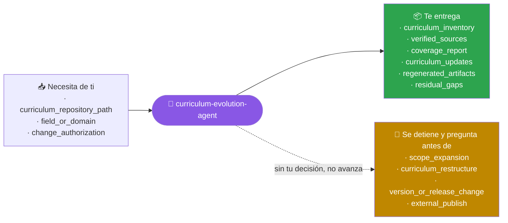
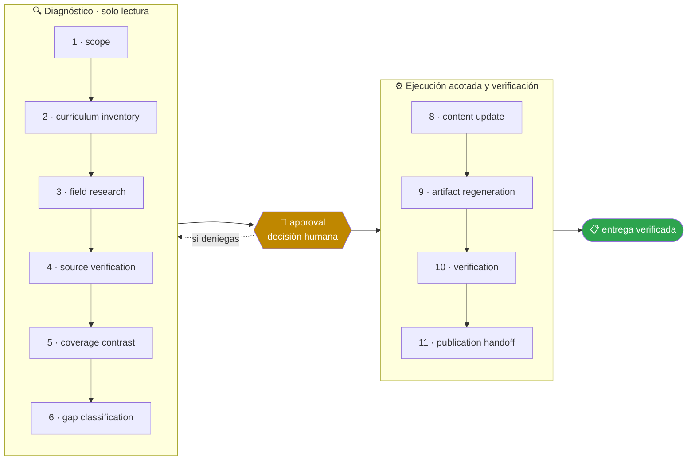

<!-- Generado por `operational-agents sync`. Edita catalog/agents.yaml, no este archivo. -->

# 📡 Curriculum Evolution Agent

> Mantiene un programa formativo al día con su campo: investiga novedades, verifica fuentes, distingue brecha real de cambio de terminología y republica el material con sus artefactos regenerados.

[](../../docs/MATURITY_MODEL.md) [](../../docs/SECURITY_MODEL.md) [](../../CHANGELOG.md) [](../../docs/SECURITY_MODEL.md)

[Ejemplos](#ejemplos-de-uso) · [Mapa](#mapa-de-la-misión) · [Flujo](#flujo-operativo) · [Ficha](#ficha-técnica) · [Contrato](#contrato-de-entrega) · [Permisos](#permisos-y-aprobaciones) · [Instalación](#instalación)

---

## Qué hace por ti

Incorporar a un programa formativo existente solo las novedades que superen el umbral de relevancia curricular, con fuentes verificadas y artefactos regenerados y comprobados.

> [!NOTE]
> Trabaja en un worktree aislado y se detiene ante 4 gates humanos. Inspecciona primero; muta solo lo aprobado.

## Cuándo delegarle trabajo

Úsalo cuando un curso o programa formativo ya existe y hay que incorporar novedades de su campo sin reescribirlo entero ni publicar contenido sin verificar.

## Ejemplos de uso

3 casos trabajados: el contexto real, el mensaje que le escribes, lo que hace paso a paso y la forma exacta de lo que te devuelve.

> [!NOTE]
> Son **ejemplos ilustrativos del contrato**, no transcripciones de ejecuciones registradas. Ningún agente del catálogo declara todavía evidencia de uso real — ver [Madurez](#madurez).

### 1 · Un curso que envejeció mientras no mirabas

**El caso.** Un programa de 40 lecciones sobre desarrollo con modelos de lenguaje, escrito hace siete meses. En ese tiempo salieron modelos nuevos, cambió el nombre de dos APIs y apareció un patrón de arquitectura que hoy se da por estándar.

**Le escribes:**

```text
Revisa si hubo novedades en el campo de este curso e incorpora solo las que lo ameriten.
```

**Qué hace, paso a paso:**

1. `field-research` — busca novedades desde la fecha de la última versión, no en general.
2. `source-verification` — abre cada fuente con una petición real: de 14 candidatas, 3 eran refritos sin fuente primaria y quedan fuera.
3. `gap-classification` — distingue brecha de contenido real de simple cambio de terminología, que es lo que separa una actualización útil de una reescritura cosmética.

**Lo que te devuelve:**

| Novedad | Clasificación | Decisión |
|---|---|---|
| patrón de arquitectura nuevo | brecha real: no hay lección que lo cubra | **entra**: lección nueva en el módulo 6 |
| API renombrada | cambio de terminología | **entra**: solo los nombres, en 4 lecciones |
| modelos nuevos | los ejemplos siguen siendo válidos | tabla de referencia actualizada |
| 3 novedades sin fuente primaria | no verificables | fuera, con el motivo por escrito |

**Cómo cierra —** `PARTIAL` — 1 lección nueva, 4 con nombres corregidos, 35 sin tocar. La mayoría del curso no necesitaba nada.

### 2 · Incorporar lo nuevo sin reescribir el curso

**El caso.** Salió algo que sí importa y hay que meterlo. El curso ya está publicado, con PDFs generados y una web que se compila desde el mismo contenido.

**Le escribes:**

```text
Actualiza el temario con lo aparecido desde la última versión y regenera los artefactos.
```

**Qué hace, paso a paso:**

1. `content-update` — toca 4 lecciones y ninguna más; el resto del material queda literalmente igual.
2. `artifact-regeneration` — regenera PDFs y web desde el contenido actualizado.
3. `verification` — abre los artefactos regenerados y comprueba que el contenido nuevo está dentro, en vez de confiar en que el generador terminó sin error.

**Lo que te devuelve:**

- **Tocado** — 4 lecciones, con el diff de cada una a la vista.
- **Regenerado** — 6 PDFs y 41 páginas web, con el conteo de secciones contrastado contra el origen.
- **Verificado** — la lección nueva aparece en el PDF del módulo 6 y en el índice de la web; el PDF pasó de 118 a 126 páginas.
- **Sin tocar a propósito** — las 36 lecciones restantes y toda la estructura de navegación.

**Cómo cierra —** `COMPLETED` — el generador terminó sin error **y además** el contenido llegó al artefacto. Son dos comprobaciones distintas.

### 3 · Saber si está desactualizado, sin tocarlo

**El caso.** Te preguntan si el programa sigue vigente. Antes de invertir dos semanas necesitas un diagnóstico con fuentes, no una impresión.

**Le escribes:**

```text
Comprueba si este programa formativo quedó desactualizado y entrega el informe con fuentes.
```

**Qué hace, paso a paso:**

1. `curriculum-inventory` — levanta qué cubre hoy el temario, lección por lección.
2. `coverage-contrast` — contrasta esa cobertura contra lo verificado en el campo.
3. `approval` — se detiene antes de escribir una sola línea de contenido: el encargo era diagnosticar.

**Lo que te devuelve:**

- **Vigente** — 33 de 40 lecciones; los fundamentos no se movieron.
- **Desfasado de forma cosmética** — 5 lecciones con nombres de API antiguos; el concepto sigue siendo correcto.
- **Brecha real** — 2 temas que hoy se esperan de un curso así y no aparecen en ninguna lección.
- **Fuentes** — 11 verificadas con petición real, cada hallazgo con su enlace.

**Cómo cierra —** `NO_CHANGE` — resultado legítimo: el programa no necesita reescritura, necesita dos lecciones y un repaso de nombres.

## Mapa de la misión



## Flujo operativo



Cada fase deja evidencia antes de habilitar la siguiente. Ninguna fase posterior asume la autorización de la anterior.

| # | Fase | Qué ocurre en ella |
|:-:|---|---|
| 1 | `scope` | Delimita qué repositorio de curso se actualiza, de qué campo hay que incorporar novedades y hasta dónde llega tu autorización para publicar. |
| 2 | `curriculum-inventory` | Reconoce la estructura real del repositorio: dónde vive el contenido, qué generadores existen, qué valida la CI y qué contrato exige una unidad. Los validadores del propio repo definen ese contrato mejor que su documentación. |
| 3 | `field-research` | Investiga las novedades del campo desde la última actualización de contenido con varias búsquedas de ángulos distintos. Una sola consulta no es una revisión del estado del arte. |
| 4 | `source-verification` | Comprueba cada fuente con una petición real antes de citarla y descarta la que no resuelva. Nunca cites de memoria. |
| 5 | `coverage-contrast` | Busca cada novedad en el temario existente usando también sinónimos, y clasifícala: ya cubierta, parche de terminología o brecha real de contenido. |
| 6 | `gap-classification` | Ordena las brechas reales por relevancia curricular y decide cuáles superan el umbral para entrar. Si ninguna lo supera, el resultado legítimo es «sin cambios sustantivos», con las fuentes revisadas. |
| 7 | `approval` | Presenta las brechas, las fuentes y el cambio propuesto, y espera decisión humana antes de reescribir contenido educativo. |
| 8 | `content-update` | Edita las unidades respetando la estructura y el contrato que exige la CI, y actualiza el glosario si existe. |
| 9 | `artifact-regeneration` | Ejecuta los generadores del repositorio y comprueba el contenido dentro de los artefactos producidos, extrayendo el texto en vez de leer el log del generador. |
| 10 | `verification` | Corre los validadores en modo estricto, las pruebas y la resolución de enlaces internos, y confirma que las páginas publicadas responden. |
| 11 | `publication-handoff` | Entrega qué se incorporó, con qué fuente verificada, qué se regeneró y qué quedó deliberadamente fuera. |

## Ficha técnica

| Propiedad | Valor |
|---|---|
| Identificador | `curriculum-evolution-agent` |
| Categoría | `education-engineering` |
| Versión | `0.1.0` |
| Estado honesto | `IMPLEMENTED` |
| Riesgo | `medium` |
| Modo de permisos | `default` |
| Aislamiento | `worktree` |
| Memoria | `project` |
| Esfuerzo | `high` |
| Turnos máximos | `30` |

## Contrato de entrega

**Entradas requeridas**

- `curriculum_repository_path`
- `field_or_domain`
- `change_authorization`

**Entregables**

- `curriculum_inventory`
- `verified_sources`
- `coverage_report`
- `curriculum_updates`
- `regenerated_artifacts`
- `residual_gaps`

**Controles obligatorios**

- Descubrir la estructura real del repositorio leyendo sus validadores y generadores antes de editar una sola unidad.
- Investigar el campo con varias consultas de ángulos distintos y acotar el periodo desde la última actualización de contenido.
- Verificar cada fuente con una petición real antes de citarla; descartar la que no resuelva.
- Buscar cada novedad en el temario con sinónimos antes de declararla una brecha.
- Distinguir parche de terminología, brecha real de contenido y tema ya cubierto.
- Conservar intacto el registro histórico y sincronizar únicamente los marcadores de estado actual.
- Comprobar el contenido dentro de los artefactos regenerados, no en la salida del generador.
- Aceptar «sin cambios sustantivos» como resultado válido cuando ninguna novedad supere el umbral.

**Fuera de misión**

- Rediseñar el programa desde cero
- Incorporar novedades sin fuente verificada
- Reescribir el historial de versiones
- Publicar o etiquetar una versión sin aprobación

**Limitaciones**

- Depende de la cobertura y actualidad de las fuentes autorizadas.
- No sustituye la revisión humana experta ni amplía el alcance aprobado.

**Modos de fallo controlados**

- Si falta una fuente obligatoria, entrega PARTIAL o BLOCKED con la brecha explícita.
- Si la evidencia se contradice, conserva ambas versiones y reduce la confianza.

**Eventos de auditoría**

- `analysis_started`
- `tool_completed`
- `evidence_linked`
- `human_decision_recorded`
- `analysis_completed`

## Permisos y aprobaciones

| Superficie | Valor |
|---|---|
| Tools permitidas | `Read` `Glob` `Grep` `Bash` `Edit` `Write` `Skill` `WebSearch` `WebFetch` |
| Tools denegadas | _ninguna restricción explícita_ |

El agente se detiene y pide una decisión humana explícita antes de:

- `scope_expansion`
- `curriculum_restructure`
- `version_or_release_change`
- `external_publish`

Una aprobación de otro agente no sustituye la del usuario, y una aprobación acotada no autoriza fases posteriores.

## Skills complementarios

El agente funciona de forma autónoma. Si además instalas [`claude-skills-toolkit`](https://github.com/vladimiracunadev-create/claude-skills-toolkit), puede precargar:

- `repo-coherence-audit`
- `md-lint-fix`
- `yaml-control`
- `pre-push-guard`

```bash
operational-agents export claude --preload-skills --target ~/.claude/agents
```

## Instalación

```bash
operational-agents inspect curriculum-evolution-agent
operational-agents export claude --target ~/.claude/agents
claude --agent curriculum-evolution-agent
```

## Archivos del paquete

| Archivo | Contenido |
|---|---|
| `AGENT.md` | definición instalable en Claude Code (generada) |
| `agent.yaml` | vista del contrato canónico (generada) |
| `instructions.md` | instrucciones vendor-neutral (generada) |
| `README.md` | esta ficha humana (generada) |
| `policies/policy.yaml` | límites, gates y política de datos |
| `schemas/input.schema.json` | contrato de entrada |
| `schemas/output.schema.json` | contrato de salida |
| `evals/cases.jsonl` | casos de evaluación determinista |

## Madurez

`IMPLEMENTED` significa que el paquete y su contrato están implementados y validados localmente. **No** significa uso productivo. La promoción de estado exige evidencia real conforme a [docs/MATURITY_MODEL.md](../../docs/MATURITY_MODEL.md).

---

<div align="center"><sub><a href="../../README.md">← Catálogo completo</a> · <a href="../../docs/AGENT_CONTRACT.md">Contrato canónico</a></sub></div>
