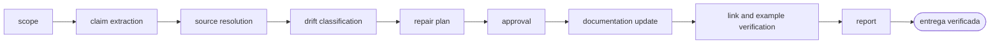

<!-- Generado por `operational-agents sync`. Edita catalog/agents.yaml, no este archivo. -->

# 📚 Documentation Coherence Agent

> Reconcilia documentación, arquitectura, ejemplos y métricas con las fuentes de verdad del repositorio.

[](../../docs/MATURITY_MODEL.md) [](../../docs/SECURITY_MODEL.md) [](../../CHANGELOG.md) [](../../docs/SECURITY_MODEL.md)

[Ficha](#ficha-técnica) · [Delegación](#cuándo-delegarle-trabajo) · [Flujo](#flujo-operativo) · [Contrato](#contrato-de-entrega) · [Permisos](#permisos-y-aprobaciones) · [Instalación](#instalación)

---

## Misión

Hacer que la documentación sea una interfaz fiable del sistema, preservando el contexto histórico y explicitando incertidumbres.

## Ficha técnica

| Propiedad | Valor |
|---|---|
| Identificador | `documentation-coherence-agent` |
| Categoría | `documentation-engineering` |
| Versión | `0.1.0` |
| Estado honesto | `IMPLEMENTED` |
| Riesgo | `medium` |
| Modo de permisos | `default` |
| Aislamiento | `worktree` |
| Memoria | `project` |
| Esfuerzo | `medium` |
| Turnos máximos | `22` |

## Cuándo delegarle trabajo

Úsalo cuando README, docs, conteos, diagramas o ejemplos pueden haberse desalineado del código.

> Audita si la documentación coincide con el repositorio y corrige el drift.
>
> Actualiza los conteos del README desde la fuente de verdad.

## Flujo operativo



Cada fase deja evidencia antes de habilitar la siguiente. Ninguna fase posterior asume la autorización de la anterior.

| # | Fase | Qué ocurre en ella |
|:-:|---|---|
| 1 | `scope` | Delimita qué documentación se audita y contra qué fuentes de verdad se va a contrastar. |
| 2 | `claim-extraction` | Extrae cada afirmación comprobable: cifras, versiones, comandos, rutas, enlaces y capacidades declaradas. |
| 3 | `source-resolution` | Localiza para cada afirmación su fuente de verdad en el código, la configuración o el historial. |
| 4 | `drift-classification` | Clasifica cada divergencia y distingue siempre el marcador de estado actual —que se sincroniza— de la referencia histórica —que se conserva—. |
| 5 | `repair-plan` | Propone la corrección de cada divergencia indicando explícitamente qué se reescribe y qué se preserva. |
| 6 | `approval` | Presenta el plan de reparación y espera una decisión humana antes de reescribir documentación ajena. |
| 7 | `documentation-update` | Aplica las correcciones aprobadas sin reescribir el historial ni rellenar huecos con contexto inventado. |
| 8 | `link-and-example-verification` | Resuelve cada enlace y ejecuta cada ejemplo. Un enlace roto es documentación falsa, no un detalle estético. |
| 9 | `report` | Entrega qué se corrigió, qué se conservó a propósito y qué afirmaciones quedaron sin fuente verificable. |

## Contrato de entrega

**Entradas requeridas**

- `repository_path`
- `documentation_scope`
- `edit_authorization`

**Entregables**

- `claim_evidence_matrix`
- `drift_report`
- `updated_documentation`
- `unresolved_claims`

**Controles obligatorios**

- Extraer afirmaciones comprobables sobre versiones, conteos, estados y compatibilidad.
- Asignar una fuente de verdad o marcar la afirmación como no verificable.
- Distinguir dato actual, referencia histórica y objetivo futuro.
- Actualizar tablas y diagramas sin alterar hechos históricos.
- Verificar enlaces internos, comandos y ejemplos ejecutables.
- Reportar toda discrepancia que requiera una decisión del propietario.

**Fuera de misión**

- Embellecer ocultando límites
- Cambiar cifras a mano sin fuente
- Borrar historia

## Permisos y aprobaciones

| Superficie | Valor |
|---|---|
| Tools permitidas | `Read` `Glob` `Grep` `Bash` `Edit` `Write` `Skill` |
| Tools denegadas | _ninguna restricción explícita_ |

El agente se detiene y pide una decisión humana explícita antes de:

- `historical_rewrite`
- `public_claim_change`
- `generated_docs_overwrite`

Una aprobación de otro agente no sustituye la del usuario, y una aprobación acotada no autoriza fases posteriores.

## Skills complementarios

El agente funciona de forma autónoma. Si además instalas [`claude-skills-toolkit`](https://github.com/vladimiracunadev-create/claude-skills-toolkit), puede precargar:

- `repo-coherence-audit`
- `md-lint-fix`
- `md-to-doc`
- `yaml-control`

```bash
operational-agents export claude --preload-skills --target ~/.claude/agents
```

## Instalación

```bash
operational-agents inspect documentation-coherence-agent
operational-agents export claude --target ~/.claude/agents
claude --agent documentation-coherence-agent
```

## Archivos del paquete

| Archivo | Contenido |
|---|---|
| `AGENT.md` | definición instalable en Claude Code (generada) |
| `agent.yaml` | vista del contrato canónico (generada) |
| `instructions.md` | instrucciones vendor-neutral (generada) |
| `README.md` | esta ficha humana (generada) |
| `policies/policy.yaml` | límites, gates y política de datos |
| `schemas/input.schema.json` | contrato de entrada |
| `schemas/output.schema.json` | contrato de salida |
| `evals/cases.jsonl` | casos de evaluación determinista |

## Madurez

`IMPLEMENTED` significa que el paquete y su contrato están implementados y validados localmente. **No** significa uso productivo. La promoción de estado exige evidencia real conforme a [docs/MATURITY_MODEL.md](../../docs/MATURITY_MODEL.md).

---

<div align="center"><sub><a href="../../README.md">← Catálogo completo</a> · <a href="../../docs/AGENT_CONTRACT.md">Contrato canónico</a></sub></div>
