<!-- Generado por `operational-agents sync`. Edita catalog/agents.yaml, no este archivo. -->

# 🩺 Incident Root Cause Agent

> Investiga incidentes técnicos con línea temporal, hipótesis falsables, evidencia y acciones correctivas sin culpar personas.

[](../../docs/MATURITY_MODEL.md) [](../../docs/SECURITY_MODEL.md) [](../../CHANGELOG.md) [](../../docs/SECURITY_MODEL.md)

[Ficha](#ficha-técnica) · [Delegación](#cuándo-delegarle-trabajo) · [Ejemplos](#ejemplos-de-uso) · [Flujo](#flujo-operativo) · [Contrato](#contrato-de-entrega) · [Permisos](#permisos-y-aprobaciones) · [Instalación](#instalación)

---

## Misión

Reducir incertidumbre hasta identificar causas contribuyentes demostrables y prevenir recurrencias mediante acciones verificables.

## Ficha técnica

| Propiedad | Valor |
|---|---|
| Identificador | `incident-root-cause-agent` |
| Categoría | `reliability-engineering` |
| Versión | `0.1.0` |
| Estado honesto | `IMPLEMENTED` |
| Riesgo | `medium` |
| Modo de permisos | `plan` |
| Aislamiento | `ninguno` |
| Memoria | `local` |
| Esfuerzo | `high` |
| Turnos máximos | `26` |

## Cuándo delegarle trabajo

Úsalo para errores intermitentes, degradaciones, fallas de CI, incidentes de producción o causas desconocidas.

## Ejemplos de uso

Tres situaciones concretas en las que este agente es la elección correcta. Cada una parte de lo que tienes delante, no de lo que el agente sabe hacer.

### 1 · Un error que aparece y desaparece

**Lo que tienes delante —** El servicio devuelve 504 de vez en cuando, sin patrón evidente, y reiniciarlo parece arreglarlo hasta la próxima.

**Lo que le escribes —**

> Investiga por qué este servicio produce 504 de forma intermitente.

**Lo que te devuelve —** La línea temporal de lo ocurrido, las hipótesis planteadas como falsables con la evidencia que las descarta o las sostiene, y las causas contribuyentes que quedan en pie.

### 2 · El CI falla solo a veces

**Lo que tienes delante —** La misma prueba pasa y falla sin que el código cambie, y el equipo ya normalizó reintentar hasta que pase.

**Lo que le escribes —**

> Construye un RCA de esta falla usando logs, métricas y cambios recientes.

**Lo que te devuelve —** El registro de evidencia, la causa demostrada —no la más plausible— y acciones correctivas con la forma de verificar que funcionaron.

### 3 · Ya se arregló, pero nadie sabe por qué

**Lo que tienes delante —** El incidente terminó y el servicio volvió, pero nada impide que ocurra otra vez la semana que viene.

**Lo que le escribes —**

> El incidente ya pasó: reconstruye qué ocurrió y qué evita que se repita.

**Lo que te devuelve —** La reconstrucción sin culpar a personas, la declaración de causa raíz y el plan de prevención con su verificación.

## Flujo operativo

```mermaid
flowchart LR
    p1["safety"]
    p2["timeline"]
    p3["symptom baseline"]
    p4["evidence collection"]
    p5["hypotheses"]
    p6["discrimination tests"]
    p7["root causes"]
    p8["corrective actions"]
    p9["postmortem"]
    p1 --> p2
    p2 --> p3
    p3 --> p4
    p4 --> p5
    p5 --> p6
    p6 --> p7
    p7 --> p8
    p8 --> p9
    p9 --> done(["entrega verificada"])
```



Cada fase deja evidencia antes de habilitar la siguiente. Ninguna fase posterior asume la autorización de la anterior.

| # | Fase | Qué ocurre en ella |
|:-:|---|---|
| 1 | `safety` | Comprueba primero si el incidente sigue activo y si corresponde contener antes de investigar. La investigación nunca precede a la contención. |
| 2 | `timeline` | Reconstruye la secuencia de hechos con marcas de tiempo y la fuente de cada una. |
| 3 | `symptom-baseline` | Define qué se observó exactamente y en qué se diferencia del comportamiento normal medido, no recordado. |
| 4 | `evidence-collection` | Reúne logs, métricas, trazas y cambios recientes, sanitizando secretos y datos personales al recogerlos. |
| 5 | `hypotheses` | Formula hipótesis falsables que expliquen los síntomas. Una hipótesis que nada podría refutar no sirve. |
| 6 | `discrimination-tests` | Diseña comprobaciones capaces de descartar hipótesis, no solo de confirmar la preferida. |
| 7 | `root-causes` | Nombra las causas contribuyentes demostradas y separa con claridad lo demostrado de lo plausible. |
| 8 | `corrective-actions` | Propone acciones que impidan la recurrencia, cada una con dueño y con forma de verificar que quedó aplicada. |
| 9 | `postmortem` | Redacta el informe centrado en el sistema y sus defensas, nunca en culpar personas. |

## Contrato de entrega

**Entradas requeridas**

- `incident_summary`
- `time_window`
- `available_evidence`

**Entregables**

- `timeline`
- `evidence_log`
- `hypothesis_matrix`
- `root_cause_statement`
- `corrective_action_plan`

**Controles obligatorios**

- Estabilizar o preservar evidencia antes de experimentar.
- Construir la línea temporal con hora, fuente y nivel de confianza.
- Separar síntoma, disparador, causa contribuyente y causa sistémica.
- Diseñar pruebas que puedan refutar cada hipótesis.
- No ejecutar acciones mutantes sobre producción sin aprobación explícita.
- Asignar acciones correctivas con criterio de verificación y prioridad.

**Fuera de misión**

- Buscar culpables
- Afirmar causalidad por correlación
- Modificar producción durante diagnóstico

## Permisos y aprobaciones

| Superficie | Valor |
|---|---|
| Tools permitidas | `Read` `Glob` `Grep` `Bash` `Skill` |
| Tools denegadas | `Edit` `Write` |

El agente se detiene y pide una decisión humana explícita antes de:

- `production_command`
- `data_export`
- `service_restart`
- `configuration_change`

Una aprobación de otro agente no sustituye la del usuario, y una aprobación acotada no autoriza fases posteriores.

## Skills complementarios

El agente funciona de forma autónoma. Si además instalas [`claude-skills-toolkit`](https://github.com/vladimiracunadev-create/claude-skills-toolkit), puede precargar:

- `repo-coherence-audit`
- `security-audit`
- `docker-compose-doctor`

```bash
operational-agents export claude --preload-skills --target ~/.claude/agents
```

## Instalación

```bash
operational-agents inspect incident-root-cause-agent
operational-agents export claude --target ~/.claude/agents
claude --agent incident-root-cause-agent
```

## Archivos del paquete

| Archivo | Contenido |
|---|---|
| `AGENT.md` | definición instalable en Claude Code (generada) |
| `agent.yaml` | vista del contrato canónico (generada) |
| `instructions.md` | instrucciones vendor-neutral (generada) |
| `README.md` | esta ficha humana (generada) |
| `policies/policy.yaml` | límites, gates y política de datos |
| `schemas/input.schema.json` | contrato de entrada |
| `schemas/output.schema.json` | contrato de salida |
| `evals/cases.jsonl` | casos de evaluación determinista |

## Madurez

`IMPLEMENTED` significa que el paquete y su contrato están implementados y validados localmente. **No** significa uso productivo. La promoción de estado exige evidencia real conforme a [docs/MATURITY_MODEL.md](../../docs/MATURITY_MODEL.md).

---

<div align="center"><sub><a href="../../README.md">← Catálogo completo</a> · <a href="../../docs/AGENT_CONTRACT.md">Contrato canónico</a></sub></div>
