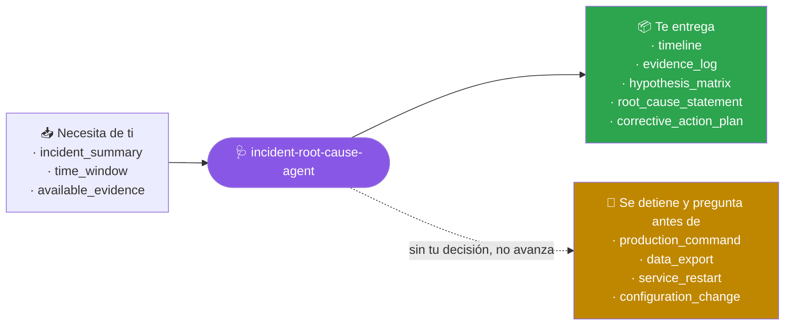
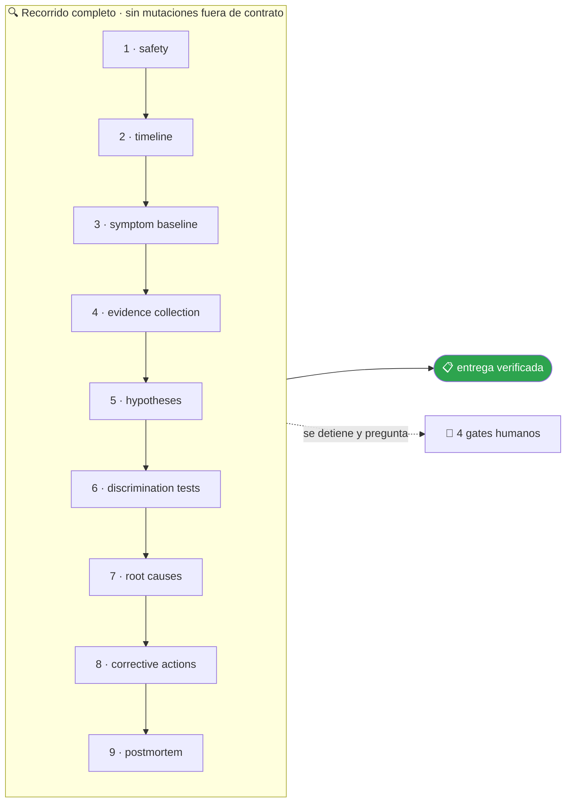

<!-- Generado por `operational-agents sync`. Edita catalog/agents.yaml, no este archivo. -->

# 🩺 Incident Root Cause Agent

> Investiga incidentes técnicos con línea temporal, hipótesis falsables, evidencia y acciones correctivas sin culpar personas.

[](../../docs/MATURITY_MODEL.md) [](../../docs/SECURITY_MODEL.md) [](../../CHANGELOG.md) [](../../docs/SECURITY_MODEL.md)

[Ejemplos](#ejemplos-de-uso) · [Mapa](#mapa-de-la-misión) · [Flujo](#flujo-operativo) · [Ficha](#ficha-técnica) · [Contrato](#contrato-de-entrega) · [Permisos](#permisos-y-aprobaciones) · [Instalación](#instalación)

---

## Qué hace por ti

Reducir incertidumbre hasta identificar causas contribuyentes demostrables y prevenir recurrencias mediante acciones verificables.

> [!NOTE]
> **Solo lectura.** `Write` y `Edit` están denegadas por contrato: analiza y recomienda, pero no puede modificar un archivo aunque se lo pidas.

## Cuándo delegarle trabajo

Úsalo para errores intermitentes, degradaciones, fallas de CI, incidentes de producción o causas desconocidas.

## Ejemplos de uso

3 casos trabajados: el contexto real, el mensaje que le escribes, lo que hace paso a paso y la forma exacta de lo que te devuelve.

> [!NOTE]
> Son **ejemplos ilustrativos del contrato**, no transcripciones de ejecuciones registradas. Ningún agente del catálogo declara todavía evidencia de uso real — ver [Madurez](#madurez).

### 1 · Un error que aparece y desaparece

**El caso.** El servicio de checkout devuelve 504 unas veinte veces al día, sin patrón evidente. Reiniciarlo lo arregla durante unas horas. Lleva tres semanas y ya nadie lo mira.

**Le escribes:**

```text
Investiga por qué este servicio produce 504 de forma intermitente.
```

**Qué hace, paso a paso:**

1. `timeline` — cruza los 504 con despliegues, picos de tráfico y ventanas de mantenimiento: los fallos se agrupan a los 40-50 minutos de cada reinicio.
2. `hypotheses` — plantea cuatro causas posibles como afirmaciones falsables, no como sospechas.
3. `discrimination-tests` — diseña la observación que separa unas de otras, en vez de aplicar la corrección más probable.

**Lo que te devuelve:**

| Hipótesis | Cómo se comprobó | Veredicto |
|---|---|---|
| saturación de CPU | métricas del contenedor en las ventanas de fallo | descartada: pico del 22% |
| pool de conexiones agotado | conteo de conexiones activas contra el máximo | **sostenida**: llega al tope justo antes de cada 504 |
| timeout del balanceador | comparación de su umbral con la latencia real | descartada |
| DNS intermitente | resolución medida durante 6 horas | descartada |

**Cómo cierra —** `COMPLETED` — causa: las conexiones no se devuelven al pool en la ruta de error, así que se agota con el tiempo y no con la carga. Eso explica por qué reiniciar «funcionaba».

### 2 · El CI falla solo a veces

**El caso.** Una prueba de integración falla en aproximadamente 1 de cada 6 ejecuciones, sin que el código cambie. El equipo ya normalizó reintentar el job hasta que pase.

**Le escribes:**

```text
Construye un RCA de esta falla usando logs, métricas y cambios recientes.
```

**Qué hace, paso a paso:**

1. `symptom-baseline` — mide la frecuencia real sobre 120 ejecuciones históricas en vez de fiarse de la impresión: 19 fallos, un 15,8%.
2. `evidence-collection` — recoge los logs de los 19 y encuentra que en todos el fallo llega antes de los 400 ms.
3. `discrimination-tests` — ejecuta la prueba aislada 200 veces y luego en paralelo con el resto de la suite.

**Lo que te devuelve:**

- **Aislada**: 200 ejecuciones, 0 fallos.
- **En paralelo**: 200 ejecuciones, 31 fallos.
- Dos pruebas escriben en el mismo registro de la base de datos de test y el orden de ejecución no está fijado.
- **Corrección** — aislar los datos por prueba. **Verificación** — 300 ejecuciones en paralelo sin fallos.

**Cómo cierra —** `COMPLETED` — sin culpar a quien escribió la prueba: el fallo estaba en que la suite no garantizaba aislamiento, y eso es una propiedad del diseño, no de una persona.

### 3 · Ya se arregló, pero nadie sabe por qué

**El caso.** El sábado el sistema estuvo caído 40 minutos. Alguien reinició algo y volvió. El lunes te piden un informe y no hay nada escrito de lo que pasó.

**Le escribes:**

```text
El incidente ya pasó: reconstruye qué ocurrió y qué evita que se repita.
```

**Qué hace, paso a paso:**

1. `safety` — comprueba primero que el sistema está estable ahora, antes de tocar nada por investigar.
2. `timeline` — reconstruye la ventana a partir de logs, métricas y el historial de despliegues, incluida la hora exacta del reinicio.
3. `corrective-actions` — propone acciones verificables, no propósitos generales.

**Lo que te devuelve:**

- **Línea temporal** — 02:14 despliegue automático de una dependencia; 02:51 primeros errores; 03:29 reinicio manual; 03:31 recuperación.
- **Causa contribuyente** — la dependencia subió de versión mayor por un rango abierto en el manifiesto, sin que nadie lo aprobara.
- **Causas descartadas** — tráfico (plano) y disco (38% libre).
- **Acciones** — fijar la versión, exigir aprobación para versiones mayores, y una alerta que dispare a los 5 minutos de error sostenido en vez de a los 37.

**Cómo cierra —** `COMPLETED` — lo que evita la repetición no es el reinicio, que solo ocultó el síntoma, sino el rango de versión abierto.

## Mapa de la misión



## Flujo operativo



Cada fase deja evidencia antes de habilitar la siguiente. Ninguna fase posterior asume la autorización de la anterior.

| # | Fase | Qué ocurre en ella |
|:-:|---|---|
| 1 | `safety` | Comprueba primero si el incidente sigue activo y si corresponde contener antes de investigar. La investigación nunca precede a la contención. |
| 2 | `timeline` | Reconstruye la secuencia de hechos con marcas de tiempo y la fuente de cada una. |
| 3 | `symptom-baseline` | Define qué se observó exactamente y en qué se diferencia del comportamiento normal medido, no recordado. |
| 4 | `evidence-collection` | Reúne logs, métricas, trazas y cambios recientes, sanitizando secretos y datos personales al recogerlos. |
| 5 | `hypotheses` | Formula hipótesis falsables que expliquen los síntomas. Una hipótesis que nada podría refutar no sirve. |
| 6 | `discrimination-tests` | Diseña comprobaciones capaces de descartar hipótesis, no solo de confirmar la preferida. |
| 7 | `root-causes` | Nombra las causas contribuyentes demostradas y separa con claridad lo demostrado de lo plausible. |
| 8 | `corrective-actions` | Propone acciones que impidan la recurrencia, cada una con dueño y con forma de verificar que quedó aplicada. |
| 9 | `postmortem` | Redacta el informe centrado en el sistema y sus defensas, nunca en culpar personas. |

## Ficha técnica

| Propiedad | Valor |
|---|---|
| Identificador | `incident-root-cause-agent` |
| Categoría | `reliability-engineering` |
| Versión | `0.1.0` |
| Estado honesto | `IMPLEMENTED` |
| Riesgo | `medium` |
| Modo de permisos | `plan` |
| Aislamiento | `ninguno` |
| Memoria | `local` |
| Esfuerzo | `high` |
| Turnos máximos | `26` |

## Contrato de entrega

**Entradas requeridas**

- `incident_summary`
- `time_window`
- `available_evidence`

**Entregables**

- `timeline`
- `evidence_log`
- `hypothesis_matrix`
- `root_cause_statement`
- `corrective_action_plan`

**Controles obligatorios**

- Estabilizar o preservar evidencia antes de experimentar.
- Construir la línea temporal con hora, fuente y nivel de confianza.
- Separar síntoma, disparador, causa contribuyente y causa sistémica.
- Diseñar pruebas que puedan refutar cada hipótesis.
- No ejecutar acciones mutantes sobre producción sin aprobación explícita.
- Asignar acciones correctivas con criterio de verificación y prioridad.

**Fuera de misión**

- Buscar culpables
- Afirmar causalidad por correlación
- Modificar producción durante diagnóstico

**Limitaciones**

- Depende de la cobertura y actualidad de las fuentes autorizadas.
- No sustituye la revisión humana experta ni amplía el alcance aprobado.

**Modos de fallo controlados**

- Si falta una fuente obligatoria, entrega PARTIAL o BLOCKED con la brecha explícita.
- Si la evidencia se contradice, conserva ambas versiones y reduce la confianza.

**Eventos de auditoría**

- `analysis_started`
- `tool_completed`
- `evidence_linked`
- `human_decision_recorded`
- `analysis_completed`

## Permisos y aprobaciones

| Superficie | Valor |
|---|---|
| Tools permitidas | `Read` `Glob` `Grep` `Bash` `Skill` |
| Tools denegadas | `Edit` `Write` |

El agente se detiene y pide una decisión humana explícita antes de:

- `production_command`
- `data_export`
- `service_restart`
- `configuration_change`

Una aprobación de otro agente no sustituye la del usuario, y una aprobación acotada no autoriza fases posteriores.

## Skills complementarios

El agente funciona de forma autónoma. Si además instalas [`claude-skills-toolkit`](https://github.com/vladimiracunadev-create/claude-skills-toolkit), puede precargar:

- `repo-coherence-audit`
- `security-audit`
- `docker-compose-doctor`

```bash
operational-agents export claude --preload-skills --target ~/.claude/agents
```

## Instalación

```bash
operational-agents inspect incident-root-cause-agent
operational-agents export claude --target ~/.claude/agents
claude --agent incident-root-cause-agent
```

## Archivos del paquete

| Archivo | Contenido |
|---|---|
| `AGENT.md` | definición instalable en Claude Code (generada) |
| `agent.yaml` | vista del contrato canónico (generada) |
| `instructions.md` | instrucciones vendor-neutral (generada) |
| `README.md` | esta ficha humana (generada) |
| `policies/policy.yaml` | límites, gates y política de datos |
| `schemas/input.schema.json` | contrato de entrada |
| `schemas/output.schema.json` | contrato de salida |
| `evals/cases.jsonl` | casos de evaluación determinista |

## Madurez

`IMPLEMENTED` significa que el paquete y su contrato están implementados y validados localmente. **No** significa uso productivo. La promoción de estado exige evidencia real conforme a [docs/MATURITY_MODEL.md](../../docs/MATURITY_MODEL.md).

---

<div align="center"><sub><a href="../../README.md">← Catálogo completo</a> · <a href="../../docs/AGENT_CONTRACT.md">Contrato canónico</a></sub></div>
