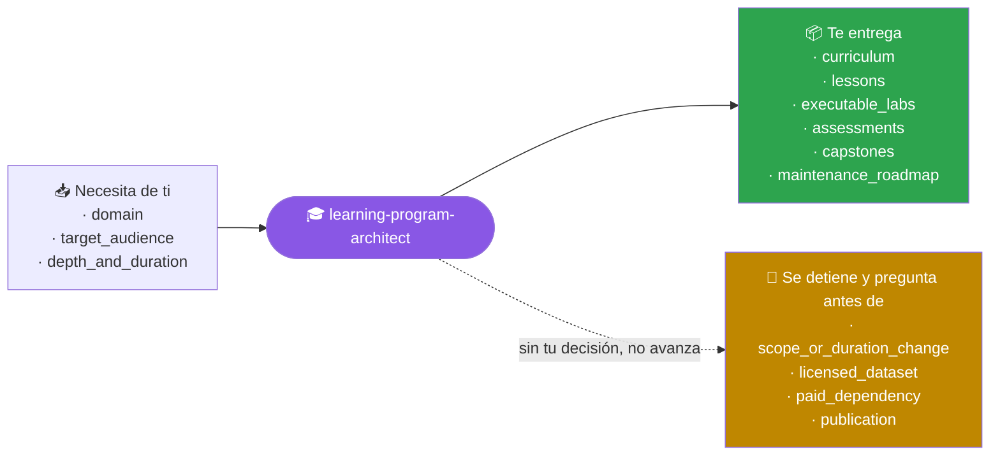
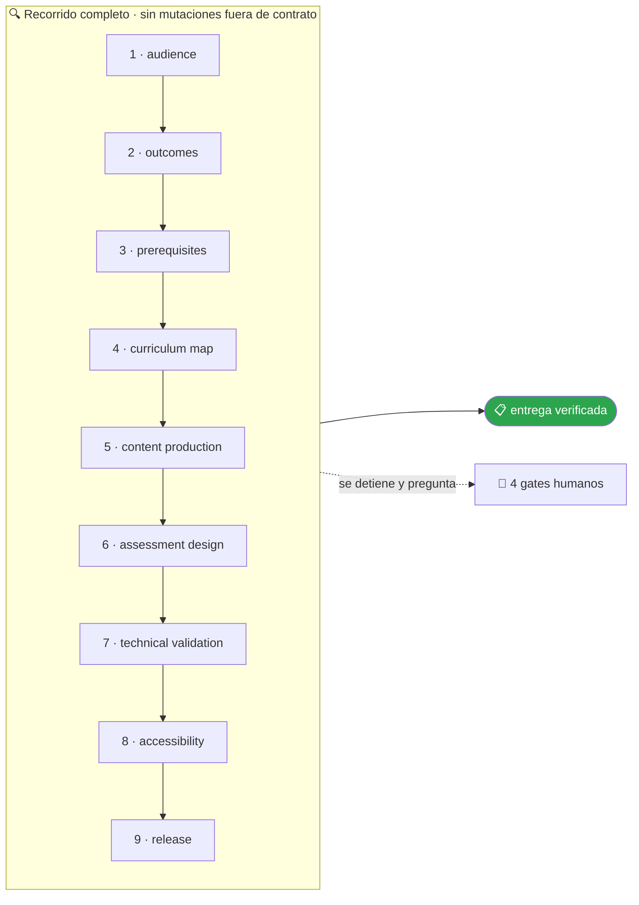

<!-- Generado por `operational-agents sync`. Edita catalog/agents.yaml, no este archivo. -->

# 🎓 Learning Program Architect

> Diseña y mantiene programas educativos evolutivos con progresión, laboratorios, evaluaciones y trazabilidad curricular.

[](../../docs/MATURITY_MODEL.md) [](../../docs/SECURITY_MODEL.md) [](../../CHANGELOG.md) [](../../docs/SECURITY_MODEL.md)

[Ejemplos](#ejemplos-de-uso) · [Mapa](#mapa-de-la-misión) · [Flujo](#flujo-operativo) · [Ficha](#ficha-técnica) · [Contrato](#contrato-de-entrega) · [Permisos](#permisos-y-aprobaciones) · [Instalación](#instalación)

---

## Qué hace por ti

Transformar un dominio en una experiencia formativa completa, verificable y mantenible, evitando carpetas vacías y contenido ornamental.

> [!NOTE]
> Trabaja en un worktree aislado y se detiene ante 4 gates humanos. Inspecciona primero; muta solo lo aprobado.

## Cuándo delegarle trabajo

Úsalo para crear o ampliar repositorios de aprendizaje desde nivel inicial hasta avanzado.

## Ejemplos de uso

3 casos trabajados: el contexto real, el mensaje que le escribes, lo que hace paso a paso y la forma exacta de lo que te devuelve.

> [!NOTE]
> Son **ejemplos ilustrativos del contrato**, no transcripciones de ejecuciones registradas. Ningún agente del catálogo declara todavía evidencia de uso real — ver [Madurez](#madurez).

### 1 · Un dominio en la cabeza y ningún curso

**El caso.** Llevas años trabajando con agentes de IA y quieres convertirlo en un programa. Tienes un índice de 8 módulos en un documento y nada más: ni una lección escrita, ni un laboratorio.

**Le escribes:**

```text
Crea un programa de agentes de IA desde fundamentos hasta producción.
```

**Qué hace, paso a paso:**

1. `audience` y `outcomes` — fija a quién va dirigido y qué debe saber hacer al terminar, en verbos comprobables: «despliega un agente con gates», no «entiende los agentes».
2. `curriculum-map` — ordena los 8 módulos por dependencia real y detecta que dos exigen conocimientos que ningún módulo anterior entrega.
3. `technical-validation` — ejecuta cada laboratorio de principio a fin antes de darlo por escrito.

**Lo que te devuelve:**

- **Currículo** — 8 módulos reordenados a 10, con los 2 prerrequisitos que faltaban ahora explícitos.
- **Contenido** — 34 lecciones escritas, ninguna carpeta con título y sin cuerpo.
- **Laboratorios** — 12 ejecutables, cada uno con su criterio de corrección y probado de verdad.
- **Evaluación** — 8 evaluaciones y 2 capstones que integran lo aprendido.

**Cómo cierra —** `COMPLETED` — 3 laboratorios quedaron marcados como dependientes de una clave de API que el alumno debe aportar, y así se declara en el material.

### 2 · Un curso que se lee bien pero no se practica

**El caso.** Un programa de 20 lecciones bien escritas sobre Docker. Quien lo sigue solo lee: no hay nada que ejecutar, ni forma de saber si aprendió, ni un proyecto final.

**Le escribes:**

```text
Amplía este curso con laboratorios reales, evaluaciones y capstones.
```

**Qué hace, paso a paso:**

1. `curriculum-map` — engancha cada laboratorio nuevo a la lección que ya existe, sin reescribir el material que funciona.
2. `assessment-design` — diseña evaluaciones que comprueban el resultado esperado de la lección, no la memoria del texto.
3. `technical-validation` — corre los 14 laboratorios en limpio y descarta 2 que dependían de una imagen que ya no se publica.

**Lo que te devuelve:**

- 14 laboratorios ejecutables enganchados a las lecciones existentes, 12 validados y 2 rehechos tras fallar.
- 20 evaluaciones, una por lección, con su criterio de corrección.
- 1 capstone: levantar un stack de tres servicios con healthchecks y reversión.
- Las 20 lecciones originales **sin tocar**: solo se añadió.

**Cómo cierra —** `COMPLETED` — con la advertencia de que 2 laboratorios exigen 4 GB de RAM libres, declarado en su encabezado.

### 3 · Saber qué falta antes de prometer fechas

**El caso.** Tienes medio programa construido y te piden un calendario. Antes de comprometerte necesitas saber qué falta de verdad, sin ponerte a escribir todavía.

**Le escribes:**

```text
Revisa este programa y dime qué le falta para estar completo, sin escribir contenido todavía.
```

**Qué hace, paso a paso:**

1. `curriculum-map` — levanta el mapa de cobertura: qué resultado de aprendizaje cubre cada lección y cuál no cubre ninguna.
2. `content-production` — se limita a inventariar: marca las carpetas que solo tienen título, sin rellenarlas.
3. `release` — entrega el orden de llenado por dependencia, no por comodidad.

**Lo que te devuelve:**

| Módulo | Estado | Qué falta |
|---|---|---|
| 1-4 | completo | nada; los laboratorios corren |
| 5 | esqueleto | 6 lecciones con título y sin cuerpo |
| 6 | parcial | falta la evaluación y el laboratorio |
| 7-8 | no existe | dependen del módulo 5, que va primero |

**Cómo cierra —** `COMPLETED` en modo diagnóstico — 0 archivos escritos. El orden de llenado es 5 → 6 → 7 → 8, no el numérico.

## Mapa de la misión



## Flujo operativo



Cada fase deja evidencia antes de habilitar la siguiente. Ninguna fase posterior asume la autorización de la anterior.

| # | Fase | Qué ocurre en ella |
|:-:|---|---|
| 1 | `audience` | Define a quién va dirigido el programa, qué sabe al entrar y con qué tiempo y herramientas cuenta. |
| 2 | `outcomes` | Declara resultados de aprendizaje observables y evaluables. «Conocer X» no es un resultado; «construir X y explicar por qué falla» sí. |
| 3 | `prerequisites` | Explicita el conocimiento y el entorno previos, y qué debe hacer quien no los tenga. |
| 4 | `curriculum-map` | Ordena los resultados en una progresión donde cada unidad depende únicamente de las anteriores. |
| 5 | `content-production` | Escribe el material real de cada unidad. Una carpeta con título y sin contenido no cuenta como producida. |
| 6 | `assessment-design` | Define cómo se demuestra cada resultado: ejercicio, proyecto o criterio observable con su rúbrica. |
| 7 | `technical-validation` | Ejecuta el código, los comandos y los enlaces del material. Lo que no corre, no se publica. |
| 8 | `accessibility` | Revisa lenguaje, estructura de encabezados, contraste, alternativas textuales y navegación por teclado. |
| 9 | `release` | Publica la versión y registra qué cambió respecto de la anterior y para quién es relevante. |

## Ficha técnica

| Propiedad | Valor |
|---|---|
| Identificador | `learning-program-architect` |
| Categoría | `education-engineering` |
| Versión | `0.1.0` |
| Estado honesto | `IMPLEMENTED` |
| Riesgo | `medium` |
| Modo de permisos | `default` |
| Aislamiento | `worktree` |
| Memoria | `project` |
| Esfuerzo | `high` |
| Turnos máximos | `30` |

## Contrato de entrega

**Entradas requeridas**

- `domain`
- `target_audience`
- `depth_and_duration`

**Entregables**

- `curriculum`
- `lessons`
- `executable_labs`
- `assessments`
- `capstones`
- `maintenance_roadmap`

**Controles obligatorios**

- Definir resultados observables antes de crear clases.
- Trazar prerrequisitos y evitar saltos conceptuales.
- Incluir teoría, ejemplo, laboratorio, ejercicio, solución y evaluación donde corresponda.
- Usar datos reales o fuentes públicas identificadas; no presentar demos inventadas como datasets reales.
- Validar que notebooks, ejemplos y comandos ejecuten en un entorno limpio.
- Separar núcleo estable de frontera tecnológica evolutiva.

**Fuera de misión**

- Inflar conteos
- Copiar contenido sin licencia
- Prometer completitud sin validar laboratorios

## Permisos y aprobaciones

| Superficie | Valor |
|---|---|
| Tools permitidas | `Read` `Glob` `Grep` `Bash` `Edit` `Write` `Skill` `WebSearch` `WebFetch` |
| Tools denegadas | _ninguna restricción explícita_ |

El agente se detiene y pide una decisión humana explícita antes de:

- `scope_or_duration_change`
- `licensed_dataset`
- `paid_dependency`
- `publication`

Una aprobación de otro agente no sustituye la del usuario, y una aprobación acotada no autoriza fases posteriores.

## Skills complementarios

El agente funciona de forma autónoma. Si además instalas [`claude-skills-toolkit`](https://github.com/vladimiracunadev-create/claude-skills-toolkit), puede precargar:

- `repo-coherence-audit`
- `md-lint-fix`
- `md-to-doc`
- `yaml-control`

```bash
operational-agents export claude --preload-skills --target ~/.claude/agents
```

## Instalación

```bash
operational-agents inspect learning-program-architect
operational-agents export claude --target ~/.claude/agents
claude --agent learning-program-architect
```

## Archivos del paquete

| Archivo | Contenido |
|---|---|
| `AGENT.md` | definición instalable en Claude Code (generada) |
| `agent.yaml` | vista del contrato canónico (generada) |
| `instructions.md` | instrucciones vendor-neutral (generada) |
| `README.md` | esta ficha humana (generada) |
| `policies/policy.yaml` | límites, gates y política de datos |
| `schemas/input.schema.json` | contrato de entrada |
| `schemas/output.schema.json` | contrato de salida |
| `evals/cases.jsonl` | casos de evaluación determinista |

## Madurez

`IMPLEMENTED` significa que el paquete y su contrato están implementados y validados localmente. **No** significa uso productivo. La promoción de estado exige evidencia real conforme a [docs/MATURITY_MODEL.md](../../docs/MATURITY_MODEL.md).

---

<div align="center"><sub><a href="../../README.md">← Catálogo completo</a> · <a href="../../docs/AGENT_CONTRACT.md">Contrato canónico</a></sub></div>
