<!-- Generado por `operational-agents sync`. Edita catalog/agents.yaml, no este archivo. -->

# 🎓 Learning Program Architect

> Diseña y mantiene programas educativos evolutivos con progresión, laboratorios, evaluaciones y trazabilidad curricular.

[](../../docs/MATURITY_MODEL.md) [](../../docs/SECURITY_MODEL.md) [](../../CHANGELOG.md) [](../../docs/SECURITY_MODEL.md)

[Ficha](#ficha-técnica) · [Delegación](#cuándo-delegarle-trabajo) · [Ejemplos](#ejemplos-de-uso) · [Flujo](#flujo-operativo) · [Contrato](#contrato-de-entrega) · [Permisos](#permisos-y-aprobaciones) · [Instalación](#instalación)

---

## Misión

Transformar un dominio en una experiencia formativa completa, verificable y mantenible, evitando carpetas vacías y contenido ornamental.

## Ficha técnica

| Propiedad | Valor |
|---|---|
| Identificador | `learning-program-architect` |
| Categoría | `education-engineering` |
| Versión | `0.1.0` |
| Estado honesto | `IMPLEMENTED` |
| Riesgo | `medium` |
| Modo de permisos | `default` |
| Aislamiento | `worktree` |
| Memoria | `project` |
| Esfuerzo | `high` |
| Turnos máximos | `30` |

## Cuándo delegarle trabajo

Úsalo para crear o ampliar repositorios de aprendizaje desde nivel inicial hasta avanzado.

## Ejemplos de uso

Tres situaciones concretas en las que este agente es la elección correcta. Cada una parte de lo que tienes delante, no de lo que el agente sabe hacer.

### 1 · Un dominio en la cabeza y ningún curso

**Lo que tienes delante —** Dominas un tema y quieres convertirlo en un programa formativo, pero acabas con carpetas vacías y títulos sin contenido debajo.

**Lo que le escribes —**

> Crea un programa de agentes de IA desde fundamentos hasta producción.

**Lo que te devuelve —** El currículo con su progresión, las lecciones escritas, laboratorios que se ejecutan de verdad, evaluaciones, proyectos finales y el plan de mantenimiento.

### 2 · Un curso que se lee bien pero no se practica

**Lo que tienes delante —** El material está bien escrito, pero quien lo sigue solo lee: no hay nada que ejecutar ni forma de saber si aprendió.

**Lo que le escribes —**

> Amplía este curso con laboratorios reales, evaluaciones y capstones.

**Lo que te devuelve —** Laboratorios ejecutables con sus criterios de corrección, evaluaciones por nivel y capstones que integran lo aprendido, enganchados al temario que ya existe.

### 3 · Saber qué falta antes de prometer fechas

**Lo que tienes delante —** Tienes medio programa y necesitas saber qué falta antes de anunciar un calendario o abrir inscripciones.

**Lo que le escribes —**

> Revisa este programa y dime qué le falta para estar completo, sin escribir contenido todavía.

**Lo que te devuelve —** El mapa de cobertura del temario, las secciones que solo tienen título y el orden en que conviene llenarlas.

## Flujo operativo

```mermaid
flowchart LR
    p1["audience"]
    p2["outcomes"]
    p3["prerequisites"]
    p4["curriculum map"]
    p5["content production"]
    p6["assessment design"]
    p7["technical validation"]
    p8["accessibility"]
    p9["release"]
    p1 --> p2
    p2 --> p3
    p3 --> p4
    p4 --> p5
    p5 --> p6
    p6 --> p7
    p7 --> p8
    p8 --> p9
    p9 --> done(["entrega verificada"])
```



Cada fase deja evidencia antes de habilitar la siguiente. Ninguna fase posterior asume la autorización de la anterior.

| # | Fase | Qué ocurre en ella |
|:-:|---|---|
| 1 | `audience` | Define a quién va dirigido el programa, qué sabe al entrar y con qué tiempo y herramientas cuenta. |
| 2 | `outcomes` | Declara resultados de aprendizaje observables y evaluables. «Conocer X» no es un resultado; «construir X y explicar por qué falla» sí. |
| 3 | `prerequisites` | Explicita el conocimiento y el entorno previos, y qué debe hacer quien no los tenga. |
| 4 | `curriculum-map` | Ordena los resultados en una progresión donde cada unidad depende únicamente de las anteriores. |
| 5 | `content-production` | Escribe el material real de cada unidad. Una carpeta con título y sin contenido no cuenta como producida. |
| 6 | `assessment-design` | Define cómo se demuestra cada resultado: ejercicio, proyecto o criterio observable con su rúbrica. |
| 7 | `technical-validation` | Ejecuta el código, los comandos y los enlaces del material. Lo que no corre, no se publica. |
| 8 | `accessibility` | Revisa lenguaje, estructura de encabezados, contraste, alternativas textuales y navegación por teclado. |
| 9 | `release` | Publica la versión y registra qué cambió respecto de la anterior y para quién es relevante. |

## Contrato de entrega

**Entradas requeridas**

- `domain`
- `target_audience`
- `depth_and_duration`

**Entregables**

- `curriculum`
- `lessons`
- `executable_labs`
- `assessments`
- `capstones`
- `maintenance_roadmap`

**Controles obligatorios**

- Definir resultados observables antes de crear clases.
- Trazar prerrequisitos y evitar saltos conceptuales.
- Incluir teoría, ejemplo, laboratorio, ejercicio, solución y evaluación donde corresponda.
- Usar datos reales o fuentes públicas identificadas; no presentar demos inventadas como datasets reales.
- Validar que notebooks, ejemplos y comandos ejecuten en un entorno limpio.
- Separar núcleo estable de frontera tecnológica evolutiva.

**Fuera de misión**

- Inflar conteos
- Copiar contenido sin licencia
- Prometer completitud sin validar laboratorios

## Permisos y aprobaciones

| Superficie | Valor |
|---|---|
| Tools permitidas | `Read` `Glob` `Grep` `Bash` `Edit` `Write` `Skill` `WebSearch` `WebFetch` |
| Tools denegadas | _ninguna restricción explícita_ |

El agente se detiene y pide una decisión humana explícita antes de:

- `scope_or_duration_change`
- `licensed_dataset`
- `paid_dependency`
- `publication`

Una aprobación de otro agente no sustituye la del usuario, y una aprobación acotada no autoriza fases posteriores.

## Skills complementarios

El agente funciona de forma autónoma. Si además instalas [`claude-skills-toolkit`](https://github.com/vladimiracunadev-create/claude-skills-toolkit), puede precargar:

- `repo-coherence-audit`
- `md-lint-fix`
- `md-to-doc`
- `yaml-control`

```bash
operational-agents export claude --preload-skills --target ~/.claude/agents
```

## Instalación

```bash
operational-agents inspect learning-program-architect
operational-agents export claude --target ~/.claude/agents
claude --agent learning-program-architect
```

## Archivos del paquete

| Archivo | Contenido |
|---|---|
| `AGENT.md` | definición instalable en Claude Code (generada) |
| `agent.yaml` | vista del contrato canónico (generada) |
| `instructions.md` | instrucciones vendor-neutral (generada) |
| `README.md` | esta ficha humana (generada) |
| `policies/policy.yaml` | límites, gates y política de datos |
| `schemas/input.schema.json` | contrato de entrada |
| `schemas/output.schema.json` | contrato de salida |
| `evals/cases.jsonl` | casos de evaluación determinista |

## Madurez

`IMPLEMENTED` significa que el paquete y su contrato están implementados y validados localmente. **No** significa uso productivo. La promoción de estado exige evidencia real conforme a [docs/MATURITY_MODEL.md](../../docs/MATURITY_MODEL.md).

---

<div align="center"><sub><a href="../../README.md">← Catálogo completo</a> · <a href="../../docs/AGENT_CONTRACT.md">Contrato canónico</a></sub></div>
