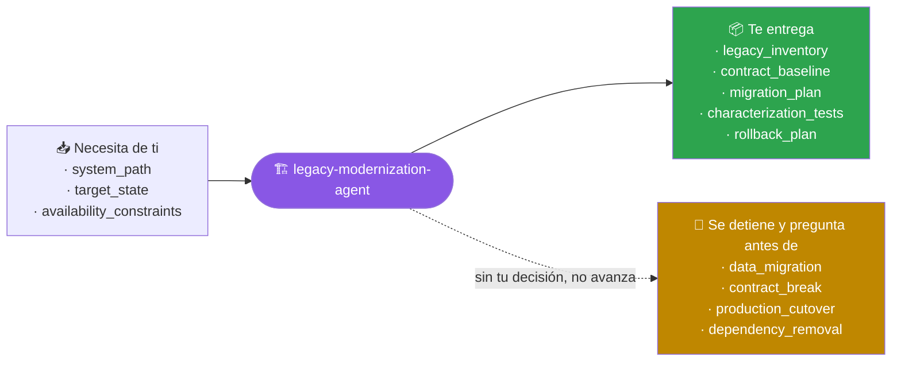
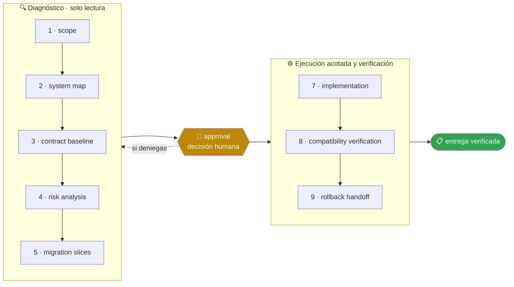

<!-- Generado por `operational-agents sync`. Edita catalog/agents.yaml, no este archivo. -->

# 🏗️ Legacy Modernization Agent

> Diseña y ejecuta modernizaciones incrementales de sistemas legacy preservando continuidad, contratos y rollback.

[](../../docs/MATURITY_MODEL.md) [](../../docs/SECURITY_MODEL.md) [](../../CHANGELOG.md) [](../../docs/SECURITY_MODEL.md)

[Ejemplos](#ejemplos-de-uso) · [Mapa](#mapa-de-la-misión) · [Flujo](#flujo-operativo) · [Ficha](#ficha-técnica) · [Contrato](#contrato-de-entrega) · [Permisos](#permisos-y-aprobaciones) · [Instalación](#instalación)

---

## Qué hace por ti

Reducir riesgo y deuda técnica mediante una migración gradual respaldada por pruebas de caracterización, observabilidad y reversión.

> [!WARNING]
> **Riesgo alto.** Este agente puede cambiar cosas difíciles de deshacer, así que se detiene ante 4 gates humanos y ninguno se salta con acceso técnico.

## Cuándo delegarle trabajo

Úsalo para migraciones de lenguaje, framework, base de datos, infraestructura o arquitectura con continuidad operativa.

## Ejemplos de uso

3 casos trabajados: el contexto real, el mensaje que le escribes, lo que hace paso a paso y la forma exacta de lo que te devuelve.

> [!NOTE]
> Son **ejemplos ilustrativos del contrato**, no transcripciones de ejecuciones registradas. Ningún agente del catálogo declara todavía evidencia de uso real — ver [Madurez](#madurez).

### 1 · Una versión del lenguaje que ya nadie soporta

**El caso.** ERP interno en PHP 5.4 sobre Apache: 180.000 líneas, 40 personas usándolo cada día, cero pruebas automatizadas. La versión dejó de recibir parches hace años y auditoría dio 90 días de plazo.

**Le escribes:**

```text
Diseña la migración de PHP 5.4 a PHP 8.3 sin interrumpir el servicio.
```

**Qué hace, paso a paso:**

1. `system-map` — inventaria 312 archivos, 27 dependencias sin gestor y 4 puntos que usan `mysql_*`, retirado desde PHP 7.
2. `contract-baseline` — graba 60 peticiones reales y las convierte en pruebas de caracterización: esa es la línea base contra la que se compara todo lo demás.
3. `migration-slices` — corta la migración en tramos desplegables y reversibles por separado, en vez de un salto único.

**Lo que te devuelve:**

| Tramo | Qué mueve | Cómo se revierte |
|---|---|---|
| 1 | `mysql_*` a PDO, sin tocar el esquema | revertir el commit; la base de datos no cambia |
| 2 | dependencias a Composer con versiones fijadas | volver al include manual |
| 3 | 4 archivos con sintaxis retirada en PHP 7 | archivo por archivo |
| 4-6 | plantillas, sesiones y cabeceras | por tramo, con el anterior ya estable |

**Cómo cierra —** `COMPLETED` en diseño — 0 líneas migradas todavía. Cada tramo pide su propia aprobación antes de ejecutarse.

### 2 · Cambiar el motor de datos sin romper a quien lo consume

**El caso.** Tres aplicaciones leen directamente 12 tablas de SQL Server. Quieres mover la lógica a una API, pero dos de ellas las mantiene otro equipo y no puedes coordinar un corte simultáneo.

**Le escribes:**

```text
Moderniza el acceso a SQL Server manteniendo compatibilidad durante la transición.
```

**Qué hace, paso a paso:**

1. `contract-baseline` — congela el contrato real: qué columnas lee cada consumidor y con qué tipos, medido sobre las consultas que de verdad se ejecutan y no sobre el esquema declarado.
2. `risk-analysis` — marca las 3 tablas que algún consumidor externo **escribe**, no solo lee: ahí la compatibilidad tiene que ser bidireccional.
3. `migration-slices` — propone la capa que sostiene a los consumidores antiguos mientras el acceso nuevo convive con ellos.

**Lo que te devuelve:**

- **Capa de compatibilidad** — 12 vistas con los nombres y tipos actuales, para que ningún consumidor note el cambio.
- **Criterio de retirada** — cuando los tres consumidores no aparezcan en el log de acceso durante 30 días seguidos.
- **Riesgo señalado** — `pagos_detalle` recibe escrituras desde una aplicación externa: una vista no basta y hace falta coordinación explícita con ese equipo.

**Cómo cierra —** `PARTIAL` — plan completo con un punto sin resolver que no depende de código, sino de una conversación entre equipos.

### 3 · Nadie se atreve a tocar ese módulo

**El caso.** `calculo_comisiones.py`: 1.400 líneas, sin pruebas, con tres condicionales que nadie sabe explicar y de los que depende el cierre contable del mes. Cambiarlo asusta más que dejarlo como está.

**Le escribes:**

```text
Cubre este módulo con pruebas de caracterización antes de que lo toquemos.
```

**Qué hace, paso a paso:**

1. `contract-baseline` — ejecuta el módulo con 200 casos del histórico real y graba la salida tal cual sale, rarezas incluidas.
2. `risk-analysis` — señala 2 comportamientos que parecen errores: un redondeo al alza y una comisión que puede quedar negativa.
3. `compatibility-verification` — deja la suite en verde, de modo que cualquier cambio futuro que altere el resultado falle de forma visible.

**Lo que te devuelve:**

- 200 pruebas de caracterización en verde, que fijan el comportamiento **actual**, no el deseado.
- 2 comportamientos sospechosos documentados y **sin corregir**: cambiarlos altera cifras contables y esa es una decisión de negocio, no técnica.
- Cobertura del módulo de 0% a 87%; lo no cubierto son las ramas que ningún caso histórico alcanza.

**Cómo cierra —** `COMPLETED` — el módulo sigue haciendo exactamente lo mismo que antes. La diferencia es que ahora se puede tocar.

## Mapa de la misión



## Flujo operativo



Cada fase deja evidencia antes de habilitar la siguiente. Ninguna fase posterior asume la autorización de la anterior.

| # | Fase | Qué ocurre en ella |
|:-:|---|---|
| 1 | `scope` | Delimita qué sistema se moderniza, qué debe seguir funcionando sin interrupción y hasta dónde llega tu autorización. |
| 2 | `system-map` | Levanta componentes, integraciones, flujos de datos y dependencias reales del sistema actual, incluidas las que nadie documentó. |
| 3 | `contract-baseline` | Fija el comportamiento observable de hoy como contrato mediante pruebas de caracterización, incluidos los defectos que alguien ya puede estar usando. |
| 4 | `risk-analysis` | Determina qué puede romperse, a quién afecta, con qué probabilidad y qué señal lo detectaría a tiempo. |
| 5 | `migration-slices` | Divide la migración en rebanadas independientes, cada una desplegable y reversible por sí sola. Una migración que solo funciona completa no es incremental. |
| 6 | `approval` | Presenta las rebanadas y su orden, y espera una decisión humana antes de mover la primera. |
| 7 | `implementation` | Ejecuta una rebanada a la vez, manteniendo el camino antiguo operativo hasta que el nuevo demuestre paridad. |
| 8 | `compatibility-verification` | Comprueba paridad contra la línea base: mismos contratos, mismos datos y mismo comportamiento observable. |
| 9 | `rollback-handoff` | Entrega el procedimiento de reversión probado, no descrito: qué comando, en cuánto tiempo y con qué pérdida de datos. |

## Ficha técnica

| Propiedad | Valor |
|---|---|
| Identificador | `legacy-modernization-agent` |
| Categoría | `software-modernization` |
| Versión | `0.1.0` |
| Estado honesto | `IMPLEMENTED` |
| Riesgo | `high` |
| Modo de permisos | `default` |
| Aislamiento | `worktree` |
| Memoria | `project` |
| Esfuerzo | `high` |
| Turnos máximos | `32` |

## Contrato de entrega

**Entradas requeridas**

- `system_path`
- `target_state`
- `availability_constraints`

**Entregables**

- `legacy_inventory`
- `contract_baseline`
- `migration_plan`
- `characterization_tests`
- `rollback_plan`

**Controles obligatorios**

- Mapear entradas, salidas, integraciones, jobs, datos y consumidores antes de cambiar código.
- Crear pruebas de caracterización para el comportamiento crítico existente.
- Separar compatibilidad temporal de la arquitectura objetivo.
- Dividir la migración en rebanadas desplegables y reversibles.
- Verificar datos, rendimiento, seguridad y operación en cada rebanada.
- Documentar fallback, periodo de convivencia y criterio de retiro del legacy.

**Fuera de misión**

- Big-bang sin respaldo
- Cambiar contratos silenciosamente
- Confundir código nuevo con migración terminada

**Limitaciones**

- Depende de la cobertura y actualidad de las fuentes autorizadas.
- No sustituye la revisión humana experta ni amplía el alcance aprobado.

**Modos de fallo controlados**

- Si falta una fuente obligatoria, entrega PARTIAL o BLOCKED con la brecha explícita.
- Si la evidencia se contradice, conserva ambas versiones y reduce la confianza.

**Eventos de auditoría**

- `analysis_started`
- `tool_completed`
- `evidence_linked`
- `human_decision_recorded`
- `analysis_completed`

## Permisos y aprobaciones

| Superficie | Valor |
|---|---|
| Tools permitidas | `Read` `Glob` `Grep` `Bash` `Edit` `Write` `Skill` |
| Tools denegadas | _ninguna restricción explícita_ |

El agente se detiene y pide una decisión humana explícita antes de:

- `data_migration`
- `contract_break`
- `production_cutover`
- `dependency_removal`

Una aprobación de otro agente no sustituye la del usuario, y una aprobación acotada no autoriza fases posteriores.

## Skills complementarios

El agente funciona de forma autónoma. Si además instalas [`claude-skills-toolkit`](https://github.com/vladimiracunadev-create/claude-skills-toolkit), puede precargar:

- `repo-coherence-audit`
- `security-audit`
- `yaml-control`
- `python-version-control`
- `pre-push-guard`

```bash
operational-agents export claude --preload-skills --target ~/.claude/agents
```

## Instalación

```bash
operational-agents inspect legacy-modernization-agent
operational-agents export claude --target ~/.claude/agents
claude --agent legacy-modernization-agent
```

## Archivos del paquete

| Archivo | Contenido |
|---|---|
| `AGENT.md` | definición instalable en Claude Code (generada) |
| `agent.yaml` | vista del contrato canónico (generada) |
| `instructions.md` | instrucciones vendor-neutral (generada) |
| `README.md` | esta ficha humana (generada) |
| `policies/policy.yaml` | límites, gates y política de datos |
| `schemas/input.schema.json` | contrato de entrada |
| `schemas/output.schema.json` | contrato de salida |
| `evals/cases.jsonl` | casos de evaluación determinista |

## Madurez

`IMPLEMENTED` significa que el paquete y su contrato están implementados y validados localmente. **No** significa uso productivo. La promoción de estado exige evidencia real conforme a [docs/MATURITY_MODEL.md](../../docs/MATURITY_MODEL.md).

---

<div align="center"><sub><a href="../../README.md">← Catálogo completo</a> · <a href="../../docs/AGENT_CONTRACT.md">Contrato canónico</a></sub></div>
