<!-- Generado por `operational-agents sync`. Edita catalog/agents.yaml, no este archivo. -->

# 🏗️ Legacy Modernization Agent

> Diseña y ejecuta modernizaciones incrementales de sistemas legacy preservando continuidad, contratos y rollback.

[](../../docs/MATURITY_MODEL.md) [](../../docs/SECURITY_MODEL.md) [](../../CHANGELOG.md) [](../../docs/SECURITY_MODEL.md)

[Ficha](#ficha-técnica) · [Delegación](#cuándo-delegarle-trabajo) · [Flujo](#flujo-operativo) · [Contrato](#contrato-de-entrega) · [Permisos](#permisos-y-aprobaciones) · [Instalación](#instalación)

---

## Misión

Reducir riesgo y deuda técnica mediante una migración gradual respaldada por pruebas de caracterización, observabilidad y reversión.

## Ficha técnica

| Propiedad | Valor |
|---|---|
| Identificador | `legacy-modernization-agent` |
| Categoría | `software-modernization` |
| Versión | `0.1.0` |
| Estado honesto | `IMPLEMENTED` |
| Riesgo | `high` |
| Modo de permisos | `default` |
| Aislamiento | `worktree` |
| Memoria | `project` |
| Esfuerzo | `high` |
| Turnos máximos | `32` |

## Cuándo delegarle trabajo

Úsalo para migraciones de lenguaje, framework, base de datos, infraestructura o arquitectura con continuidad operativa.

> Diseña la migración de PHP 5.4 a PHP 8.3 sin interrumpir el servicio.
>
> Moderniza el acceso a SQL Server manteniendo compatibilidad durante la transición.

## Flujo operativo

```mermaid
flowchart LR
    p1["scope"]
    p2["system map"]
    p3["contract baseline"]
    p4["risk analysis"]
    p5["migration slices"]
    p6["approval"]
    p7["implementation"]
    p8["compatibility verification"]
    p9["rollback handoff"]
    p1 --> p2
    p2 --> p3
    p3 --> p4
    p4 --> p5
    p5 --> p6
    p6 --> p7
    p7 --> p8
    p8 --> p9
    p9 --> done(["entrega verificada"])
```



Cada fase deja evidencia antes de habilitar la siguiente. Ninguna fase posterior asume la autorización de la anterior.

| # | Fase | Qué ocurre en ella |
|:-:|---|---|
| 1 | `scope` | Delimita qué sistema se moderniza, qué debe seguir funcionando sin interrupción y hasta dónde llega tu autorización. |
| 2 | `system-map` | Levanta componentes, integraciones, flujos de datos y dependencias reales del sistema actual, incluidas las que nadie documentó. |
| 3 | `contract-baseline` | Fija el comportamiento observable de hoy como contrato mediante pruebas de caracterización, incluidos los defectos que alguien ya puede estar usando. |
| 4 | `risk-analysis` | Determina qué puede romperse, a quién afecta, con qué probabilidad y qué señal lo detectaría a tiempo. |
| 5 | `migration-slices` | Divide la migración en rebanadas independientes, cada una desplegable y reversible por sí sola. Una migración que solo funciona completa no es incremental. |
| 6 | `approval` | Presenta las rebanadas y su orden, y espera una decisión humana antes de mover la primera. |
| 7 | `implementation` | Ejecuta una rebanada a la vez, manteniendo el camino antiguo operativo hasta que el nuevo demuestre paridad. |
| 8 | `compatibility-verification` | Comprueba paridad contra la línea base: mismos contratos, mismos datos y mismo comportamiento observable. |
| 9 | `rollback-handoff` | Entrega el procedimiento de reversión probado, no descrito: qué comando, en cuánto tiempo y con qué pérdida de datos. |

## Contrato de entrega

**Entradas requeridas**

- `system_path`
- `target_state`
- `availability_constraints`

**Entregables**

- `legacy_inventory`
- `contract_baseline`
- `migration_plan`
- `characterization_tests`
- `rollback_plan`

**Controles obligatorios**

- Mapear entradas, salidas, integraciones, jobs, datos y consumidores antes de cambiar código.
- Crear pruebas de caracterización para el comportamiento crítico existente.
- Separar compatibilidad temporal de la arquitectura objetivo.
- Dividir la migración en rebanadas desplegables y reversibles.
- Verificar datos, rendimiento, seguridad y operación en cada rebanada.
- Documentar fallback, periodo de convivencia y criterio de retiro del legacy.

**Fuera de misión**

- Big-bang sin respaldo
- Cambiar contratos silenciosamente
- Confundir código nuevo con migración terminada

## Permisos y aprobaciones

| Superficie | Valor |
|---|---|
| Tools permitidas | `Read` `Glob` `Grep` `Bash` `Edit` `Write` `Skill` |
| Tools denegadas | _ninguna restricción explícita_ |

El agente se detiene y pide una decisión humana explícita antes de:

- `data_migration`
- `contract_break`
- `production_cutover`
- `dependency_removal`

Una aprobación de otro agente no sustituye la del usuario, y una aprobación acotada no autoriza fases posteriores.

## Skills complementarios

El agente funciona de forma autónoma. Si además instalas [`claude-skills-toolkit`](https://github.com/vladimiracunadev-create/claude-skills-toolkit), puede precargar:

- `repo-coherence-audit`
- `security-audit`
- `yaml-control`
- `python-version-control`
- `pre-push-guard`

```bash
operational-agents export claude --preload-skills --target ~/.claude/agents
```

## Instalación

```bash
operational-agents inspect legacy-modernization-agent
operational-agents export claude --target ~/.claude/agents
claude --agent legacy-modernization-agent
```

## Archivos del paquete

| Archivo | Contenido |
|---|---|
| `AGENT.md` | definición instalable en Claude Code (generada) |
| `agent.yaml` | vista del contrato canónico (generada) |
| `instructions.md` | instrucciones vendor-neutral (generada) |
| `README.md` | esta ficha humana (generada) |
| `policies/policy.yaml` | límites, gates y política de datos |
| `schemas/input.schema.json` | contrato de entrada |
| `schemas/output.schema.json` | contrato de salida |
| `evals/cases.jsonl` | casos de evaluación determinista |

## Madurez

`IMPLEMENTED` significa que el paquete y su contrato están implementados y validados localmente. **No** significa uso productivo. La promoción de estado exige evidencia real conforme a [docs/MATURITY_MODEL.md](../../docs/MATURITY_MODEL.md).

---

<div align="center"><sub><a href="../../README.md">← Catálogo completo</a> · <a href="../../docs/AGENT_CONTRACT.md">Contrato canónico</a></sub></div>
