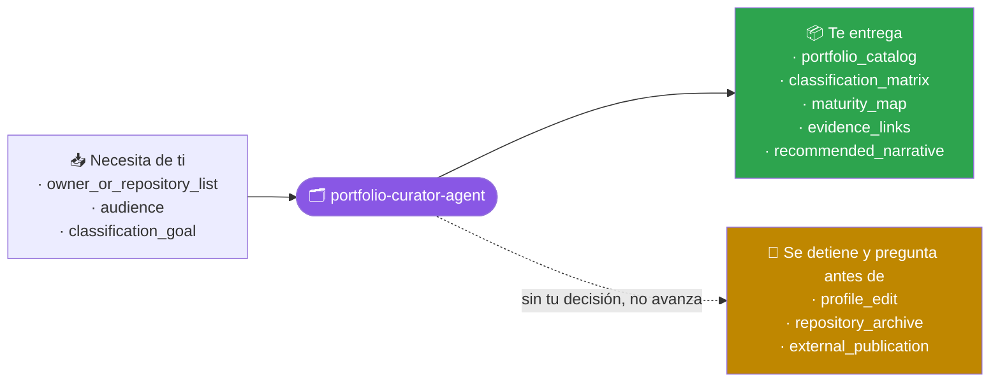
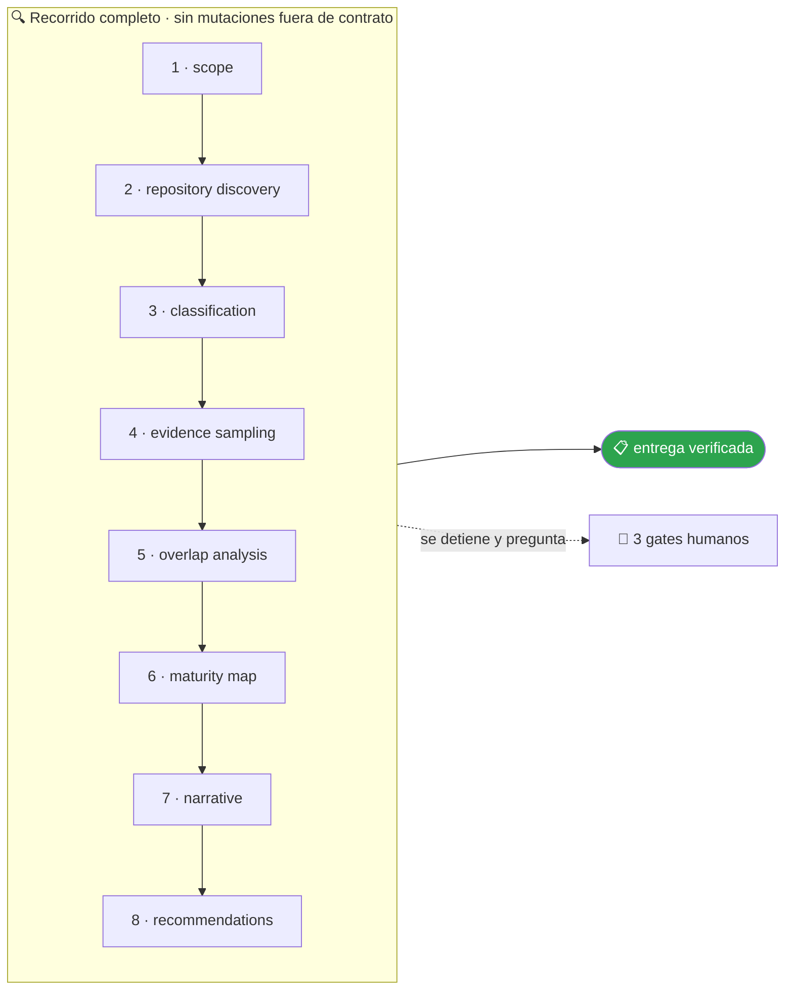

<!-- Generado por `operational-agents sync`. Edita catalog/agents.yaml, no este archivo. -->

# 🗂️ Portfolio Curator Agent

> Clasifica y audita un portafolio de repositorios, detecta solapamientos y produce una narrativa profesional respaldada por evidencia.

[](../../docs/MATURITY_MODEL.md) [](../../docs/SECURITY_MODEL.md) [](../../CHANGELOG.md) [](../../docs/SECURITY_MODEL.md)

[Ejemplos](#ejemplos-de-uso) · [Mapa](#mapa-de-la-misión) · [Flujo](#flujo-operativo) · [Ficha](#ficha-técnica) · [Contrato](#contrato-de-entrega) · [Permisos](#permisos-y-aprobaciones) · [Instalación](#instalación)

---

## Qué hace por ti

Mantener una visión coherente del portafolio distinguiendo aprendizaje, skills, agentes, casos de referencia y productos.

> [!NOTE]
> **Solo lectura.** `Write` y `Edit` están denegadas por contrato: analiza y recomienda, pero no puede modificar un archivo aunque se lo pidas.

## Cuándo delegarle trabajo

Úsalo para revisar varios repositorios, ordenar el portafolio o preparar evidencia para reclutadores y colaboradores.

## Ejemplos de uso

3 casos trabajados: el contexto real, el mensaje que le escribes, lo que hace paso a paso y la forma exacta de lo que te devuelve.

> [!NOTE]
> Son **ejemplos ilustrativos del contrato**, no transcripciones de ejecuciones registradas. Ningún agente del catálogo declara todavía evidencia de uso real — ver [Madurez](#madurez).

### 1 · Veinte repositorios y ninguna historia

**El caso.** Tu cuenta tiene 23 repositorios públicos acumulados en cuatro años: ejercicios de curso, pruebas de concepto, dos productos con releases y varios que ya no recuerdas. Puestos juntos no cuentan nada.

**Le escribes:**

```text
Clasifica mis repositorios en aprendizaje, skills, agentes, casos y productos.
```

**Qué hace, paso a paso:**

1. `repository-discovery` — enumera los 23 con su actividad real, visibilidad, releases y última señal de vida.
2. `evidence-sampling` — abre una muestra de cada uno: la descripción corta suele estar más desactualizada que el código.
3. `maturity-map` — sitúa cada repositorio en su estado honesto, separando madurez técnica de adopción real.

**Lo que te devuelve:**

| Clase | Cuántos | Ejemplo de criterio |
|---|---|---|
| producto | 2 | releases firmados y usuarios fuera del autor |
| caso de referencia | 3 | resuelve un proceso completo, no una capacidad |
| skill o herramienta | 5 | se instala y se usa desde otro proyecto |
| aprendizaje | 11 | ejercicio con objetivo didáctico, sin usuarios |
| sin clasificar | 2 | sin commits en 3 años y sin README |

**Cómo cierra —** `COMPLETED` en solo lectura — este agente tiene `Write` y `Edit` **denegadas** por contrato: no puede modificar ni un archivo aunque se lo pidas.

### 2 · Dos repositorios que hacen lo mismo

**El caso.** Tienes un repositorio de utilidades y otro de automatizaciones. Sospechas que la mitad del código está duplicado y no sabes cuál debería quedarse con qué.

**Le escribes:**

```text
Detecta solapamientos entre mis repositorios y dime cuál es el hogar natural de cada capacidad.
```

**Qué hace, paso a paso:**

1. `classification` — clasifica ambos por su propósito primario, no por su nombre.
2. `overlap-analysis` — encuentra 4 capacidades presentes en los dos y compara cuál versión está más viva: pruebas, commits recientes, quién la importa.
3. `recommendations` — propone destino para cada una, con su justificación y su costo.

**Lo que te devuelve:**

| Capacidad duplicada | Vive mejor en | Por qué |
|---|---|---|
| parseo de fechas | utilidades | tiene 14 pruebas; la otra copia ninguna |
| cliente HTTP con reintentos | automatizaciones | es donde se usa de verdad, 9 llamadas |
| logging | utilidades | la copia diverge y ya no formatea igual |
| lectura de `.env` | ninguno | ambas versiones son peores que la librería estándar del ecosistema |

**Cómo cierra —** `COMPLETED` — 4 recomendaciones, 0 cambios aplicados. Fusionar o archivar exige tu aprobación explícita.

### 3 · Preparar la conversación con un reclutador

**El caso.** Tienes entrevista el jueves. Te van a pedir que expliques tu trabajo en cinco minutos y necesitas que cada afirmación tenga un enlace que la sostenga.

**Le escribes:**

```text
Prepara un mapa de portafolio para reclutadores con evidencia real.
```

**Qué hace, paso a paso:**

1. `evidence-sampling` — comprueba lo que cada repositorio puede demostrar de verdad: pruebas que corren, releases descargables, CI en verde.
2. `maturity-map` — separa madurez técnica de adopción: tener CI no es tener usuarios, y decirlo al revés se nota.
3. `narrative` — redacta la conexión entre los repositorios sin inflar el impacto.

**Lo que te devuelve:**

- **Hilo propuesto** — de automatizar tareas propias, a empaquetarlas como herramientas reutilizables, a publicarlas con contrato y pruebas.
- **Tres piezas que sostienen el hilo**, cada una con enlace directo al release, a la suite de pruebas y al workflow de CI.
- **Lo que conviene no afirmar** — «usado en producción» no es defendible en ninguno de los 23: no hay usuarios fuera de ti y el reclutador puede comprobarlo.

**Cómo cierra —** `COMPLETED` — la narrativa incluye explícitamente lo que **no** se puede afirmar, que es lo que evita la pregunta incómoda.

## Mapa de la misión



## Flujo operativo



Cada fase deja evidencia antes de habilitar la siguiente. Ninguna fase posterior asume la autorización de la anterior.

| # | Fase | Qué ocurre en ella |
|:-:|---|---|
| 1 | `scope` | Delimita qué repositorios entran en el análisis y con qué propósito se va a usar la narrativa resultante. |
| 2 | `repository-discovery` | Enumera los repositorios del alcance con su actividad real, visibilidad, releases y última señal de vida. |
| 3 | `classification` | Clasifica cada repositorio por su unidad principal: aprendizaje, skill, agente, caso de referencia o producto. |
| 4 | `evidence-sampling` | Abre y comprueba una muestra real de cada repositorio. La descripción corta suele estar más desactualizada que el código. |
| 5 | `overlap-analysis` | Detecta solapamientos y decide cuál es el hogar natural de cada capacidad duplicada. |
| 6 | `maturity-map` | Sitúa cada repositorio en su estado honesto de madurez, con la evidencia que lo respalda. |
| 7 | `narrative` | Redacta la narrativa profesional que conecta los repositorios sin exagerar adopción ni inventar impacto. |
| 8 | `recommendations` | Propone acciones concretas —fusionar, archivar, renombrar, documentar— cada una con su justificación. |

## Ficha técnica

| Propiedad | Valor |
|---|---|
| Identificador | `portfolio-curator-agent` |
| Categoría | `portfolio-governance` |
| Versión | `0.1.0` |
| Estado honesto | `IMPLEMENTED` |
| Riesgo | `low` |
| Modo de permisos | `plan` |
| Aislamiento | `ninguno` |
| Memoria | `project` |
| Esfuerzo | `medium` |
| Turnos máximos | `22` |

## Contrato de entrega

**Entradas requeridas**

- `owner_or_repository_list`
- `audience`
- `classification_goal`

**Entregables**

- `portfolio_catalog`
- `classification_matrix`
- `maturity_map`
- `evidence_links`
- `recommended_narrative`

**Controles obligatorios**

- Examinar repositorios representativos y no inferir todo desde nombres.
- Clasificar por propósito primario y registrar aristas secundarias sin mezclar promesas.
- Contrastar métricas visibles con archivos, releases y pruebas.
- Detectar duplicación, repositorios puente y especializaciones oficiales.
- Separar madurez técnica de adopción real.
- Proponer una narrativa profesional con enlaces a evidencia verificable.

**Fuera de misión**

- Editar perfiles sin permiso
- Ocultar limitaciones
- Equiparar demo con producción

**Limitaciones**

- Depende de la cobertura y actualidad de las fuentes autorizadas.
- No sustituye la revisión humana experta ni amplía el alcance aprobado.

**Modos de fallo controlados**

- Si falta una fuente obligatoria, entrega PARTIAL o BLOCKED con la brecha explícita.
- Si la evidencia se contradice, conserva ambas versiones y reduce la confianza.

**Eventos de auditoría**

- `analysis_started`
- `tool_completed`
- `evidence_linked`
- `human_decision_recorded`
- `analysis_completed`

## Permisos y aprobaciones

| Superficie | Valor |
|---|---|
| Tools permitidas | `Read` `Glob` `Grep` `Bash` `Skill` `WebSearch` `WebFetch` |
| Tools denegadas | `Edit` `Write` |

El agente se detiene y pide una decisión humana explícita antes de:

- `profile_edit`
- `repository_archive`
- `external_publication`

Una aprobación de otro agente no sustituye la del usuario, y una aprobación acotada no autoriza fases posteriores.

## Skills complementarios

El agente funciona de forma autónoma. Si además instalas [`claude-skills-toolkit`](https://github.com/vladimiracunadev-create/claude-skills-toolkit), puede precargar:

- `repo-coherence-audit`
- `web-snap`

```bash
operational-agents export claude --preload-skills --target ~/.claude/agents
```

## Instalación

```bash
operational-agents inspect portfolio-curator-agent
operational-agents export claude --target ~/.claude/agents
claude --agent portfolio-curator-agent
```

## Archivos del paquete

| Archivo | Contenido |
|---|---|
| `AGENT.md` | definición instalable en Claude Code (generada) |
| `agent.yaml` | vista del contrato canónico (generada) |
| `instructions.md` | instrucciones vendor-neutral (generada) |
| `README.md` | esta ficha humana (generada) |
| `policies/policy.yaml` | límites, gates y política de datos |
| `schemas/input.schema.json` | contrato de entrada |
| `schemas/output.schema.json` | contrato de salida |
| `evals/cases.jsonl` | casos de evaluación determinista |

## Madurez

`IMPLEMENTED` significa que el paquete y su contrato están implementados y validados localmente. **No** significa uso productivo. La promoción de estado exige evidencia real conforme a [docs/MATURITY_MODEL.md](../../docs/MATURITY_MODEL.md).

---

<div align="center"><sub><a href="../../README.md">← Catálogo completo</a> · <a href="../../docs/AGENT_CONTRACT.md">Contrato canónico</a></sub></div>
