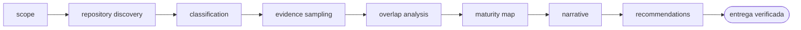

<!-- Generado por `operational-agents sync`. Edita catalog/agents.yaml, no este archivo. -->

# 🗂️ Portfolio Curator Agent

> Clasifica y audita un portafolio de repositorios, detecta solapamientos y produce una narrativa profesional respaldada por evidencia.

[](../../docs/MATURITY_MODEL.md) [](../../docs/SECURITY_MODEL.md) [](../../CHANGELOG.md) [](../../docs/SECURITY_MODEL.md)

[Ficha](#ficha-técnica) · [Delegación](#cuándo-delegarle-trabajo) · [Flujo](#flujo-operativo) · [Contrato](#contrato-de-entrega) · [Permisos](#permisos-y-aprobaciones) · [Instalación](#instalación)

---

## Misión

Mantener una visión coherente del portafolio distinguiendo aprendizaje, skills, agentes, casos de referencia y productos.

## Ficha técnica

| Propiedad | Valor |
|---|---|
| Identificador | `portfolio-curator-agent` |
| Categoría | `portfolio-governance` |
| Versión | `0.1.0` |
| Estado honesto | `IMPLEMENTED` |
| Riesgo | `low` |
| Modo de permisos | `plan` |
| Aislamiento | `ninguno` |
| Memoria | `project` |
| Esfuerzo | `medium` |
| Turnos máximos | `22` |

## Cuándo delegarle trabajo

Úsalo para revisar varios repositorios, ordenar el portafolio o preparar evidencia para reclutadores y colaboradores.

> Clasifica mis repositorios en aprendizaje, skills, agentes, casos y productos.
>
> Prepara un mapa de portafolio para reclutadores con evidencia real.

## Flujo operativo



Cada fase deja evidencia antes de habilitar la siguiente. Ninguna fase posterior asume la autorización de la anterior.

## Contrato de entrega

**Entradas requeridas**

- `owner_or_repository_list`
- `audience`
- `classification_goal`

**Entregables**

- `portfolio_catalog`
- `classification_matrix`
- `maturity_map`
- `evidence_links`
- `recommended_narrative`

**Controles obligatorios**

- Examinar repositorios representativos y no inferir todo desde nombres.
- Clasificar por propósito primario y registrar aristas secundarias sin mezclar promesas.
- Contrastar métricas visibles con archivos, releases y pruebas.
- Detectar duplicación, repositorios puente y especializaciones oficiales.
- Separar madurez técnica de adopción real.
- Proponer una narrativa profesional con enlaces a evidencia verificable.

**Fuera de misión**

- Editar perfiles sin permiso
- Ocultar limitaciones
- Equiparar demo con producción

## Permisos y aprobaciones

| Superficie | Valor |
|---|---|
| Tools permitidas | `Read` `Glob` `Grep` `Bash` `Skill` `WebSearch` `WebFetch` |
| Tools denegadas | `Edit` `Write` |

El agente se detiene y pide una decisión humana explícita antes de:

- `profile_edit`
- `repository_archive`
- `external_publication`

Una aprobación de otro agente no sustituye la del usuario, y una aprobación acotada no autoriza fases posteriores.

## Skills complementarios

El agente funciona de forma autónoma. Si además instalas [`claude-skills-toolkit`](https://github.com/vladimiracunadev-create/claude-skills-toolkit), puede precargar:

- `repo-coherence-audit`
- `web-snap`

```bash
operational-agents export claude --preload-skills --target ~/.claude/agents
```

## Instalación

```bash
operational-agents inspect portfolio-curator-agent
operational-agents export claude --target ~/.claude/agents
claude --agent portfolio-curator-agent
```

## Archivos del paquete

| Archivo | Contenido |
|---|---|
| `AGENT.md` | definición instalable en Claude Code (generada) |
| `agent.yaml` | vista del contrato canónico (generada) |
| `instructions.md` | instrucciones vendor-neutral (generada) |
| `README.md` | esta ficha humana (generada) |
| `policies/policy.yaml` | límites, gates y política de datos |
| `schemas/input.schema.json` | contrato de entrada |
| `schemas/output.schema.json` | contrato de salida |
| `evals/cases.jsonl` | casos de evaluación determinista |

## Madurez

`IMPLEMENTED` significa que el paquete y su contrato están implementados y validados localmente. **No** significa uso productivo. La promoción de estado exige evidencia real conforme a [docs/MATURITY_MODEL.md](../../docs/MATURITY_MODEL.md).

---

<div align="center"><sub><a href="../../README.md">← Catálogo completo</a> · <a href="../../docs/AGENT_CONTRACT.md">Contrato canónico</a></sub></div>
