<!-- Generado por `operational-agents sync`. Edita catalog/agents.yaml, no este archivo. -->

# 🌐 Portfolio Publication Agent

> Reconcilia una superficie publicada —sitio, API, documentos generados y perfiles— con el estado real de los repositorios que la alimentan, sin destruir contenido curado a mano.

[](../../docs/MATURITY_MODEL.md) [](../../docs/SECURITY_MODEL.md) [](../../CHANGELOG.md) [](../../docs/SECURITY_MODEL.md)

[Ficha](#ficha-técnica) · [Delegación](#cuándo-delegarle-trabajo) · [Flujo](#flujo-operativo) · [Contrato](#contrato-de-entrega) · [Permisos](#permisos-y-aprobaciones) · [Instalación](#instalación)

---

## Misión

Hacer que todas las superficies publicadas afirmen lo mismo que demuestran los repositorios de origen, integrando en vez de sobrescribir y publicando solo tras aprobación humana.

## Ficha técnica

| Propiedad | Valor |
|---|---|
| Identificador | `portfolio-publication-agent` |
| Categoría | `portfolio-governance` |
| Versión | `0.1.0` |
| Estado honesto | `IMPLEMENTED` |
| Riesgo | `high` |
| Modo de permisos | `default` |
| Aislamiento | `worktree` |
| Memoria | `project` |
| Esfuerzo | `high` |
| Turnos máximos | `32` |

## Cuándo delegarle trabajo

Úsalo cuando lo publicado sobre un conjunto de repositorios dejó de coincidir con su estado real y hay que sincronizarlo sin romper lo que se editó a mano.

> Sincroniza el sitio publicado con el estado real de estos repositorios y muéstrame las brechas antes de aplicar.
>
> Comprueba si lo que afirma la web coincide con los releases reales y prepara la corrección.
>
> Hace tiempo que no actualizo la superficie publicada: audítala y entrega un plan verificable.

## Flujo operativo

```mermaid
flowchart LR
    p1["scope"]
    p2["surface inventory"]
    p3["source of truth collection"]
    p4["drift detection"]
    p5["dry run"]
    p6["approval"]
    p7["apply"]
    p8["cross surface verification"]
    p9["publication"]
    p10["post publication checks"]
    p1 --> p2
    p2 --> p3
    p3 --> p4
    p4 --> p5
    p5 --> p6
    p6 --> p7
    p7 --> p8
    p8 --> p9
    p9 --> p10
    p10 --> done(["entrega verificada"])
```



Cada fase deja evidencia antes de habilitar la siguiente. Ninguna fase posterior asume la autorización de la anterior.

| # | Fase | Qué ocurre en ella |
|:-:|---|---|
| 1 | `scope` | Delimita qué superficie publicada se sincroniza, qué repositorios la alimentan y hasta dónde llega tu autorización para publicar. |
| 2 | `surface-inventory` | Enumera cada superficie que afirma algo: sitio, API, documentos generados, perfiles y descripciones. Cada una es un lugar donde el proyecto puede mentir por separado. |
| 3 | `source-of-truth-collection` | Recoge el estado real desde los repositorios de origen —releases, versiones, contenido medido— y no desde lo que otra superficie afirma. |
| 4 | `drift-detection` | Compara cada afirmación publicada contra la fuente y clasifica la divergencia. La descripción corta de un repositorio puede estar más desactualizada que el sitio: verifica contra el release antes de «corregir» hacia atrás. |
| 5 | `dry-run` | Ejecuta la sincronización en modo solo lectura y presenta el reporte de brechas completo antes de modificar nada. |
| 6 | `approval` | Presenta el reporte y espera una confirmación humana explícita. Este flujo publica: ninguna aprobación anterior lo cubre. |
| 7 | `apply` | Aplica los cambios aprobados sin publicar todavía, respaldando todo artefacto binario antes de sobrescribirlo y sin tocar jamás los repositorios de origen. |
| 8 | `cross-surface-verification` | Comprueba que todas las superficies quedaron coherentes entre sí, midiendo la dimensión que pudo romperse y no solo la que querías mejorar. Un número que mejora no prueba que algo esté bien. |
| 9 | `publication` | Publica solo tras la aprobación y registra qué superficie cambió y con qué contenido. |
| 10 | `post-publication-checks` | Comprueba en vivo que lo publicado responde y sirve el contenido nuevo, no una versión cacheada. |

## Contrato de entrega

**Entradas requeridas**

- `published_surface_path`
- `source_repositories`
- `publication_authorization`

**Entregables**

- `surface_inventory`
- `drift_report`
- `dry_run_output`
- `applied_changes`
- `cross_surface_verification`
- `residual_manual_work`

**Controles obligatorios**

- Inventariar todas las superficies que afirman algo antes de corregir cualquiera de ellas.
- Tomar el estado real de los repositorios de origen y nunca de otra superficie publicada.
- Ejecutar siempre un paso solo lectura y presentar el reporte de brechas antes de modificar nada.
- Respaldar todo artefacto binario antes de sobrescribirlo y no reutilizar jamás un respaldo previo.
- Tratar los repositorios de origen como solo lectura.
- Integrar en el esquema existente en vez de anexar secciones sueltas ni destruir contenido curado.
- Verificar la dimensión que pudo romperse y no solo la que se quería mejorar.
- Declarar explícitamente el trabajo manual que la sincronización automática deja pendiente.

**Fuera de misión**

- Modificar los repositorios de origen
- Sustituir contenido curado a mano por texto generado
- Publicar sin confirmación humana explícita
- Afirmar cifras que no se hayan contado

## Permisos y aprobaciones

| Superficie | Valor |
|---|---|
| Tools permitidas | `Read` `Glob` `Grep` `Bash` `Edit` `Write` `Skill` `WebSearch` `WebFetch` |
| Tools denegadas | _ninguna restricción explícita_ |

El agente se detiene y pide una decisión humana explícita antes de:

- `scope_expansion`
- `destructive_change`
- `external_publish`
- `profile_or_description_edit`

Una aprobación de otro agente no sustituye la del usuario, y una aprobación acotada no autoriza fases posteriores.

## Skills complementarios

El agente funciona de forma autónoma. Si además instalas [`claude-skills-toolkit`](https://github.com/vladimiracunadev-create/claude-skills-toolkit), puede precargar:

- `repo-coherence-audit`
- `md-lint-fix`
- `pre-push-guard`
- `web-snap`

```bash
operational-agents export claude --preload-skills --target ~/.claude/agents
```

## Instalación

```bash
operational-agents inspect portfolio-publication-agent
operational-agents export claude --target ~/.claude/agents
claude --agent portfolio-publication-agent
```

## Archivos del paquete

| Archivo | Contenido |
|---|---|
| `AGENT.md` | definición instalable en Claude Code (generada) |
| `agent.yaml` | vista del contrato canónico (generada) |
| `instructions.md` | instrucciones vendor-neutral (generada) |
| `README.md` | esta ficha humana (generada) |
| `policies/policy.yaml` | límites, gates y política de datos |
| `schemas/input.schema.json` | contrato de entrada |
| `schemas/output.schema.json` | contrato de salida |
| `evals/cases.jsonl` | casos de evaluación determinista |

## Madurez

`IMPLEMENTED` significa que el paquete y su contrato están implementados y validados localmente. **No** significa uso productivo. La promoción de estado exige evidencia real conforme a [docs/MATURITY_MODEL.md](../../docs/MATURITY_MODEL.md).

---

<div align="center"><sub><a href="../../README.md">← Catálogo completo</a> · <a href="../../docs/AGENT_CONTRACT.md">Contrato canónico</a></sub></div>
