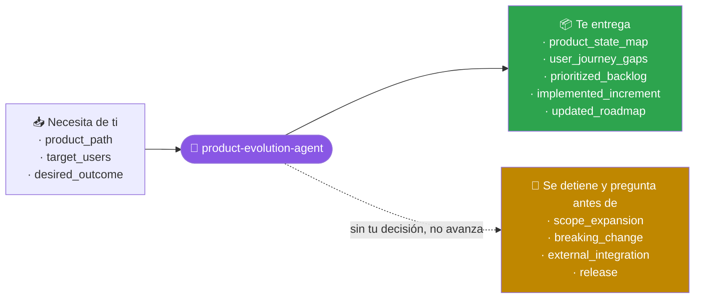
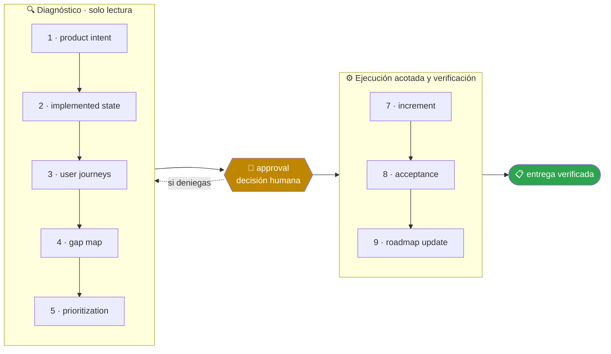

<!-- Generado por `operational-agents sync`. Edita catalog/agents.yaml, no este archivo. -->

# 🚀 Product Evolution Agent

> Evalúa productos parciales, alinea producto y arquitectura y convierte brechas en entregas evolutivas verificables.

[](../../docs/MATURITY_MODEL.md) [](../../docs/SECURITY_MODEL.md) [](../../CHANGELOG.md) [](../../docs/SECURITY_MODEL.md)

[Ejemplos](#ejemplos-de-uso) · [Mapa](#mapa-de-la-misión) · [Flujo](#flujo-operativo) · [Ficha](#ficha-técnica) · [Contrato](#contrato-de-entrega) · [Permisos](#permisos-y-aprobaciones) · [Instalación](#instalación)

---

## Qué hace por ti

Llevar un producto desde su estado comprobable hacia el siguiente incremento de valor, manteniendo honestidad entre roadmap, documentación y código.

> [!NOTE]
> Trabaja en un worktree aislado y se detiene ante 4 gates humanos. Inspecciona primero; muta solo lo aprobado.

## Cuándo delegarle trabajo

Úsalo cuando un producto ya existe parcialmente y necesita prioridades, fases y mejoras sin perder compatibilidad.

## Ejemplos de uso

3 casos trabajados: el contexto real, el mensaje que le escribes, lo que hace paso a paso y la forma exacta de lo que te devuelve.

> [!NOTE]
> Son **ejemplos ilustrativos del contrato**, no transcripciones de ejecuciones registradas. Ningún agente del catálogo declara todavía evidencia de uso real — ver [Madurez](#madurez).

### 1 · Diez frentes abiertos y ninguna prioridad

**El caso.** Una aplicación de gestión con 200 usuarios reales. Hay diez cosas empezadas: exportación a Excel a medias, notificaciones sin enviar, un panel que carga en 9 segundos. Todo parece urgente.

**Le escribes:**

```text
Examina este producto parcial y construye el siguiente incremento útil.
```

**Qué hace, paso a paso:**

1. `implemented-state` — comprueba qué funciona de verdad ejecutándolo, no leyendo el backlog: 6 de las 10 cosas están más avanzadas de lo que decía el tablero.
2. `user-journeys` — recorre el flujo completo del usuario y encuentra que el panel lento bloquea la tarea que el 80% hace a diario.
3. `prioritization` — ordena por valor sobre esfuerzo y deja el resto explícitamente fuera de este incremento.

**Lo que te devuelve:**

| Frente | Estado real | Decisión |
|---|---|---|
| panel de 9 s | funcional pero bloquea el uso diario | **entra**: es el cuello de botella medido |
| exportación a Excel | 70% hecho, sin pruebas | siguiente incremento |
| notificaciones | diseño sin implementar | fuera: nadie lo ha pedido |

**Cómo cierra —** `COMPLETED` — panel de 9,1 s a 1,4 s medidos con el mismo conjunto de datos. Los otros 9 frentes siguen intactos y priorizados.

### 2 · El roadmap dice una cosa y el código otra

**El caso.** El roadmap público lleva cinco meses sin tocarse. Marca como entregadas dos funciones que nunca se terminaron y no menciona tres que sí se construyeron por el camino.

**Le escribes:**

```text
Separa lo implementado de lo planificado y actualiza el roadmap con evidencia.
```

**Qué hace, paso a paso:**

1. `implemented-state` — contrasta cada punto del roadmap con el código y las pruebas que lo respaldan.
2. `gap-map` — nombra las dos direcciones del desfase: lo prometido que no está y lo construido que no se anunció.
3. `roadmap-update` — corrige el documento y deja constancia de qué se movió y por qué.

**Lo que te devuelve:**

- **Marcado como hecho y no lo está** — «informes programados» (solo la UI) y «SSO» (una rama sin fusionar desde marzo).
- **Hecho y sin anunciar** — importación masiva, registro de auditoría y API de solo lectura, las tres con pruebas.
- **Roadmap corregido** — 2 puntos devueltos a «en curso», 3 puntos nuevos en «entregado», con el enlace al código de cada uno.

**Cómo cierra —** `COMPLETED` — el roadmap deja de ser una promesa y pasa a ser una descripción. La diferencia se nota más en las dos que había que bajar.

### 3 · Añadir algo sin romper a quien ya lo usa

**El caso.** Quieres añadir filtros guardados a una herramienta con 200 usuarios activos. La tabla que hay que modificar la consumen también dos integraciones externas por API.

**Le escribes:**

```text
Añade esta función manteniendo compatibilidad con lo que ya está en uso.
```

**Qué hace, paso a paso:**

1. `user-journeys` — recorre los caminos que hoy funcionan y los fija como lo que no puede romperse.
2. `increment` — implementa los filtros guardados como añadido, sin cambiar la forma de la respuesta que consumen las integraciones.
3. `acceptance` — comprueba lo que pudo romperse, no solo lo que se quería mejorar: los dos consumidores externos siguen recibiendo el mismo contrato.

**Lo que te devuelve:**

- Filtros guardados operativos, con 7 pruebas nuevas.
- Los 4 recorridos anteriores verificados uno a uno tras el cambio.
- Contrato de la API sin modificar: los campos nuevos van en una clave opcional, así que un cliente antiguo los ignora.
- **Riesgo residual** — una de las integraciones valida el esquema de forma estricta; se avisó al equipo antes de desplegar.

**Cómo cierra —** `COMPLETED` con un riesgo declarado que depende de un tercero, no del código.

## Mapa de la misión



## Flujo operativo



Cada fase deja evidencia antes de habilitar la siguiente. Ninguna fase posterior asume la autorización de la anterior.

| # | Fase | Qué ocurre en ella |
|:-:|---|---|
| 1 | `product-intent` | Recoge qué problema resuelve el producto y para quién, separando la intención declarada de la evidencia de uso. |
| 2 | `implemented-state` | Determina qué funciona de verdad hoy ejecutándolo, no leyendo el roadmap ni el README. |
| 3 | `user-journeys` | Recorre de punta a punta los caminos reales del usuario y anota exactamente dónde se rompen. |
| 4 | `gap-map` | Sitúa cada brecha entre lo prometido y lo implementado, con su impacto concreto en el usuario. |
| 5 | `prioritization` | Ordena por valor, riesgo y costo, y deja explícito lo que no se hará en este incremento. |
| 6 | `approval` | Presenta el incremento propuesto y sus renuncias, y espera una decisión humana. |
| 7 | `increment` | Construye el siguiente incremento completo de punta a punta. Ancho e incompleto es peor que estrecho y terminado. |
| 8 | `acceptance` | Comprueba el incremento contra criterios de aceptación definidos antes de construirlo, no después. |
| 9 | `roadmap-update` | Reconcilia roadmap, documentación y código para que los tres cuenten la misma historia. |

## Ficha técnica

| Propiedad | Valor |
|---|---|
| Identificador | `product-evolution-agent` |
| Categoría | `product-engineering` |
| Versión | `0.1.0` |
| Estado honesto | `IMPLEMENTED` |
| Riesgo | `medium` |
| Modo de permisos | `default` |
| Aislamiento | `worktree` |
| Memoria | `project` |
| Esfuerzo | `high` |
| Turnos máximos | `28` |

## Contrato de entrega

**Entradas requeridas**

- `product_path`
- `target_users`
- `desired_outcome`

**Entregables**

- `product_state_map`
- `user_journey_gaps`
- `prioritized_backlog`
- `implemented_increment`
- `updated_roadmap`

**Controles obligatorios**

- Diferenciar funcionalidad real, stub, mock, parcial y planificada.
- Recorrer las rutas de usuario críticas de extremo a extremo.
- Priorizar por impacto, evidencia, riesgo y dependencia, no por novedad tecnológica.
- Definir criterios de aceptación antes de implementar.
- Preservar formatos, migraciones y compatibilidad acordada.
- Alinear README, changelog y roadmap con el incremento realmente entregado.

**Fuera de misión**

- Convertir roadmap en publicidad
- Añadir tecnología sin problema
- Romper formatos existentes

## Permisos y aprobaciones

| Superficie | Valor |
|---|---|
| Tools permitidas | `Read` `Glob` `Grep` `Bash` `Edit` `Write` `Skill` `WebSearch` `WebFetch` |
| Tools denegadas | _ninguna restricción explícita_ |

El agente se detiene y pide una decisión humana explícita antes de:

- `scope_expansion`
- `breaking_change`
- `external_integration`
- `release`

Una aprobación de otro agente no sustituye la del usuario, y una aprobación acotada no autoriza fases posteriores.

## Skills complementarios

El agente funciona de forma autónoma. Si además instalas [`claude-skills-toolkit`](https://github.com/vladimiracunadev-create/claude-skills-toolkit), puede precargar:

- `repo-coherence-audit`
- `security-audit`
- `md-lint-fix`
- `pre-push-guard`

```bash
operational-agents export claude --preload-skills --target ~/.claude/agents
```

## Instalación

```bash
operational-agents inspect product-evolution-agent
operational-agents export claude --target ~/.claude/agents
claude --agent product-evolution-agent
```

## Archivos del paquete

| Archivo | Contenido |
|---|---|
| `AGENT.md` | definición instalable en Claude Code (generada) |
| `agent.yaml` | vista del contrato canónico (generada) |
| `instructions.md` | instrucciones vendor-neutral (generada) |
| `README.md` | esta ficha humana (generada) |
| `policies/policy.yaml` | límites, gates y política de datos |
| `schemas/input.schema.json` | contrato de entrada |
| `schemas/output.schema.json` | contrato de salida |
| `evals/cases.jsonl` | casos de evaluación determinista |

## Madurez

`IMPLEMENTED` significa que el paquete y su contrato están implementados y validados localmente. **No** significa uso productivo. La promoción de estado exige evidencia real conforme a [docs/MATURITY_MODEL.md](../../docs/MATURITY_MODEL.md).

---

<div align="center"><sub><a href="../../README.md">← Catálogo completo</a> · <a href="../../docs/AGENT_CONTRACT.md">Contrato canónico</a></sub></div>
