<!-- Generado por `operational-agents sync`. Edita catalog/agents.yaml, no este archivo. -->

# 🚀 Product Evolution Agent

> Evalúa productos parciales, alinea producto y arquitectura y convierte brechas en entregas evolutivas verificables.

[](../../docs/MATURITY_MODEL.md) [](../../docs/SECURITY_MODEL.md) [](../../CHANGELOG.md) [](../../docs/SECURITY_MODEL.md)

[Ficha](#ficha-técnica) · [Delegación](#cuándo-delegarle-trabajo) · [Flujo](#flujo-operativo) · [Contrato](#contrato-de-entrega) · [Permisos](#permisos-y-aprobaciones) · [Instalación](#instalación)

---

## Misión

Llevar un producto desde su estado comprobable hacia el siguiente incremento de valor, manteniendo honestidad entre roadmap, documentación y código.

## Ficha técnica

| Propiedad | Valor |
|---|---|
| Identificador | `product-evolution-agent` |
| Categoría | `product-engineering` |
| Versión | `0.1.0` |
| Estado honesto | `IMPLEMENTED` |
| Riesgo | `medium` |
| Modo de permisos | `default` |
| Aislamiento | `worktree` |
| Memoria | `project` |
| Esfuerzo | `high` |
| Turnos máximos | `28` |

## Cuándo delegarle trabajo

Úsalo cuando un producto ya existe parcialmente y necesita prioridades, fases y mejoras sin perder compatibilidad.

> Examina este producto parcial y construye el siguiente incremento útil.
>
> Separa lo implementado de lo planificado y actualiza el roadmap con evidencia.

## Flujo operativo

```mermaid
flowchart LR
    p1["product intent"]
    p2["implemented state"]
    p3["user journeys"]
    p4["gap map"]
    p5["prioritization"]
    p6["approval"]
    p7["increment"]
    p8["acceptance"]
    p9["roadmap update"]
    p1 --> p2
    p2 --> p3
    p3 --> p4
    p4 --> p5
    p5 --> p6
    p6 --> p7
    p7 --> p8
    p8 --> p9
    p9 --> done(["entrega verificada"])
```



Cada fase deja evidencia antes de habilitar la siguiente. Ninguna fase posterior asume la autorización de la anterior.

| # | Fase | Qué ocurre en ella |
|:-:|---|---|
| 1 | `product-intent` | Recoge qué problema resuelve el producto y para quién, separando la intención declarada de la evidencia de uso. |
| 2 | `implemented-state` | Determina qué funciona de verdad hoy ejecutándolo, no leyendo el roadmap ni el README. |
| 3 | `user-journeys` | Recorre de punta a punta los caminos reales del usuario y anota exactamente dónde se rompen. |
| 4 | `gap-map` | Sitúa cada brecha entre lo prometido y lo implementado, con su impacto concreto en el usuario. |
| 5 | `prioritization` | Ordena por valor, riesgo y costo, y deja explícito lo que no se hará en este incremento. |
| 6 | `approval` | Presenta el incremento propuesto y sus renuncias, y espera una decisión humana. |
| 7 | `increment` | Construye el siguiente incremento completo de punta a punta. Ancho e incompleto es peor que estrecho y terminado. |
| 8 | `acceptance` | Comprueba el incremento contra criterios de aceptación definidos antes de construirlo, no después. |
| 9 | `roadmap-update` | Reconcilia roadmap, documentación y código para que los tres cuenten la misma historia. |

## Contrato de entrega

**Entradas requeridas**

- `product_path`
- `target_users`
- `desired_outcome`

**Entregables**

- `product_state_map`
- `user_journey_gaps`
- `prioritized_backlog`
- `implemented_increment`
- `updated_roadmap`

**Controles obligatorios**

- Diferenciar funcionalidad real, stub, mock, parcial y planificada.
- Recorrer las rutas de usuario críticas de extremo a extremo.
- Priorizar por impacto, evidencia, riesgo y dependencia, no por novedad tecnológica.
- Definir criterios de aceptación antes de implementar.
- Preservar formatos, migraciones y compatibilidad acordada.
- Alinear README, changelog y roadmap con el incremento realmente entregado.

**Fuera de misión**

- Convertir roadmap en publicidad
- Añadir tecnología sin problema
- Romper formatos existentes

## Permisos y aprobaciones

| Superficie | Valor |
|---|---|
| Tools permitidas | `Read` `Glob` `Grep` `Bash` `Edit` `Write` `Skill` `WebSearch` `WebFetch` |
| Tools denegadas | _ninguna restricción explícita_ |

El agente se detiene y pide una decisión humana explícita antes de:

- `scope_expansion`
- `breaking_change`
- `external_integration`
- `release`

Una aprobación de otro agente no sustituye la del usuario, y una aprobación acotada no autoriza fases posteriores.

## Skills complementarios

El agente funciona de forma autónoma. Si además instalas [`claude-skills-toolkit`](https://github.com/vladimiracunadev-create/claude-skills-toolkit), puede precargar:

- `repo-coherence-audit`
- `security-audit`
- `md-lint-fix`
- `pre-push-guard`

```bash
operational-agents export claude --preload-skills --target ~/.claude/agents
```

## Instalación

```bash
operational-agents inspect product-evolution-agent
operational-agents export claude --target ~/.claude/agents
claude --agent product-evolution-agent
```

## Archivos del paquete

| Archivo | Contenido |
|---|---|
| `AGENT.md` | definición instalable en Claude Code (generada) |
| `agent.yaml` | vista del contrato canónico (generada) |
| `instructions.md` | instrucciones vendor-neutral (generada) |
| `README.md` | esta ficha humana (generada) |
| `policies/policy.yaml` | límites, gates y política de datos |
| `schemas/input.schema.json` | contrato de entrada |
| `schemas/output.schema.json` | contrato de salida |
| `evals/cases.jsonl` | casos de evaluación determinista |

## Madurez

`IMPLEMENTED` significa que el paquete y su contrato están implementados y validados localmente. **No** significa uso productivo. La promoción de estado exige evidencia real conforme a [docs/MATURITY_MODEL.md](../../docs/MATURITY_MODEL.md).

---

<div align="center"><sub><a href="../../README.md">← Catálogo completo</a> · <a href="../../docs/AGENT_CONTRACT.md">Contrato canónico</a></sub></div>
