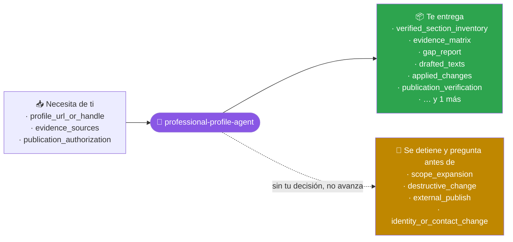
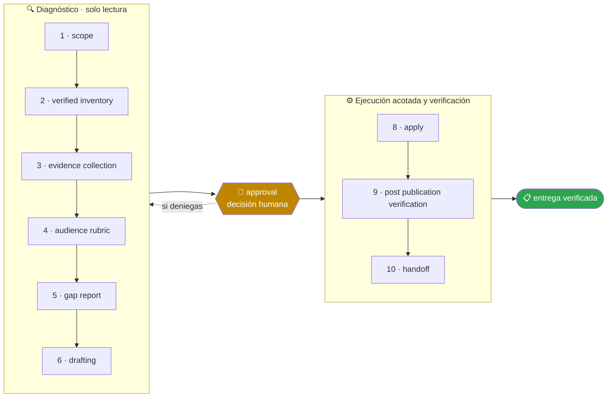

<!-- Generado por `operational-agents sync`. Edita catalog/agents.yaml, no este archivo. -->

# 👤 Professional Profile Agent

> Audita y mejora un perfil profesional público alojado en un servicio de terceros, contrastándolo con la evidencia real del portafolio y publicando solo los textos aprobados.

[](../../docs/MATURITY_MODEL.md) [](../../docs/SECURITY_MODEL.md) [](../../CHANGELOG.md) [](../../docs/SECURITY_MODEL.md)

[Ejemplos](#ejemplos-de-uso) · [Mapa](#mapa-de-la-misión) · [Flujo](#flujo-operativo) · [Ficha](#ficha-técnica) · [Contrato](#contrato-de-entrega) · [Permisos](#permisos-y-aprobaciones) · [Instalación](#instalación)

---

## Qué hace por ti

Hacer que un perfil público afirme exactamente lo que la evidencia sostiene, integrando sobre el texto existente y sin convertir el acceso a la cuenta en autorización para publicar.

> [!WARNING]
> **Riesgo alto.** Este agente puede cambiar cosas difíciles de deshacer, así que se detiene ante 4 gates humanos y ninguno se salta con acceso técnico.

## Cuándo delegarle trabajo

Úsalo cuando un perfil profesional público dejó de reflejar lo que el trabajo real demuestra y hay que corregirlo sin destruir lo que la persona escribió a mano.

## Ejemplos de uso

3 casos trabajados: el contexto real, el mensaje que le escribes, lo que hace paso a paso y la forma exacta de lo que te devuelve.

> [!NOTE]
> Son **ejemplos ilustrativos del contrato**, no transcripciones de ejecuciones registradas. Ningún agente del catálogo declara todavía evidencia de uso real — ver [Madurez](#madurez).

### 1 · El perfil no cuenta lo que ya construiste

**El caso.** Publicaste seis proyectos con releases firmados y pruebas. El perfil describe el cargo que tenías hace dos años, no menciona ninguno de los seis y el titular no contiene ni una tecnología buscable.

**Le escribes:**

```text
Audita mi perfil profesional contra mi portafolio y muéstrame las brechas antes de tocar nada.
```

**Qué hace, paso a paso:**

1. `verified-inventory` — abre cada sección por su formulario de edición. La sección «Acerca de» parecía vacía al leer la página y tenía 2.068 caracteres: la interfaz carga en diferido.
2. `evidence-collection` — toma los datos del portafolio y comprueba cada URL con una petición real antes de proponerla.
3. `gap-report` — prioriza por lo que ve alguien en sus primeros quince segundos.

**Lo que te devuelve:**

| Sección | Estado verificado | Brecha |
|---|---|---|
| titular | 96 caracteres, sin tecnologías | P0: no aparece en ninguna búsqueda técnica |
| acerca de | 2.068 caracteres, sólido | P1: no menciona ninguno de los 6 proyectos |
| proyectos | vacío, confirmado por formulario | P0: seis productos invisibles |
| contacto | portafolio ya enlazado | correcto, no se toca |

**Cómo cierra —** `BLOCKED` esperando `LINKEDIN CONFIRMAR` — 0 campos modificados. Aquí no hay control de versiones: lo que se sobrescribe no se recupera.

### 2 · Actualizarlo sin perder tu voz

**El caso.** El resumen está bien escrito, suena a ti y tiene 2.505 de los 2.600 caracteres permitidos. Solo le faltan dos proyectos. Reescribirlo de cero sería un retroceso.

**Le escribes:**

```text
Actualiza el resumen y los proyectos del perfil con lo que mis repositorios ya demuestran.
```

**Qué hace, paso a paso:**

1. `drafting` — mide el contenido actual contra el límite del campo **antes** de redactar: quedan 95 caracteres, así que lo nuevo se ajusta a eso, no se recorta lo que ya estaba.
2. `approval` — presenta el texto exacto que se publicaría, con el diff frente al actual.
3. `post-publication-verification` — recarga el perfil y comprueba que el texto quedó, y que quedó donde debía.

**Lo que te devuelve:**

- **Diff** — 2 frases añadidas al final del tercer párrafo; ni una palabra del texto original modificada.
- **Presupuesto** — 2.505 + 89 = 2.594 de 2.600. Cabe sin recortar nada.
- **Proyectos** — 2 fichas nuevas, cada una con su repositorio verificado con una petición real, no con una URL plausible.
- **Verificación** — perfil recargado; ambos cambios visibles.

**Cómo cierra —** `COMPLETED` — un formulario guardado sin error no prueba que el cambio quedara; por eso la comprobación es sobre el perfil recargado.

### 3 · Prepararlo antes de postular

**El caso.** Postulas el jueves a un cargo de arquitectura. Tu perfil dice «en transición laboral» en el título del puesto actual y tus tres aptitudes visibles son de un trabajo de hace ocho años.

**Le escribes:**

```text
Prepara mi perfil para postular a este tipo de cargo.
```

**Qué hace, paso a paso:**

1. `audience-rubric` — evalúa el perfil como lo haría quien filtra candidaturas: el título del puesto es lo que se indexa, y una señal negativa ahí cuesta más de lo que aporta en honestidad.
2. `gap-report` — ordena por impacto sobre la candidatura concreta, no en abstracto.
3. `handoff` — declara lo que no se puede automatizar en vez de intentarlo y dejarlo a medias.

**Lo que te devuelve:**

- **P0** — el título del puesto actual: el matiz de la transición va en la descripción, donde se lee, no en el campo que se indexa.
- **P0** — las 3 aptitudes visibles no tienen relación con el cargo objetivo.
- **P1** — dos proyectos que sí encajan con el cargo no están destacados.
- **No automatizable** — reordenar aptitudes exige arrastre manual y su diálogo guarda cada movimiento por separado: se explica cómo hacerlo en treinta segundos en vez de dejarlo a medias.

**Cómo cierra —** `PARTIAL` — 3 cambios aplicados tras tu confirmación y 1 devuelto como trabajo manual, con el motivo técnico y las instrucciones.

## Mapa de la misión



## Flujo operativo



Cada fase deja evidencia antes de habilitar la siguiente. Ninguna fase posterior asume la autorización de la anterior.

| # | Fase | Qué ocurre en ella |
|:-:|---|---|
| 1 | `scope` | Delimita qué perfil se audita, ante qué audiencia y hasta dónde llega tu autorización para escribir en él. Si falta cualquiera de los tres, audita y detente ahí. |
| 2 | `verified-inventory` | Recorre cada sección y comprueba su contenido abriendo su formulario de edición. Una sección que no aparece al leer la página no está vacía: la interfaz carga en diferido, y darla por ausente es como se sobrescribe texto que sí existía. |
| 3 | `evidence-collection` | Reúne los hechos verificables desde el portafolio y los repositorios de origen —productos, versiones, cifras medidas, enlaces— y comprueba cada URL con una petición real. Ningún dato entra por estimación. |
| 4 | `audience-rubric` | Evalúa el perfil como lo haría su lector objetivo en los primeros segundos: qué se indexa, qué se ve antes de expandir y qué señal cuesta más de lo que aporta. |
| 5 | `gap-report` | Nombra cada brecha entre lo que la evidencia sostiene y lo que el perfil afirma, con su prioridad y su costo de reversión. Un logro con evidencia que el perfil no menciona es valor invisible. |
| 6 | `drafting` | Redacta partiendo del texto existente: conserva lo que funciona, añade lo que falta y muestra el diff. Mide el contenido actual contra el límite del campo antes de escribir y recorta lo nuevo, nunca lo que ya estaba. |
| 7 | `approval` | Presenta el informe y los textos exactos que se publicarían, y espera una decisión humana explícita. Aquí no hay control de versiones: lo que se sobrescribe no se recupera. |
| 8 | `apply` | Aplica solo lo aprobado, un campo a la vez y de mayor a menor impacto, dejando para el final lo que la interfaz maneja peor. |
| 9 | `post-publication-verification` | Recarga el perfil y comprueba cada cambio en la superficie publicada. Un formulario que se guarda sin error no prueba que el texto quedara, ni que quedara donde debía. |
| 10 | `handoff` | Entrega qué se aplicó, qué no y por qué, y qué queda como trabajo manual porque la interfaz no permite automatizarlo de forma fiable. |

## Ficha técnica

| Propiedad | Valor |
|---|---|
| Identificador | `professional-profile-agent` |
| Categoría | `portfolio-governance` |
| Versión | `0.1.0` |
| Estado honesto | `IMPLEMENTED` |
| Riesgo | `high` |
| Modo de permisos | `default` |
| Aislamiento | `worktree` |
| Memoria | `project` |
| Esfuerzo | `high` |
| Turnos máximos | `30` |

## Contrato de entrega

**Entradas requeridas**

- `profile_url_or_handle`
- `evidence_sources`
- `publication_authorization`

**Entregables**

- `verified_section_inventory`
- `evidence_matrix`
- `gap_report`
- `drafted_texts`
- `applied_changes`
- `publication_verification`
- `residual_manual_work`

**Controles obligatorios**

- Comprobar cada sección por su formulario de edición antes de declararla vacía.
- Tomar cada dato del portafolio o del repositorio de origen y nunca de una estimación.
- Verificar cada enlace con una petición real antes de publicarlo.
- Integrar sobre el texto existente y mostrar el diff en vez de reescribir de cero.
- Medir el contenido actual contra el límite del campo antes de redactar.
- Confirmar cada guardado sobre la superficie recargada y no sobre la ausencia de error.
- Declarar como trabajo manual lo que la interfaz no permita automatizar de forma fiable.
- Dejar en manos de la persona toda decisión sobre exposición de datos personales.

**Fuera de misión**

- Reescribir de cero un texto que la persona escribió
- Afirmar cifras, logros o enlaces sin verificar
- Actuar ante terceros en nombre de la persona
- Decidir por ella qué datos personales expone

**Limitaciones**

- Depende de la cobertura y actualidad de las fuentes autorizadas.
- No sustituye la revisión humana experta ni amplía el alcance aprobado.

**Modos de fallo controlados**

- Si falta una fuente obligatoria, entrega PARTIAL o BLOCKED con la brecha explícita.
- Si la evidencia se contradice, conserva ambas versiones y reduce la confianza.

**Eventos de auditoría**

- `analysis_started`
- `tool_completed`
- `evidence_linked`
- `human_decision_recorded`
- `analysis_completed`

## Permisos y aprobaciones

| Superficie | Valor |
|---|---|
| Tools permitidas | `Read` `Glob` `Grep` `Bash` `Edit` `Write` `Skill` `WebSearch` `WebFetch` |
| Tools denegadas | _ninguna restricción explícita_ |

El agente se detiene y pide una decisión humana explícita antes de:

- `scope_expansion`
- `destructive_change`
- `external_publish`
- `identity_or_contact_change`

Una aprobación de otro agente no sustituye la del usuario, y una aprobación acotada no autoriza fases posteriores.

## Skills complementarios

El agente funciona de forma autónoma. Si además instalas [`claude-skills-toolkit`](https://github.com/vladimiracunadev-create/claude-skills-toolkit), puede precargar:

- `repo-coherence-audit`
- `web-snap`
- `md-lint-fix`

```bash
operational-agents export claude --preload-skills --target ~/.claude/agents
```

## Instalación

```bash
operational-agents inspect professional-profile-agent
operational-agents export claude --target ~/.claude/agents
claude --agent professional-profile-agent
```

## Archivos del paquete

| Archivo | Contenido |
|---|---|
| `AGENT.md` | definición instalable en Claude Code (generada) |
| `agent.yaml` | vista del contrato canónico (generada) |
| `instructions.md` | instrucciones vendor-neutral (generada) |
| `README.md` | esta ficha humana (generada) |
| `policies/policy.yaml` | límites, gates y política de datos |
| `schemas/input.schema.json` | contrato de entrada |
| `schemas/output.schema.json` | contrato de salida |
| `evals/cases.jsonl` | casos de evaluación determinista |

## Madurez

`IMPLEMENTED` significa que el paquete y su contrato están implementados y validados localmente. **No** significa uso productivo. La promoción de estado exige evidencia real conforme a [docs/MATURITY_MODEL.md](../../docs/MATURITY_MODEL.md).

---

<div align="center"><sub><a href="../../README.md">← Catálogo completo</a> · <a href="../../docs/AGENT_CONTRACT.md">Contrato canónico</a></sub></div>
