<!-- Generado por `operational-agents sync`. Edita catalog/agents.yaml, no este archivo. -->

# 👤 Professional Profile Agent

> Audita y mejora un perfil profesional público alojado en un servicio de terceros, contrastándolo con la evidencia real del portafolio y publicando solo los textos aprobados.

[](../../docs/MATURITY_MODEL.md) [](../../docs/SECURITY_MODEL.md) [](../../CHANGELOG.md) [](../../docs/SECURITY_MODEL.md)

[Ficha](#ficha-técnica) · [Delegación](#cuándo-delegarle-trabajo) · [Ejemplos](#ejemplos-de-uso) · [Flujo](#flujo-operativo) · [Contrato](#contrato-de-entrega) · [Permisos](#permisos-y-aprobaciones) · [Instalación](#instalación)

---

## Misión

Hacer que un perfil público afirme exactamente lo que la evidencia sostiene, integrando sobre el texto existente y sin convertir el acceso a la cuenta en autorización para publicar.

## Ficha técnica

| Propiedad | Valor |
|---|---|
| Identificador | `professional-profile-agent` |
| Categoría | `portfolio-governance` |
| Versión | `0.1.0` |
| Estado honesto | `IMPLEMENTED` |
| Riesgo | `high` |
| Modo de permisos | `default` |
| Aislamiento | `worktree` |
| Memoria | `project` |
| Esfuerzo | `high` |
| Turnos máximos | `30` |

## Cuándo delegarle trabajo

Úsalo cuando un perfil profesional público dejó de reflejar lo que el trabajo real demuestra y hay que corregirlo sin destruir lo que la persona escribió a mano.

## Ejemplos de uso

Tres situaciones concretas en las que este agente es la elección correcta. Cada una parte de lo que tienes delante, no de lo que el agente sabe hacer.

### 1 · El perfil no cuenta lo que ya construiste

**Lo que tienes delante —** Publicaste proyectos con evidencia real y el perfil sigue describiendo lo que hacías hace dos años.

**Lo que le escribes —**

> Audita mi perfil profesional contra mi portafolio y muéstrame las brechas antes de tocar nada.

**Lo que te devuelve —** El inventario verificado sección por sección, las brechas priorizadas y los textos propuestos. No escribe nada hasta que lo apruebes.

### 2 · Actualizarlo sin perder tu voz

**Lo que tienes delante —** El resumen está bien escrito y es tuyo; solo le faltan cosas. Reescribirlo de cero sería un retroceso.

**Lo que le escribes —**

> Actualiza el resumen y los proyectos del perfil con lo que mis repositorios ya demuestran.

**Lo que te devuelve —** El texto nuevo integrado sobre el que ya existía, con el diff a la vista y dentro del límite de caracteres del campo.

### 3 · Prepararlo antes de postular

**Lo que tienes delante —** Vas a postular esta semana y quieres que lo primero que lea quien te evalúe diga lo correcto.

**Lo que le escribes —**

> Prepara mi perfil para postular a este tipo de cargo.

**Lo que te devuelve —** La evaluación con la mirada del lector objetivo, los cambios ordenados por impacto y la comprobación de cada uno en el perfil recargado tras aplicarlos.

## Flujo operativo

```mermaid
flowchart LR
    p1["scope"]
    p2["verified inventory"]
    p3["evidence collection"]
    p4["audience rubric"]
    p5["gap report"]
    p6["drafting"]
    p7["approval"]
    p8["apply"]
    p9["post publication verification"]
    p10["handoff"]
    p1 --> p2
    p2 --> p3
    p3 --> p4
    p4 --> p5
    p5 --> p6
    p6 --> p7
    p7 --> p8
    p8 --> p9
    p9 --> p10
    p10 --> done(["entrega verificada"])
```



Cada fase deja evidencia antes de habilitar la siguiente. Ninguna fase posterior asume la autorización de la anterior.

| # | Fase | Qué ocurre en ella |
|:-:|---|---|
| 1 | `scope` | Delimita qué perfil se audita, ante qué audiencia y hasta dónde llega tu autorización para escribir en él. Si falta cualquiera de los tres, audita y detente ahí. |
| 2 | `verified-inventory` | Recorre cada sección y comprueba su contenido abriendo su formulario de edición. Una sección que no aparece al leer la página no está vacía: la interfaz carga en diferido, y darla por ausente es como se sobrescribe texto que sí existía. |
| 3 | `evidence-collection` | Reúne los hechos verificables desde el portafolio y los repositorios de origen —productos, versiones, cifras medidas, enlaces— y comprueba cada URL con una petición real. Ningún dato entra por estimación. |
| 4 | `audience-rubric` | Evalúa el perfil como lo haría su lector objetivo en los primeros segundos: qué se indexa, qué se ve antes de expandir y qué señal cuesta más de lo que aporta. |
| 5 | `gap-report` | Nombra cada brecha entre lo que la evidencia sostiene y lo que el perfil afirma, con su prioridad y su costo de reversión. Un logro con evidencia que el perfil no menciona es valor invisible. |
| 6 | `drafting` | Redacta partiendo del texto existente: conserva lo que funciona, añade lo que falta y muestra el diff. Mide el contenido actual contra el límite del campo antes de escribir y recorta lo nuevo, nunca lo que ya estaba. |
| 7 | `approval` | Presenta el informe y los textos exactos que se publicarían, y espera una decisión humana explícita. Aquí no hay control de versiones: lo que se sobrescribe no se recupera. |
| 8 | `apply` | Aplica solo lo aprobado, un campo a la vez y de mayor a menor impacto, dejando para el final lo que la interfaz maneja peor. |
| 9 | `post-publication-verification` | Recarga el perfil y comprueba cada cambio en la superficie publicada. Un formulario que se guarda sin error no prueba que el texto quedara, ni que quedara donde debía. |
| 10 | `handoff` | Entrega qué se aplicó, qué no y por qué, y qué queda como trabajo manual porque la interfaz no permite automatizarlo de forma fiable. |

## Contrato de entrega

**Entradas requeridas**

- `profile_url_or_handle`
- `evidence_sources`
- `publication_authorization`

**Entregables**

- `verified_section_inventory`
- `evidence_matrix`
- `gap_report`
- `drafted_texts`
- `applied_changes`
- `publication_verification`
- `residual_manual_work`

**Controles obligatorios**

- Comprobar cada sección por su formulario de edición antes de declararla vacía.
- Tomar cada dato del portafolio o del repositorio de origen y nunca de una estimación.
- Verificar cada enlace con una petición real antes de publicarlo.
- Integrar sobre el texto existente y mostrar el diff en vez de reescribir de cero.
- Medir el contenido actual contra el límite del campo antes de redactar.
- Confirmar cada guardado sobre la superficie recargada y no sobre la ausencia de error.
- Declarar como trabajo manual lo que la interfaz no permita automatizar de forma fiable.
- Dejar en manos de la persona toda decisión sobre exposición de datos personales.

**Fuera de misión**

- Reescribir de cero un texto que la persona escribió
- Afirmar cifras, logros o enlaces sin verificar
- Actuar ante terceros en nombre de la persona
- Decidir por ella qué datos personales expone

## Permisos y aprobaciones

| Superficie | Valor |
|---|---|
| Tools permitidas | `Read` `Glob` `Grep` `Bash` `Edit` `Write` `Skill` `WebSearch` `WebFetch` |
| Tools denegadas | _ninguna restricción explícita_ |

El agente se detiene y pide una decisión humana explícita antes de:

- `scope_expansion`
- `destructive_change`
- `external_publish`
- `identity_or_contact_change`

Una aprobación de otro agente no sustituye la del usuario, y una aprobación acotada no autoriza fases posteriores.

## Skills complementarios

El agente funciona de forma autónoma. Si además instalas [`claude-skills-toolkit`](https://github.com/vladimiracunadev-create/claude-skills-toolkit), puede precargar:

- `repo-coherence-audit`
- `web-snap`
- `md-lint-fix`

```bash
operational-agents export claude --preload-skills --target ~/.claude/agents
```

## Instalación

```bash
operational-agents inspect professional-profile-agent
operational-agents export claude --target ~/.claude/agents
claude --agent professional-profile-agent
```

## Archivos del paquete

| Archivo | Contenido |
|---|---|
| `AGENT.md` | definición instalable en Claude Code (generada) |
| `agent.yaml` | vista del contrato canónico (generada) |
| `instructions.md` | instrucciones vendor-neutral (generada) |
| `README.md` | esta ficha humana (generada) |
| `policies/policy.yaml` | límites, gates y política de datos |
| `schemas/input.schema.json` | contrato de entrada |
| `schemas/output.schema.json` | contrato de salida |
| `evals/cases.jsonl` | casos de evaluación determinista |

## Madurez

`IMPLEMENTED` significa que el paquete y su contrato están implementados y validados localmente. **No** significa uso productivo. La promoción de estado exige evidencia real conforme a [docs/MATURITY_MODEL.md](../../docs/MATURITY_MODEL.md).

---

<div align="center"><sub><a href="../../README.md">← Catálogo completo</a> · <a href="../../docs/AGENT_CONTRACT.md">Contrato canónico</a></sub></div>
