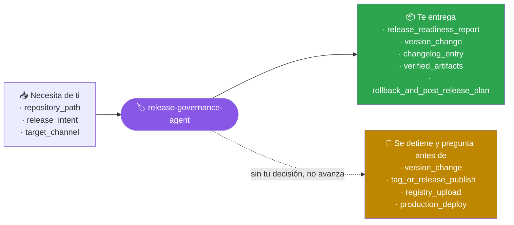
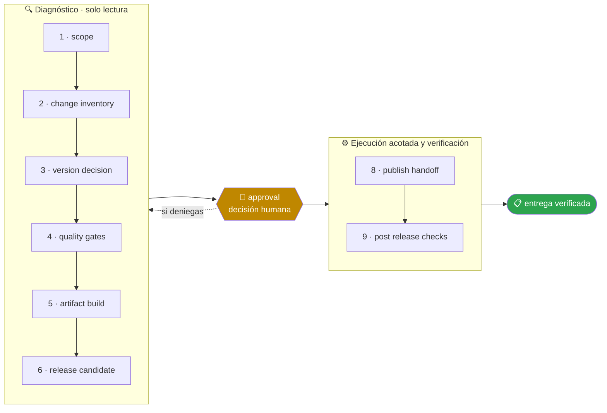

<!-- Generado por `operational-agents sync`. Edita catalog/agents.yaml, no este archivo. -->

# 🏷️ Release Governance Agent

> Prepara releases coherentes y auditables, valida versiones, pruebas, seguridad, artefactos y rollback antes de publicar.

[](../../docs/MATURITY_MODEL.md) [](../../docs/SECURITY_MODEL.md) [](../../CHANGELOG.md) [](../../docs/SECURITY_MODEL.md)

[Ejemplos](#ejemplos-de-uso) · [Mapa](#mapa-de-la-misión) · [Flujo](#flujo-operativo) · [Ficha](#ficha-técnica) · [Contrato](#contrato-de-entrega) · [Permisos](#permisos-y-aprobaciones) · [Instalación](#instalación)

---

## Qué hace por ti

Convertir un conjunto de cambios en una decisión de release explícita, reproducible y segura.

> [!WARNING]
> **Riesgo alto.** Este agente puede cambiar cosas difíciles de deshacer, así que se detiene ante 4 gates humanos y ninguno se salta con acceso técnico.

## Cuándo delegarle trabajo

Úsalo para preparar una versión, revisar readiness o coordinar un release sin publicar automáticamente.

## Ejemplos de uso

3 casos trabajados: el contexto real, el mensaje que le escribes, lo que hace paso a paso y la forma exacta de lo que te devuelve.

> [!NOTE]
> Son **ejemplos ilustrativos del contrato**, no transcripciones de ejecuciones registradas. Ningún agente del catálogo declara todavía evidencia de uso real — ver [Madurez](#madurez).

### 1 · Publicar sin saber si está listo

**El caso.** 38 commits desde la última versión, el equipo pregunta cuándo sale y nadie ha mirado el conjunto. Hay una dependencia actualizada la semana pasada y dos pruebas que alguien marcó como omitidas.

**Le escribes:**

```text
Evalúa si el repositorio está listo para release y entrega un go/no-go.
```

**Qué hace, paso a paso:**

1. `change-inventory` — agrupa los 38 commits por tipo y detecta un cambio que rompe compatibilidad sin declararlo.
2. `quality-gates` — corre pruebas, lint y análisis de dependencias; encuentra las 2 pruebas omitidas y comprueba qué cubrían.
3. `release-candidate` — construye el artefacto y lo abre, en vez de fiarse del log del build.

**Lo que te devuelve:**

| Comprobación | Resultado |
|---|---|
| pruebas | 214 en verde, **2 omitidas** que cubrían el flujo de reembolso |
| compatibilidad | un cambio rompe el contrato de `/v1/orders` y va marcado como `fix` |
| dependencias | 1 vulnerabilidad de severidad media sin parche disponible |
| artefacto | se construye y contiene los 3 binarios esperados |

**Cómo cierra —** **NO-GO** · `BLOCKED` — no por las pruebas, sino porque un cambio incompatible saldría como versión de parche y rompería a quien actualice sin leer.

### 2 · Dejarlo todo listo y decidir tú cuándo sale

**El caso.** La versión está lista de verdad, pero quieres publicarla el lunes con el equipo disponible, no un viernes por la tarde.

**Le escribes:**

```text
Prepara la versión 0.4.0 y detente antes de publicar.
```

**Qué hace, paso a paso:**

1. `version-decision` — comprueba que 0.4.0 es la que corresponde por los cambios acumulados y sube el número en los 5 sitios donde aparece.
2. `artifact-build` — construye los artefactos y verifica su contenido y su checksum.
3. `approval` — se detiene. Tiene todo hecho y no publica: publicar es un gate humano, no un paso más.

**Lo que te devuelve:**

- Versión subida en `pyproject.toml`, el manifiesto, el badge del README, el módulo y el endpoint de estado. Las referencias del changelog a versiones anteriores quedaron intactas.
- Changelog de 0.4.0 redactado a partir de los commits reales, no de los títulos de los PR.
- Artefactos construidos, con su checksum y su contenido verificado abriéndolos.
- Plan de reversión escrito antes de publicar, no después.

**Cómo cierra —** `PARTIAL` por diseño — todo preparado, nada publicado. El tag y el release esperan tu orden.

### 3 · Un artefacto que compila pero llega vacío

**El caso.** El build pasa en verde y el instalador pesa lo esperado, pero un usuario reporta que la aplicación se abre sin ningún contenido dentro.

**Le escribes:**

```text
Verifica que los artefactos de este release contienen de verdad lo que prometen.
```

**Qué hace, paso a paso:**

1. `artifact-build` — reconstruye el artefacto y lo **abre**: descomprime, lista y cuenta lo que hay dentro.
2. `release-candidate` — compara ese conteo con la fuente: 0 de las 48 unidades de contenido llegaron al paquete.
3. `post-release-checks` — localiza la causa en el patrón de inclusión del empaquetador, que dejaba fuera el directorio de datos.

**Lo que te devuelve:**

- **Build**: en verde. **Checksum**: correcto. **Versión**: correcta. **Contenido**: 0 de 48.
- Causa: el patrón de inclusión solo tomaba `*.py`, y el contenido son `.md` dentro de `data/`.
- Comprobación añadida al proceso: contar unidades dentro del artefacto y fallar si son menos que en el origen.

**Cómo cierra —** `COMPLETED` — el release anterior queda marcado para retirar. Un build en verde nunca fue prueba de un artefacto correcto.

## Mapa de la misión



## Flujo operativo



Cada fase deja evidencia antes de habilitar la siguiente. Ninguna fase posterior asume la autorización de la anterior.

| # | Fase | Qué ocurre en ella |
|:-:|---|---|
| 1 | `scope` | Delimita qué entra en el release, qué queda fuera y hasta dónde llega tu autorización para publicar. |
| 2 | `change-inventory` | Enumera qué cambió desde el release anterior, con su origen, su tipo y su impacto para quien actualiza. |
| 3 | `version-decision` | Decide la versión según el tipo de cambio y comprueba que todos los marcadores de versión actuales coincidan, conservando intactas las referencias históricas. |
| 4 | `quality-gates` | Ejecuta pruebas, lint, validaciones y revisión de seguridad. Un gate que no se ejecuta se declara omitido, no se salta en silencio. |
| 5 | `artifact-build` | Construye los artefactos de forma reproducible y registra sus checksums. |
| 6 | `release-candidate` | Abre el artefacto y comprueba su contenido: instala, extrae y cuenta. Un build verde no prueba un artefacto correcto. |
| 7 | `approval` | Presenta el go/no-go con su evidencia y espera la decisión humana. Publicar nunca es una consecuencia automática de que todo esté verde. |
| 8 | `publish-handoff` | Publica solo tras la aprobación y deja registrado qué se publicó, dónde y con qué checksum. |
| 9 | `post-release-checks` | Comprueba en vivo que lo publicado se descarga, instala y responde como se prometió. |

## Ficha técnica

| Propiedad | Valor |
|---|---|
| Identificador | `release-governance-agent` |
| Categoría | `delivery-governance` |
| Versión | `0.1.0` |
| Estado honesto | `IMPLEMENTED` |
| Riesgo | `high` |
| Modo de permisos | `default` |
| Aislamiento | `worktree` |
| Memoria | `project` |
| Esfuerzo | `high` |
| Turnos máximos | `24` |

## Contrato de entrega

**Entradas requeridas**

- `repository_path`
- `release_intent`
- `target_channel`

**Entregables**

- `release_readiness_report`
- `version_change`
- `changelog_entry`
- `verified_artifacts`
- `rollback_and_post_release_plan`

**Controles obligatorios**

- Inventariar cambios desde la última versión verificable.
- Determinar SemVer con justificación y revisar referencias históricas.
- Ejecutar gates locales equivalentes a CI.
- Verificar dependencias, secretos, vulnerabilidades y provenance del artefacto.
- Construir el release candidate de forma reproducible.
- Detenerse antes de tag, push, publicación o despliegue y solicitar aprobación humana.

**Fuera de misión**

- Publicar por defecto
- Saltar checks por presión
- Cambiar historia de versiones

## Permisos y aprobaciones

| Superficie | Valor |
|---|---|
| Tools permitidas | `Read` `Glob` `Grep` `Bash` `Edit` `Write` `Skill` |
| Tools denegadas | _ninguna restricción explícita_ |

El agente se detiene y pide una decisión humana explícita antes de:

- `version_change`
- `tag_or_release_publish`
- `registry_upload`
- `production_deploy`

Una aprobación de otro agente no sustituye la del usuario, y una aprobación acotada no autoriza fases posteriores.

## Skills complementarios

El agente funciona de forma autónoma. Si además instalas [`claude-skills-toolkit`](https://github.com/vladimiracunadev-create/claude-skills-toolkit), puede precargar:

- `version-bump`
- `pre-push-guard`
- `security-audit`
- `yaml-control`
- `python-deps-pinning`

```bash
operational-agents export claude --preload-skills --target ~/.claude/agents
```

## Instalación

```bash
operational-agents inspect release-governance-agent
operational-agents export claude --target ~/.claude/agents
claude --agent release-governance-agent
```

## Archivos del paquete

| Archivo | Contenido |
|---|---|
| `AGENT.md` | definición instalable en Claude Code (generada) |
| `agent.yaml` | vista del contrato canónico (generada) |
| `instructions.md` | instrucciones vendor-neutral (generada) |
| `README.md` | esta ficha humana (generada) |
| `policies/policy.yaml` | límites, gates y política de datos |
| `schemas/input.schema.json` | contrato de entrada |
| `schemas/output.schema.json` | contrato de salida |
| `evals/cases.jsonl` | casos de evaluación determinista |

## Madurez

`IMPLEMENTED` significa que el paquete y su contrato están implementados y validados localmente. **No** significa uso productivo. La promoción de estado exige evidencia real conforme a [docs/MATURITY_MODEL.md](../../docs/MATURITY_MODEL.md).

---

<div align="center"><sub><a href="../../README.md">← Catálogo completo</a> · <a href="../../docs/AGENT_CONTRACT.md">Contrato canónico</a></sub></div>
