<!-- Generado por `operational-agents sync`. Edita catalog/agents.yaml, no este archivo. -->

# 🏷️ Release Governance Agent

> Prepara releases coherentes y auditables, valida versiones, pruebas, seguridad, artefactos y rollback antes de publicar.

[](../../docs/MATURITY_MODEL.md) [](../../docs/SECURITY_MODEL.md) [](../../CHANGELOG.md) [](../../docs/SECURITY_MODEL.md)

[Ficha](#ficha-técnica) · [Delegación](#cuándo-delegarle-trabajo) · [Ejemplos](#ejemplos-de-uso) · [Flujo](#flujo-operativo) · [Contrato](#contrato-de-entrega) · [Permisos](#permisos-y-aprobaciones) · [Instalación](#instalación)

---

## Misión

Convertir un conjunto de cambios en una decisión de release explícita, reproducible y segura.

## Ficha técnica

| Propiedad | Valor |
|---|---|
| Identificador | `release-governance-agent` |
| Categoría | `delivery-governance` |
| Versión | `0.1.0` |
| Estado honesto | `IMPLEMENTED` |
| Riesgo | `high` |
| Modo de permisos | `default` |
| Aislamiento | `worktree` |
| Memoria | `project` |
| Esfuerzo | `high` |
| Turnos máximos | `24` |

## Cuándo delegarle trabajo

Úsalo para preparar una versión, revisar readiness o coordinar un release sin publicar automáticamente.

## Ejemplos de uso

Tres situaciones concretas en las que este agente es la elección correcta. Cada una parte de lo que tienes delante, no de lo que el agente sabe hacer.

### 1 · Publicar sin saber si está listo

**Lo que tienes delante —** Hay cambios acumulados, alguien pregunta cuándo sale la versión y nadie ha comprobado si el conjunto está en condiciones.

**Lo que le escribes —**

> Evalúa si el repositorio está listo para release y entrega un go/no-go.

**Lo que te devuelve —** Un informe de preparación con versión, pruebas, seguridad y artefactos comprobados, y una recomendación explícita de publicar o no, con sus motivos.

### 2 · Dejarlo todo listo y decidir tú cuándo sale

**Lo que tienes delante —** Quieres versión, changelog y artefactos preparados, pero el momento de publicar lo eliges tú.

**Lo que le escribes —**

> Prepara la versión 0.4.0 y detente antes de publicar.

**Lo que te devuelve —** La versión subida en todos sus marcadores, el changelog redactado y los artefactos construidos y verificados, con el proceso detenido en el gate de publicación.

### 3 · Un artefacto que compila pero llega vacío

**Lo que tienes delante —** El build pasa en verde y aun así el instalador o el paquete llega incompleto a quien lo descarga.

**Lo que le escribes —**

> Verifica que los artefactos de este release contienen de verdad lo que prometen.

**Lo que te devuelve —** La comprobación hecha dentro del artefacto y no en el log del build, con el contenido contado, más el plan de reversión si algo ya salió publicado.

## Flujo operativo

```mermaid
flowchart LR
    p1["scope"]
    p2["change inventory"]
    p3["version decision"]
    p4["quality gates"]
    p5["artifact build"]
    p6["release candidate"]
    p7["approval"]
    p8["publish handoff"]
    p9["post release checks"]
    p1 --> p2
    p2 --> p3
    p3 --> p4
    p4 --> p5
    p5 --> p6
    p6 --> p7
    p7 --> p8
    p8 --> p9
    p9 --> done(["entrega verificada"])
```



Cada fase deja evidencia antes de habilitar la siguiente. Ninguna fase posterior asume la autorización de la anterior.

| # | Fase | Qué ocurre en ella |
|:-:|---|---|
| 1 | `scope` | Delimita qué entra en el release, qué queda fuera y hasta dónde llega tu autorización para publicar. |
| 2 | `change-inventory` | Enumera qué cambió desde el release anterior, con su origen, su tipo y su impacto para quien actualiza. |
| 3 | `version-decision` | Decide la versión según el tipo de cambio y comprueba que todos los marcadores de versión actuales coincidan, conservando intactas las referencias históricas. |
| 4 | `quality-gates` | Ejecuta pruebas, lint, validaciones y revisión de seguridad. Un gate que no se ejecuta se declara omitido, no se salta en silencio. |
| 5 | `artifact-build` | Construye los artefactos de forma reproducible y registra sus checksums. |
| 6 | `release-candidate` | Abre el artefacto y comprueba su contenido: instala, extrae y cuenta. Un build verde no prueba un artefacto correcto. |
| 7 | `approval` | Presenta el go/no-go con su evidencia y espera la decisión humana. Publicar nunca es una consecuencia automática de que todo esté verde. |
| 8 | `publish-handoff` | Publica solo tras la aprobación y deja registrado qué se publicó, dónde y con qué checksum. |
| 9 | `post-release-checks` | Comprueba en vivo que lo publicado se descarga, instala y responde como se prometió. |

## Contrato de entrega

**Entradas requeridas**

- `repository_path`
- `release_intent`
- `target_channel`

**Entregables**

- `release_readiness_report`
- `version_change`
- `changelog_entry`
- `verified_artifacts`
- `rollback_and_post_release_plan`

**Controles obligatorios**

- Inventariar cambios desde la última versión verificable.
- Determinar SemVer con justificación y revisar referencias históricas.
- Ejecutar gates locales equivalentes a CI.
- Verificar dependencias, secretos, vulnerabilidades y provenance del artefacto.
- Construir el release candidate de forma reproducible.
- Detenerse antes de tag, push, publicación o despliegue y solicitar aprobación humana.

**Fuera de misión**

- Publicar por defecto
- Saltar checks por presión
- Cambiar historia de versiones

## Permisos y aprobaciones

| Superficie | Valor |
|---|---|
| Tools permitidas | `Read` `Glob` `Grep` `Bash` `Edit` `Write` `Skill` |
| Tools denegadas | _ninguna restricción explícita_ |

El agente se detiene y pide una decisión humana explícita antes de:

- `version_change`
- `tag_or_release_publish`
- `registry_upload`
- `production_deploy`

Una aprobación de otro agente no sustituye la del usuario, y una aprobación acotada no autoriza fases posteriores.

## Skills complementarios

El agente funciona de forma autónoma. Si además instalas [`claude-skills-toolkit`](https://github.com/vladimiracunadev-create/claude-skills-toolkit), puede precargar:

- `version-bump`
- `pre-push-guard`
- `security-audit`
- `yaml-control`
- `python-deps-pinning`

```bash
operational-agents export claude --preload-skills --target ~/.claude/agents
```

## Instalación

```bash
operational-agents inspect release-governance-agent
operational-agents export claude --target ~/.claude/agents
claude --agent release-governance-agent
```

## Archivos del paquete

| Archivo | Contenido |
|---|---|
| `AGENT.md` | definición instalable en Claude Code (generada) |
| `agent.yaml` | vista del contrato canónico (generada) |
| `instructions.md` | instrucciones vendor-neutral (generada) |
| `README.md` | esta ficha humana (generada) |
| `policies/policy.yaml` | límites, gates y política de datos |
| `schemas/input.schema.json` | contrato de entrada |
| `schemas/output.schema.json` | contrato de salida |
| `evals/cases.jsonl` | casos de evaluación determinista |

## Madurez

`IMPLEMENTED` significa que el paquete y su contrato están implementados y validados localmente. **No** significa uso productivo. La promoción de estado exige evidencia real conforme a [docs/MATURITY_MODEL.md](../../docs/MATURITY_MODEL.md).

---

<div align="center"><sub><a href="../../README.md">← Catálogo completo</a> · <a href="../../docs/AGENT_CONTRACT.md">Contrato canónico</a></sub></div>
