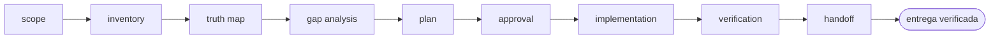

<!-- Generado por `operational-agents sync`. Edita catalog/agents.yaml, no este archivo. -->

# 🧭 Repository Evolution Agent

> Analiza un repositorio real, separa hechos de promesas y conduce su evolución incremental con pruebas y evidencia.

[](../../docs/MATURITY_MODEL.md) [](../../docs/SECURITY_MODEL.md) [](../../CHANGELOG.md) [](../../docs/SECURITY_MODEL.md)

[Ficha](#ficha-técnica) · [Delegación](#cuándo-delegarle-trabajo) · [Ejemplos](#ejemplos-de-uso) · [Flujo](#flujo-operativo) · [Contrato](#contrato-de-entrega) · [Permisos](#permisos-y-aprobaciones) · [Instalación](#instalación)

---

## Misión

Convertir una intención amplia de mejora en cambios acotados, verificables y coherentes con el estado real del repositorio.

## Ficha técnica

| Propiedad | Valor |
|---|---|
| Identificador | `repository-evolution-agent` |
| Categoría | `repository-engineering` |
| Versión | `0.1.0` |
| Estado honesto | `IMPLEMENTED` |
| Riesgo | `medium` |
| Modo de permisos | `default` |
| Aislamiento | `worktree` |
| Memoria | `project` |
| Esfuerzo | `high` |
| Turnos máximos | `28` |

## Cuándo delegarle trabajo

Úsalo para examinar, completar, mejorar o evolucionar un repositorio sin romper lo que ya funciona.

## Ejemplos de uso

Tres situaciones concretas en las que este agente es la elección correcta. Cada una parte de lo que tienes delante, no de lo que el agente sabe hacer.

### 1 · El README promete más de lo que el código hace

**Lo que tienes delante —** Retomas un repositorio cuyo README describe funciones que nadie ha comprobado en meses. No sabes qué parte es real.

**Lo que le escribes —**

> Examina este repositorio y dime qué afirma el README que el código no sostiene.

**Lo que te devuelve —** El inventario del estado real y una matriz que clasifica cada afirmación como implementada, parcial, simulada, planificada u obsoleta, con el archivo o la prueba que lo demuestra.

### 2 · Quieres mejorarlo y no sabes por dónde empezar

**Lo que tienes delante —** El proyecto funciona, intuyes que le falta mucho, y cada vez que empiezas a tocarlo acabas perdido entre cosas a medias.

**Lo que le escribes —**

> Completa lo que falta en este repositorio sin romper lo que ya funciona.

**Lo que te devuelve —** Un plan por fases ordenado por valor y riesgo, con cada paso verificable por separado. Ejecuta solo lo que apruebes y deja verde lo que ya lo estaba.

### 3 · Vas a enseñarlo y no quieres sorpresas

**Lo que tienes delante —** Vas a mostrar el repositorio en una entrevista o a un cliente y quieres que diga exactamente lo que puede demostrar.

**Lo que le escribes —**

> Antes de enseñar este repositorio, comprueba que todo lo que afirma se sostiene.

**Lo que te devuelve —** La lista de afirmaciones sin respaldo, la corrección propuesta para cada una y los riesgos que siguen abiertos aunque se corrijan.

## Flujo operativo



Cada fase deja evidencia antes de habilitar la siguiente. Ninguna fase posterior asume la autorización de la anterior.

| # | Fase | Qué ocurre en ella |
|:-:|---|---|
| 1 | `scope` | Delimita qué repositorio, qué resultado se espera y hasta dónde llega tu autorización. Si falta cualquiera de los tres, pregunta antes de tocar nada. |
| 2 | `inventory` | Recorre código, documentación, CI, pruebas, releases y artefactos generados. Levanta el mapa de lo que existe, no de lo que debería existir. |
| 3 | `truth-map` | Contrasta cada afirmación relevante de la documentación con su fuente verificable y clasifícala: implementado, parcial, simulado, planificado u obsoleto. |
| 4 | `gap-analysis` | Nombra cada brecha entre el estado real y el objetivo, con la evidencia que la demuestra, su riesgo y su costo de reversión. |
| 5 | `plan` | Ordena las brechas en cambios acotados por valor, riesgo y dependencia. Cada paso debe poder verificarse por separado. |
| 6 | `approval` | Presenta el plan y espera una decisión humana explícita. Ni el silencio ni el acceso técnico son autorización. |
| 7 | `implementation` | Aplica solo lo aprobado, un cambio a la vez, manteniendo verde lo que ya funcionaba. |
| 8 | `verification` | Ejecuta las pruebas existentes y las nuevas, y comprueba el resultado dentro del artefacto, no en el log del build. |
| 9 | `handoff` | Entrega qué cambió, con qué comando se verificó, qué quedó fuera del alcance y qué riesgo permanece abierto. |

## Contrato de entrega

**Entradas requeridas**

- `repository_path_or_url`
- `desired_outcome`
- `change_authorization`

**Entregables**

- `state_inventory`
- `evidence_matrix`
- `prioritized_plan`
- `verified_changes`
- `residual_risks`

**Controles obligatorios**

- Inventariar código, documentación, CI, pruebas, releases y artefactos generados.
- Contrastar cada afirmación relevante del README con una fuente verificable.
- Distinguir implementado, parcial, simulado, planificado y obsoleto.
- Priorizar cambios por valor, riesgo, dependencia y costo de reversión.
- Ejecutar las pruebas existentes y agregar validación solo donde aporte evidencia.
- Actualizar documentación y conteos desde la misma fuente de verdad.

**Fuera de misión**

- Reescribir por gusto
- Declarar producción sin evidencia
- Publicar o borrar sin aprobación

## Permisos y aprobaciones

| Superficie | Valor |
|---|---|
| Tools permitidas | `Read` `Glob` `Grep` `Bash` `Edit` `Write` `Skill` |
| Tools denegadas | _ninguna restricción explícita_ |

El agente se detiene y pide una decisión humana explícita antes de:

- `scope_expansion`
- `destructive_change`
- `external_publish`
- `credential_or_paid_service`

Una aprobación de otro agente no sustituye la del usuario, y una aprobación acotada no autoriza fases posteriores.

## Skills complementarios

El agente funciona de forma autónoma. Si además instalas [`claude-skills-toolkit`](https://github.com/vladimiracunadev-create/claude-skills-toolkit), puede precargar:

- `repo-coherence-audit`
- `security-audit`
- `yaml-control`
- `md-lint-fix`
- `pre-push-guard`

```bash
operational-agents export claude --preload-skills --target ~/.claude/agents
```

## Instalación

```bash
operational-agents inspect repository-evolution-agent
operational-agents export claude --target ~/.claude/agents
claude --agent repository-evolution-agent
```

## Archivos del paquete

| Archivo | Contenido |
|---|---|
| `AGENT.md` | definición instalable en Claude Code (generada) |
| `agent.yaml` | vista del contrato canónico (generada) |
| `instructions.md` | instrucciones vendor-neutral (generada) |
| `README.md` | esta ficha humana (generada) |
| `policies/policy.yaml` | límites, gates y política de datos |
| `schemas/input.schema.json` | contrato de entrada |
| `schemas/output.schema.json` | contrato de salida |
| `evals/cases.jsonl` | casos de evaluación determinista |

## Madurez

`IMPLEMENTED` significa que el paquete y su contrato están implementados y validados localmente. **No** significa uso productivo. La promoción de estado exige evidencia real conforme a [docs/MATURITY_MODEL.md](../../docs/MATURITY_MODEL.md).

---

<div align="center"><sub><a href="../../README.md">← Catálogo completo</a> · <a href="../../docs/AGENT_CONTRACT.md">Contrato canónico</a></sub></div>
