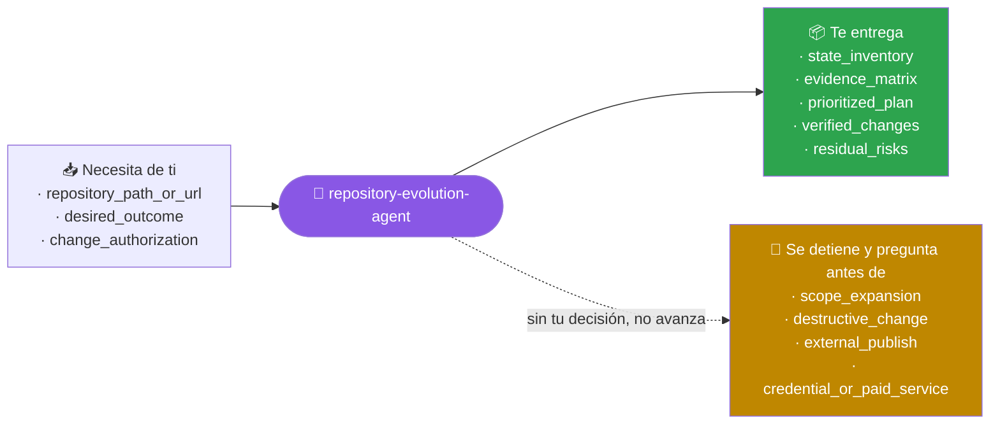
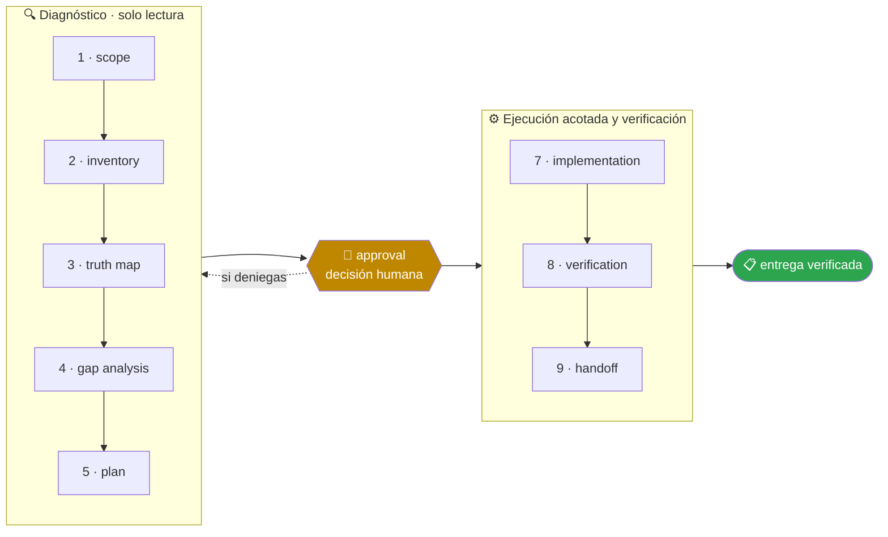

<!-- Generado por `operational-agents sync`. Edita catalog/agents.yaml, no este archivo. -->

# 🧭 Repository Evolution Agent

> Analiza un repositorio real, separa hechos de promesas y conduce su evolución incremental con pruebas y evidencia.

[](../../docs/MATURITY_MODEL.md) [](../../docs/SECURITY_MODEL.md) [](../../CHANGELOG.md) [](../../docs/SECURITY_MODEL.md)

[Ejemplos](#ejemplos-de-uso) · [Mapa](#mapa-de-la-misión) · [Flujo](#flujo-operativo) · [Ficha](#ficha-técnica) · [Contrato](#contrato-de-entrega) · [Permisos](#permisos-y-aprobaciones) · [Instalación](#instalación)

---

## Qué hace por ti

Convertir una intención amplia de mejora en cambios acotados, verificables y coherentes con el estado real del repositorio.

> [!NOTE]
> Trabaja en un worktree aislado y se detiene ante 4 gates humanos. Inspecciona primero; muta solo lo aprobado.

## Cuándo delegarle trabajo

Úsalo para examinar, completar, mejorar o evolucionar un repositorio sin romper lo que ya funciona.

## Ejemplos de uso

3 casos trabajados: el contexto real, el mensaje que le escribes, lo que hace paso a paso y la forma exacta de lo que te devuelve.

> [!NOTE]
> Son **ejemplos ilustrativos del contrato**, no transcripciones de ejecuciones registradas. Ningún agente del catálogo declara todavía evidencia de uso real — ver [Madurez](#madurez).

### 1 · El README promete más de lo que el código hace

**El caso.** `pagos-api` — 3.400 líneas de Python, 12 tests, sin releases publicados. El README anuncia autenticación OAuth2, rate limiting y webhooks. Nadie ha comprobado esas tres afirmaciones en ocho meses.

**Le escribes:**

```text
Examina este repositorio y dime qué afirma el README que el código no sostiene.
```

**Qué hace, paso a paso:**

1. `inventory` — recorre 47 archivos, 12 tests y 2 workflows, y anota que sin releases no hay contra qué contrastar la versión.
2. `truth-map` — busca cada afirmación en el árbol: `oauth` aparece en un módulo, `ratelimit` y `throttle` no aparecen en ninguno.
3. `gap-analysis` — clasifica las tres afirmaciones adjuntando archivo y línea, o la ausencia de coincidencias, como evidencia.

**Lo que te devuelve:**

| Afirmación del README | Estado | Evidencia |
|---|---|---|
| «autenticación OAuth2» | parcial | `auth/oauth.py:41` implementa el flujo; `refresh_token()` lanza `NotImplementedError` |
| «rate limiting» | no implementado | sin coincidencias de `ratelimit` ni `throttle` en 47 archivos |
| «webhooks» | implementado | `webhooks/dispatch.py` con 12 casos en `tests/test_webhooks.py` |

**Cómo cierra —** `PARTIAL` — 3 afirmaciones revisadas, 1 se sostiene entera. No modifica nada: el plan de corrección espera tu decisión.

### 2 · Quieres mejorarlo y no sabes por dónde empezar

**El caso.** Un proyecto propio que funciona: API en Flask con 6 endpoints, sin CI, sin pruebas de integración y con tres `TODO` de hace un año. Quieres avanzarlo sin romperlo.

**Le escribes:**

```text
Completa lo que falta en este repositorio sin romper lo que ya funciona.
```

**Qué hace, paso a paso:**

1. `gap-analysis` — separa lo que falta de lo que sobra: no hay CI, el endpoint de pagos no tiene cobertura y `utils/fechas.py` no lo importa nadie.
2. `plan` — ordena las brechas por valor y riesgo, cada paso con su propia forma de verificarse.
3. `approval` — se detiene aquí. No escribe una línea hasta que elijas qué pasos entran.

**Lo que te devuelve:**

1. **CI mínimo** · riesgo bajo — workflow con lint y pruebas. Se verifica: el workflow pasa en verde sobre el commit actual.
2. **Cobertura del endpoint de pagos** · riesgo medio — 4 casos, incluido el de reintento. Se verifica: `pytest tests/test_pagos.py` en verde.
3. **Retirar el módulo duplicado** · riesgo bajo, reversible — `utils/fechas.py` no se importa desde ninguna parte. Se verifica: la suite sigue verde tras borrarlo.

**Cómo cierra —** `BLOCKED` a propósito, esperando tu decisión. Ejecuta solo los pasos que apruebes, uno a uno, dejando verde lo que ya lo estaba.

### 3 · Vas a enseñarlo mañana y no quieres sorpresas

**El caso.** Muestras el repositorio en una entrevista técnica. Tiene un badge de cobertura, una sección «Arquitectura» con diagrama y un roadmap con seis puntos marcados como hechos.

**Le escribes:**

```text
Antes de enseñar este repositorio, comprueba que todo lo que afirma se sostiene.
```

**Qué hace, paso a paso:**

1. `truth-map` — contrasta el badge, el diagrama y los seis puntos del roadmap contra su fuente verificable, no contra otro documento.
2. `gap-analysis` — separa lo falso de lo desactualizado: un número viejo y una promesa que nunca fue cierta no cuestan lo mismo en una entrevista.
3. `handoff` — entrega qué conviene corregir antes y qué es defendible tal como está.

**Lo que te devuelve:**

| Afirmación | Veredicto | Qué hacer |
|---|---|---|
| badge «cobertura 94%» | falso — la medición real da 71% | corregir el número o retirar el badge |
| diagrama de arquitectura | obsoleto — muestra un cache retirado en marzo | actualizar el diagrama |
| roadmap «6 de 6 hechos» | 4 hechos, 1 parcial, 1 sin empezar | marcar el estado real |

**Cómo cierra —** `COMPLETED` — 3 hallazgos, ninguno corregido todavía: tocar tu repositorio exige tu OK explícito.

## Mapa de la misión



## Flujo operativo



Cada fase deja evidencia antes de habilitar la siguiente. Ninguna fase posterior asume la autorización de la anterior.

| # | Fase | Qué ocurre en ella |
|:-:|---|---|
| 1 | `scope` | Delimita qué repositorio, qué resultado se espera y hasta dónde llega tu autorización. Si falta cualquiera de los tres, pregunta antes de tocar nada. |
| 2 | `inventory` | Recorre código, documentación, CI, pruebas, releases y artefactos generados. Levanta el mapa de lo que existe, no de lo que debería existir. |
| 3 | `truth-map` | Contrasta cada afirmación relevante de la documentación con su fuente verificable y clasifícala: implementado, parcial, simulado, planificado u obsoleto. |
| 4 | `gap-analysis` | Nombra cada brecha entre el estado real y el objetivo, con la evidencia que la demuestra, su riesgo y su costo de reversión. |
| 5 | `plan` | Ordena las brechas en cambios acotados por valor, riesgo y dependencia. Cada paso debe poder verificarse por separado. |
| 6 | `approval` | Presenta el plan y espera una decisión humana explícita. Ni el silencio ni el acceso técnico son autorización. |
| 7 | `implementation` | Aplica solo lo aprobado, un cambio a la vez, manteniendo verde lo que ya funcionaba. |
| 8 | `verification` | Ejecuta las pruebas existentes y las nuevas, y comprueba el resultado dentro del artefacto, no en el log del build. |
| 9 | `handoff` | Entrega qué cambió, con qué comando se verificó, qué quedó fuera del alcance y qué riesgo permanece abierto. |

## Ficha técnica

| Propiedad | Valor |
|---|---|
| Identificador | `repository-evolution-agent` |
| Categoría | `repository-engineering` |
| Versión | `0.1.0` |
| Estado honesto | `IMPLEMENTED` |
| Riesgo | `medium` |
| Modo de permisos | `default` |
| Aislamiento | `worktree` |
| Memoria | `project` |
| Esfuerzo | `high` |
| Turnos máximos | `28` |

## Contrato de entrega

**Entradas requeridas**

- `repository_path_or_url`
- `desired_outcome`
- `change_authorization`

**Entregables**

- `state_inventory`
- `evidence_matrix`
- `prioritized_plan`
- `verified_changes`
- `residual_risks`

**Controles obligatorios**

- Inventariar código, documentación, CI, pruebas, releases y artefactos generados.
- Contrastar cada afirmación relevante del README con una fuente verificable.
- Distinguir implementado, parcial, simulado, planificado y obsoleto.
- Priorizar cambios por valor, riesgo, dependencia y costo de reversión.
- Ejecutar las pruebas existentes y agregar validación solo donde aporte evidencia.
- Actualizar documentación y conteos desde la misma fuente de verdad.

**Fuera de misión**

- Reescribir por gusto
- Declarar producción sin evidencia
- Publicar o borrar sin aprobación

## Permisos y aprobaciones

| Superficie | Valor |
|---|---|
| Tools permitidas | `Read` `Glob` `Grep` `Bash` `Edit` `Write` `Skill` |
| Tools denegadas | _ninguna restricción explícita_ |

El agente se detiene y pide una decisión humana explícita antes de:

- `scope_expansion`
- `destructive_change`
- `external_publish`
- `credential_or_paid_service`

Una aprobación de otro agente no sustituye la del usuario, y una aprobación acotada no autoriza fases posteriores.

## Skills complementarios

El agente funciona de forma autónoma. Si además instalas [`claude-skills-toolkit`](https://github.com/vladimiracunadev-create/claude-skills-toolkit), puede precargar:

- `repo-coherence-audit`
- `security-audit`
- `yaml-control`
- `md-lint-fix`
- `pre-push-guard`

```bash
operational-agents export claude --preload-skills --target ~/.claude/agents
```

## Instalación

```bash
operational-agents inspect repository-evolution-agent
operational-agents export claude --target ~/.claude/agents
claude --agent repository-evolution-agent
```

## Archivos del paquete

| Archivo | Contenido |
|---|---|
| `AGENT.md` | definición instalable en Claude Code (generada) |
| `agent.yaml` | vista del contrato canónico (generada) |
| `instructions.md` | instrucciones vendor-neutral (generada) |
| `README.md` | esta ficha humana (generada) |
| `policies/policy.yaml` | límites, gates y política de datos |
| `schemas/input.schema.json` | contrato de entrada |
| `schemas/output.schema.json` | contrato de salida |
| `evals/cases.jsonl` | casos de evaluación determinista |

## Madurez

`IMPLEMENTED` significa que el paquete y su contrato están implementados y validados localmente. **No** significa uso productivo. La promoción de estado exige evidencia real conforme a [docs/MATURITY_MODEL.md](../../docs/MATURITY_MODEL.md).

---

<div align="center"><sub><a href="../../README.md">← Catálogo completo</a> · <a href="../../docs/AGENT_CONTRACT.md">Contrato canónico</a></sub></div>
