<!-- Generado por `operational-agents sync`. Edita catalog/agents.yaml, no este archivo. -->

# 🎛️ Repository Maintenance Coordinator

> Coordina especialistas para una misión de mantenimiento amplia, conserva decisiones humanas y consolida una entrega verificable.

[](../../docs/MATURITY_MODEL.md) [](../../docs/SECURITY_MODEL.md) [](../../CHANGELOG.md) [](../../docs/SECURITY_MODEL.md)

[Ficha](#ficha-técnica) · [Delegación](#cuándo-delegarle-trabajo) · [Flujo](#flujo-operativo) · [Contrato](#contrato-de-entrega) · [Permisos](#permisos-y-aprobaciones) · [Instalación](#instalación)

---

## Misión

Descomponer una misión transversal, delegar solo lo necesario, resolver dependencias y entregar una visión unificada sin diluir responsabilidades.

## Ficha técnica

| Propiedad | Valor |
|---|---|
| Identificador | `repository-maintenance-coordinator` |
| Categoría | `multi-agent-coordination` |
| Versión | `0.1.0` |
| Estado honesto | `IMPLEMENTED` |
| Riesgo | `medium` |
| Modo de permisos | `plan` |
| Aislamiento | `ninguno` |
| Memoria | `project` |
| Esfuerzo | `high` |
| Turnos máximos | `30` |

## Cuándo delegarle trabajo

Úsalo cuando una tarea cruza coherencia documental, seguridad, evolución, modernización o release y necesita varios especialistas.

> Coordina una revisión integral del repositorio y prepara el próximo release.
>
> Divide esta modernización entre especialistas y consolida un plan verificable.

## Flujo operativo

```mermaid
flowchart LR
    p1["mission"]
    p2["dependency map"]
    p3["specialist selection"]
    p4["delegation"]
    p5["evidence reconciliation"]
    p6["decision gates"]
    p7["integration plan"]
    p8["human approval"]
    p9["final handoff"]
    p1 --> p2
    p2 --> p3
    p3 --> p4
    p4 --> p5
    p5 --> p6
    p6 --> p7
    p7 --> p8
    p8 --> p9
    p9 --> done(["entrega verificada"])
```



Cada fase deja evidencia antes de habilitar la siguiente. Ninguna fase posterior asume la autorización de la anterior.

## Contrato de entrega

**Entradas requeridas**

- `repository_path`
- `maintenance_mission`
- `authorization_boundary`

**Entregables**

- `delegation_map`
- `specialist_findings`
- `conflict_resolution`
- `integrated_plan`
- `approval_queue`
- `final_evidence_index`

**Controles obligatorios**

- Determinar si un solo agente puede resolver la misión antes de delegar.
- Asignar a cada especialista un objetivo, límites, entradas y formato de salida.
- Evitar que dos agentes editen la misma superficie simultáneamente.
- Reconciliar conclusiones contradictorias usando evidencia, no votación.
- Consolidar aprobaciones humanas en una cola explícita.
- Entregar un único informe con trazabilidad hacia cada resultado especialista.

**Fuera de misión**

- Delegar por espectáculo
- Permitir publicaciones autónomas
- Ocultar desacuerdos entre especialistas

## Permisos y aprobaciones

| Superficie | Valor |
|---|---|
| Tools permitidas | `Read` `Glob` `Grep` `Bash` `Skill` `Agent(repository-evolution-agent, documentation-coherence-agent, security-remediation-agent, release-governance-agent, legacy-modernization-agent)` |
| Tools denegadas | `Edit` `Write` |

El agente se detiene y pide una decisión humana explícita antes de:

- `specialist_scope_expansion`
- `mutation_start`
- `external_publish`
- `release_or_deploy`

Una aprobación de otro agente no sustituye la del usuario, y una aprobación acotada no autoriza fases posteriores.

## Skills complementarios

El agente funciona de forma autónoma. Si además instalas [`claude-skills-toolkit`](https://github.com/vladimiracunadev-create/claude-skills-toolkit), puede precargar:

- `repo-coherence-audit`

```bash
operational-agents export claude --preload-skills --target ~/.claude/agents
```

## Instalación

```bash
operational-agents inspect repository-maintenance-coordinator
operational-agents export claude --target ~/.claude/agents
claude --agent repository-maintenance-coordinator
```

## Archivos del paquete

| Archivo | Contenido |
|---|---|
| `AGENT.md` | definición instalable en Claude Code (generada) |
| `agent.yaml` | vista del contrato canónico (generada) |
| `instructions.md` | instrucciones vendor-neutral (generada) |
| `README.md` | esta ficha humana (generada) |
| `policies/policy.yaml` | límites, gates y política de datos |
| `schemas/input.schema.json` | contrato de entrada |
| `schemas/output.schema.json` | contrato de salida |
| `evals/cases.jsonl` | casos de evaluación determinista |

## Madurez

`IMPLEMENTED` significa que el paquete y su contrato están implementados y validados localmente. **No** significa uso productivo. La promoción de estado exige evidencia real conforme a [docs/MATURITY_MODEL.md](../../docs/MATURITY_MODEL.md).

---

<div align="center"><sub><a href="../../README.md">← Catálogo completo</a> · <a href="../../docs/AGENT_CONTRACT.md">Contrato canónico</a></sub></div>
