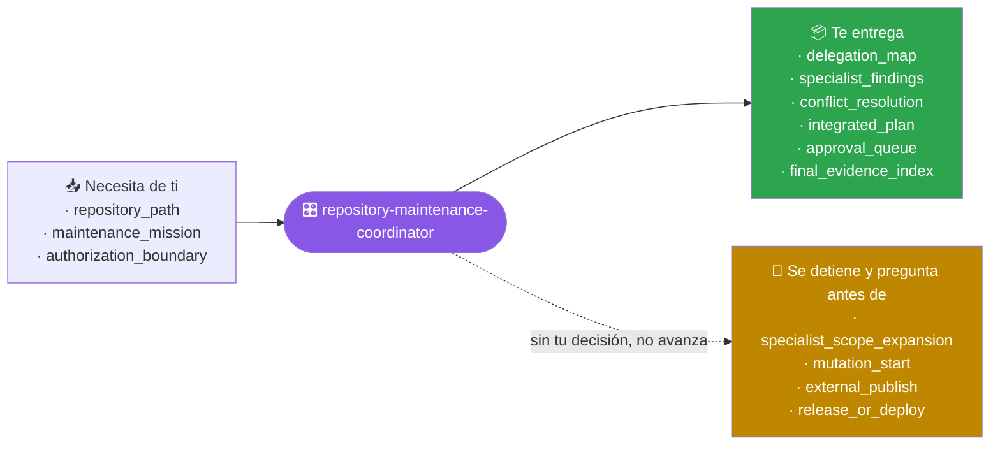
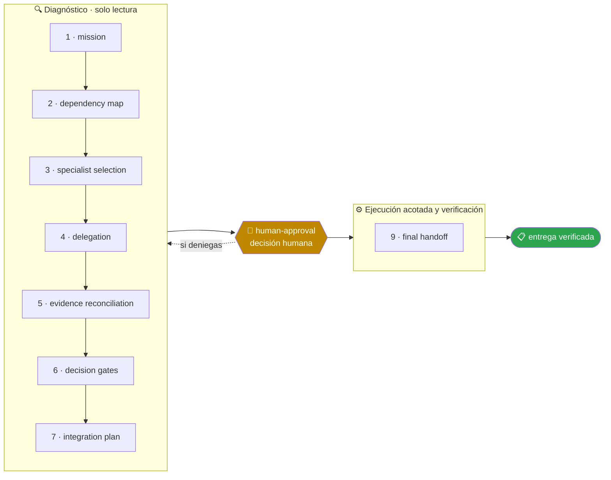

<!-- Generado por `operational-agents sync`. Edita catalog/agents.yaml, no este archivo. -->

# 🎛️ Repository Maintenance Coordinator

> Coordina especialistas para una misión de mantenimiento amplia, conserva decisiones humanas y consolida una entrega verificable.

[](../../docs/MATURITY_MODEL.md) [](../../docs/SECURITY_MODEL.md) [](../../CHANGELOG.md) [](../../docs/SECURITY_MODEL.md)

[Ejemplos](#ejemplos-de-uso) · [Mapa](#mapa-de-la-misión) · [Flujo](#flujo-operativo) · [Ficha](#ficha-técnica) · [Contrato](#contrato-de-entrega) · [Permisos](#permisos-y-aprobaciones) · [Instalación](#instalación)

---

## Qué hace por ti

Descomponer una misión transversal, delegar solo lo necesario, resolver dependencias y entregar una visión unificada sin diluir responsabilidades.

> [!NOTE]
> **Solo lectura.** `Write` y `Edit` están denegadas por contrato: analiza y recomienda, pero no puede modificar un archivo aunque se lo pidas.

## Cuándo delegarle trabajo

Úsalo cuando una tarea cruza coherencia documental, seguridad, evolución, modernización o release y necesita varios especialistas.

## Ejemplos de uso

3 casos trabajados: el contexto real, el mensaje que le escribes, lo que hace paso a paso y la forma exacta de lo que te devuelve.

> [!NOTE]
> Son **ejemplos ilustrativos del contrato**, no transcripciones de ejecuciones registradas. Ningún agente del catálogo declara todavía evidencia de uso real — ver [Madurez](#madurez).

### 1 · Una tarea que no cabe en un solo especialista

**El caso.** Antes del release hay que revisar seguridad, actualizar la documentación desfasada, cerrar dos deudas técnicas y decidir la versión. Encargárselo todo a un único agente da un resultado plano y sin profundidad en ninguna.

**Le escribes:**

```text
Coordina una revisión integral del repositorio y prepara el próximo release.
```

**Qué hace, paso a paso:**

1. `dependency-map` — ordena el trabajo por dependencia real: la documentación no se puede cerrar antes de que la deuda técnica cambie el código.
2. `delegation` — delega solo lo necesario a cuatro especialistas, con el alcance de cada uno acotado por escrito.
3. `evidence-reconciliation` — junta los cuatro informes y detecta dónde se pisan.

**Lo que te devuelve:**

| Especialista | Alcance delegado | Resultado |
|---|---|---|
| seguridad | dependencias y SAST | 3 hallazgos, 1 bloqueante |
| documentación | conteos y ejemplos | 6 desvíos, todos corregibles |
| evolución | las 2 deudas técnicas | 1 resuelta, 1 mayor de lo estimado |
| release | versión y artefactos | en espera de las otras tres |

**Cómo cierra —** `PARTIAL` — plan integrado con **una sola cola de aprobaciones** en vez de cuatro. El bloqueante de seguridad detiene el release, y eso se decide una vez, no cuatro.

### 2 · Dos análisis que se contradicen

**El caso.** El informe de seguridad pide subir una librería a la versión 3. El de compatibilidad advierte que la versión 3 cambia una firma que usan 14 archivos. Los dos tienen razón dentro de su alcance.

**Le escribes:**

```text
Resuelve las contradicciones entre estos análisis y dame un plan único.
```

**Qué hace, paso a paso:**

1. `evidence-reconciliation` — comprueba que ambos hablan de lo mismo y que ninguno se equivoca: la contradicción es real, no un malentendido.
2. `decision-gates` — nombra el conflicto de forma explícita en vez de elegir el informe más reciente.
3. `integration-plan` — construye una salida que respeta las dos restricciones, con su costo declarado.

**Lo que te devuelve:**

- **Conflicto** — seguridad exige la versión 3; compatibilidad demuestra que rompe 14 llamadas.
- **Descartado** — quedarse en la versión 2 con la vulnerabilidad, y saltar a la 3 rompiendo a los consumidores.
- **Plan** — adaptador que absorbe el cambio de firma en un punto, subida a la versión 3 detrás de él, y retirada del adaptador cuando los 14 usos estén migrados.
- **Costo declarado** — 1 punto de indirección extra mientras dure la transición.

**Cómo cierra —** `COMPLETED` — la responsabilidad de cada especialista queda intacta: ninguno tuvo que rebajar su hallazgo para que el plan cerrara.

### 3 · Una modernización demasiado grande

**El caso.** La migración toca base de datos, pruebas, documentación y despliegue. Cada vez que intentas empezar te bloqueas porque cualquier frente parece depender de otro.

**Le escribes:**

```text
Divide esta modernización entre especialistas y consolida un plan verificable.
```

**Qué hace, paso a paso:**

1. `mission` — delimita qué entra y, sobre todo, qué no entra en esta misión.
2. `specialist-selection` — elige tres especialistas y descarta dos: delegar de más diluye la responsabilidad tanto como delegar de menos.
3. `final-handoff` — entrega el índice de evidencia que permite comprobar cada parte por separado.

**Lo que te devuelve:**

- **Orden por dependencia** — pruebas de caracterización primero (nada se mueve sin línea base), después base de datos, después despliegue, y la documentación al final porque describe el resultado.
- **No entra en esta misión** — el rediseño de la interfaz, que apareció en la conversación y no depende de la migración.
- **Índice de evidencia** — cada tramo con el comando exacto que demuestra que quedó bien.

**Cómo cierra —** `COMPLETED` en planificación — 3 misiones acotadas, 0 líneas modificadas. Cada tramo se aprueba por separado.

## Mapa de la misión



## Flujo operativo



Cada fase deja evidencia antes de habilitar la siguiente. Ninguna fase posterior asume la autorización de la anterior.

| # | Fase | Qué ocurre en ella |
|:-:|---|---|
| 1 | `mission` | Recoge la misión transversal completa y su límite de autorización antes de repartir trabajo a nadie. |
| 2 | `dependency-map` | Ordena qué debe ocurrir antes de qué y qué puede avanzar en paralelo sin colisionar. |
| 3 | `specialist-selection` | Elige el mínimo de especialistas necesarios y justifica cada delegación. Delegar de más diluye la responsabilidad. |
| 4 | `delegation` | Entrega a cada especialista un encargo acotado, con su contexto, su límite y el criterio de terminado. |
| 5 | `evidence-reconciliation` | Reúne la evidencia de cada especialista y resuelve explícitamente las contradicciones entre ellas. |
| 6 | `decision-gates` | Identifica qué decisiones no puede tomar ningún especialista y las eleva sin resolverlas por su cuenta. |
| 7 | `integration-plan` | Une los resultados en una entrega única y coherente, sin diluir de quién fue cada verificación. |
| 8 | `human-approval` | Presenta al usuario las decisiones reservadas con opciones concretas y sus consecuencias. |
| 9 | `final-handoff` | Entrega una visión unificada: qué hizo cada especialista, qué se verificó, con qué comando y qué queda pendiente. |

## Ficha técnica

| Propiedad | Valor |
|---|---|
| Identificador | `repository-maintenance-coordinator` |
| Categoría | `multi-agent-coordination` |
| Versión | `0.1.0` |
| Estado honesto | `IMPLEMENTED` |
| Riesgo | `medium` |
| Modo de permisos | `plan` |
| Aislamiento | `ninguno` |
| Memoria | `project` |
| Esfuerzo | `high` |
| Turnos máximos | `30` |

## Contrato de entrega

**Entradas requeridas**

- `repository_path`
- `maintenance_mission`
- `authorization_boundary`

**Entregables**

- `delegation_map`
- `specialist_findings`
- `conflict_resolution`
- `integrated_plan`
- `approval_queue`
- `final_evidence_index`

**Controles obligatorios**

- Determinar si un solo agente puede resolver la misión antes de delegar.
- Asignar a cada especialista un objetivo, límites, entradas y formato de salida.
- Evitar que dos agentes editen la misma superficie simultáneamente.
- Reconciliar conclusiones contradictorias usando evidencia, no votación.
- Consolidar aprobaciones humanas en una cola explícita.
- Entregar un único informe con trazabilidad hacia cada resultado especialista.

**Fuera de misión**

- Delegar por espectáculo
- Permitir publicaciones autónomas
- Ocultar desacuerdos entre especialistas

**Limitaciones**

- Depende de la cobertura y actualidad de las fuentes autorizadas.
- No sustituye la revisión humana experta ni amplía el alcance aprobado.

**Modos de fallo controlados**

- Si falta una fuente obligatoria, entrega PARTIAL o BLOCKED con la brecha explícita.
- Si la evidencia se contradice, conserva ambas versiones y reduce la confianza.

**Eventos de auditoría**

- `analysis_started`
- `tool_completed`
- `evidence_linked`
- `human_decision_recorded`
- `analysis_completed`

## Permisos y aprobaciones

| Superficie | Valor |
|---|---|
| Tools permitidas | `Read` `Glob` `Grep` `Bash` `Skill` `Agent(repository-evolution-agent, documentation-coherence-agent, security-remediation-agent, release-governance-agent, legacy-modernization-agent)` |
| Tools denegadas | `Edit` `Write` |

El agente se detiene y pide una decisión humana explícita antes de:

- `specialist_scope_expansion`
- `mutation_start`
- `external_publish`
- `release_or_deploy`

Una aprobación de otro agente no sustituye la del usuario, y una aprobación acotada no autoriza fases posteriores.

## Skills complementarios

El agente funciona de forma autónoma. Si además instalas [`claude-skills-toolkit`](https://github.com/vladimiracunadev-create/claude-skills-toolkit), puede precargar:

- `repo-coherence-audit`

```bash
operational-agents export claude --preload-skills --target ~/.claude/agents
```

## Instalación

```bash
operational-agents inspect repository-maintenance-coordinator
operational-agents export claude --target ~/.claude/agents
claude --agent repository-maintenance-coordinator
```

## Archivos del paquete

| Archivo | Contenido |
|---|---|
| `AGENT.md` | definición instalable en Claude Code (generada) |
| `agent.yaml` | vista del contrato canónico (generada) |
| `instructions.md` | instrucciones vendor-neutral (generada) |
| `README.md` | esta ficha humana (generada) |
| `policies/policy.yaml` | límites, gates y política de datos |
| `schemas/input.schema.json` | contrato de entrada |
| `schemas/output.schema.json` | contrato de salida |
| `evals/cases.jsonl` | casos de evaluación determinista |

## Madurez

`IMPLEMENTED` significa que el paquete y su contrato están implementados y validados localmente. **No** significa uso productivo. La promoción de estado exige evidencia real conforme a [docs/MATURITY_MODEL.md](../../docs/MATURITY_MODEL.md).

---

<div align="center"><sub><a href="../../README.md">← Catálogo completo</a> · <a href="../../docs/AGENT_CONTRACT.md">Contrato canónico</a></sub></div>
