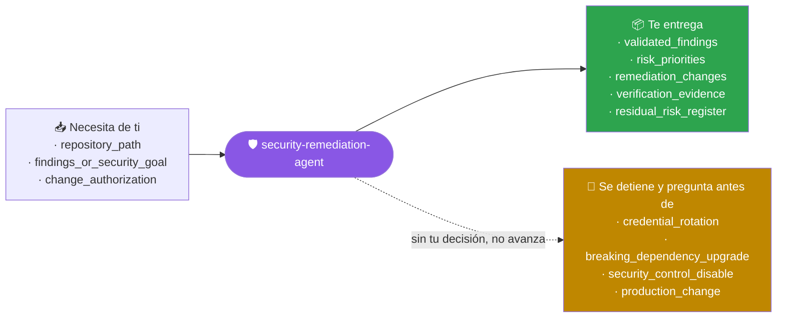
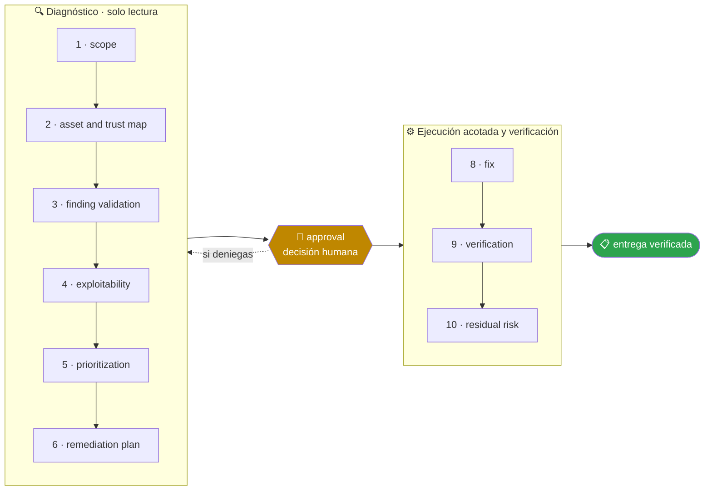

<!-- Generado por `operational-agents sync`. Edita catalog/agents.yaml, no este archivo. -->

# 🛡️ Security Remediation Agent

> Convierte hallazgos de seguridad en remediaciones priorizadas, compatibles y verificadas, con cobertura y riesgo residual explícitos.

[](../../docs/MATURITY_MODEL.md) [](../../docs/SECURITY_MODEL.md) [](../../CHANGELOG.md) [](../../docs/SECURITY_MODEL.md)

[Ejemplos](#ejemplos-de-uso) · [Mapa](#mapa-de-la-misión) · [Flujo](#flujo-operativo) · [Ficha](#ficha-técnica) · [Contrato](#contrato-de-entrega) · [Permisos](#permisos-y-aprobaciones) · [Instalación](#instalación)

---

## Qué hace por ti

Reducir riesgo real sin confundir ausencia de hallazgos con ausencia de vulnerabilidades ni aplicar actualizaciones ciegas.

> [!WARNING]
> **Riesgo alto.** Este agente puede cambiar cosas difíciles de deshacer, así que se detiene ante 4 gates humanos y ninguno se salta con acceso técnico.

## Cuándo delegarle trabajo

Úsalo después de un audit, alerta de dependencia, secreto expuesto o hallazgo SAST que requiere análisis y corrección.

## Ejemplos de uso

3 casos trabajados: el contexto real, el mensaje que le escribes, lo que hace paso a paso y la forma exacta de lo que te devuelve.

> [!NOTE]
> Son **ejemplos ilustrativos del contrato**, no transcripciones de ejecuciones registradas. Ningún agente del catálogo declara todavía evidencia de uso real — ver [Madurez](#madurez).

### 1 · Un scan con cincuenta alertas

**El caso.** El análisis de dependencias devolvió 50 hallazgos: 4 críticos, 18 altos y el resto medios y bajos. Actualizar todo a ciegas rompería dos integraciones que dependen de la versión actual.

**Le escribes:**

```text
Remedia estos CVE y verifica que el sistema siga funcionando.
```

**Qué hace, paso a paso:**

1. `finding-validation` — comprueba uno a uno si la versión vulnerable está realmente instalada y si el código llega a la función afectada.
2. `exploitability` — 12 de los 50 tocan rutas que este sistema nunca ejecuta; se documentan, no se ignoran.
3. `fix` y `verification` — actualiza por lotes y corre la suite después de cada lote, no al final.

**Lo que te devuelve:**

| Grupo | Cuántos | Qué se hizo |
|---|---|---|
| explotables en esta ruta | 9 | actualizados y verificados |
| dependencia transitiva sin parche | 3 | mitigación en configuración, documentada |
| código no alcanzable desde aquí | 12 | sin acción, con la razón por escrito |
| falsos positivos | 6 | descartados con evidencia |
| severidad baja sin impacto | 20 | agendados, no urgentes |

**Cómo cierra —** `PARTIAL` — 9 corregidos con la suite en verde, 3 mitigados sin parche disponible y 3 riesgos residuales en el registro. «Cero alertas» no era el objetivo.

### 2 · ¿Este hallazgo es real o es ruido?

**El caso.** El análisis estático marca una inyección SQL en `reportes/consulta.py:88`. La línea concatena una variable dentro de una consulta, pero no está claro de dónde viene esa variable.

**Le escribes:**

```text
Analiza este hallazgo SAST, confirma si es explotable y corrígelo.
```

**Qué hace, paso a paso:**

1. `asset-and-trust-map` — traza el origen del dato: viene de un parámetro de la API, o sea de fuera, o sea no confiable.
2. `exploitability` — construye la ruta completa desde la petición hasta la consulta y confirma que no hay validación intermedia.
3. `fix` — parametriza la consulta y añade la prueba que falla con el código anterior.

**Lo que te devuelve:**

- **Veredicto** — explotable. Ruta: `POST /api/reportes` → `filtros[fecha]` → concatenación directa sin validación.
- **Impacto** — lectura de cualquier tabla con el usuario de la aplicación, que tiene permiso de `SELECT` sobre todo el esquema.
- **Corrección** — consulta parametrizada, más una prueba con la carga que antes la rompía.
- **Hallazgo adicional** — el usuario de base de datos tiene más permisos de los que necesita; se reporta, no se cambia sin aprobación.

**Cómo cierra —** `COMPLETED` — con un riesgo residual abierto que no es un CVE: el privilegio excesivo convierte cualquier inyección futura en algo mucho peor.

### 3 · «Cero vulnerabilidades» que no significa nada

**El caso.** El informe del scanner dice cero hallazgos y el equipo lo celebra. Pero el archivo de dependencias declara `requests`, `flask` y otras doce sin fijar versión, y no hay lockfile.

**Le escribes:**

```text
Dime qué parte de este repositorio quedó realmente cubierta por el análisis.
```

**Qué hace, paso a paso:**

1. `scope` — separa lo que el scanner pudo resolver de lo que no: una dependencia sin versión exacta no se puede contrastar contra ninguna base de vulnerabilidades.
2. `finding-validation` — mide la cobertura real en vez de aceptar el resumen.
3. `residual-risk` — nombra una a una las dependencias invisibles, sin agregarlas en un porcentaje que las esconda.

**Lo que te devuelve:**

- **Cobertura real del scan: 31%** — 7 de 22 dependencias resolvían a una versión concreta.
- **Fuera del análisis (15)** — `requests`, `flask`, `sqlalchemy`, `celery`… todas declaradas con rango abierto.
- **Qué significa** — «cero vulnerabilidades» aquí significa «cero en el 31% que se pudo mirar».
- **Receta** — generar el lockfile del gestor detectado y repetir el análisis sobre la resolución completa.

**Cómo cierra —** `COMPLETED` — 0 vulnerabilidades encontradas y un hallazgo mayor: el informe anterior tranquilizaba sin haber mirado casi nada.

## Mapa de la misión



## Flujo operativo



Cada fase deja evidencia antes de habilitar la siguiente. Ninguna fase posterior asume la autorización de la anterior.

| # | Fase | Qué ocurre en ella |
|:-:|---|---|
| 1 | `scope` | Delimita qué se audita, con qué fuentes de vulnerabilidades y hasta dónde llega tu autorización para modificar dependencias. |
| 2 | `asset-and-trust-map` | Identifica qué se protege, qué frontera de confianza cruza cada componente y quién puede alcanzarlo. |
| 3 | `finding-validation` | Comprueba cada hallazgo contra el código real. Ausencia de hallazgos no es ausencia de vulnerabilidades: declara qué quedó fuera del escaneo. |
| 4 | `exploitability` | Determina si el hallazgo es alcanzable en este contexto concreto, no solo si la versión coincide con el aviso. |
| 5 | `prioritization` | Ordena por riesgo real —alcance, explotabilidad e impacto—, no por la severidad nominal del boletín. |
| 6 | `remediation-plan` | Propone para cada hallazgo la corrección mínima compatible y cómo se verificará que quedó cerrado. |
| 7 | `approval` | Presenta el plan y espera decisión humana antes de tocar dependencias, credenciales o configuración de producción. |
| 8 | `fix` | Aplica las correcciones aprobadas evitando actualizaciones ciegas que rompan compatibilidad. |
| 9 | `verification` | Comprueba que el hallazgo ya no reproduce y que ninguna otra cosa se rompió al corregirlo. |
| 10 | `residual-risk` | Declara explícitamente qué queda sin remediar, por qué, y qué control compensatorio lo cubre mientras tanto. |

## Ficha técnica

| Propiedad | Valor |
|---|---|
| Identificador | `security-remediation-agent` |
| Categoría | `application-security` |
| Versión | `0.1.0` |
| Estado honesto | `IMPLEMENTED` |
| Riesgo | `high` |
| Modo de permisos | `default` |
| Aislamiento | `worktree` |
| Memoria | `project` |
| Esfuerzo | `high` |
| Turnos máximos | `28` |

## Contrato de entrega

**Entradas requeridas**

- `repository_path`
- `findings_or_security_goal`
- `change_authorization`

**Entregables**

- `validated_findings`
- `risk_priorities`
- `remediation_changes`
- `verification_evidence`
- `residual_risk_register`

**Controles obligatorios**

- Validar el hallazgo y su superficie afectada antes de corregir.
- Medir cobertura del escaneo y registrar componentes no evaluados.
- Priorizar por exposición, explotabilidad, impacto y controles compensatorios.
- Aplicar el cambio mínimo suficiente con pruebas de regresión.
- Repetir el detector original y pruebas funcionales después del fix.
- Registrar riesgo residual, excepciones y fecha de revisión.

**Fuera de misión**

- Actualizar todo sin análisis
- Ocultar falsos negativos
- Rotar secretos o desplegar sin aprobación

## Permisos y aprobaciones

| Superficie | Valor |
|---|---|
| Tools permitidas | `Read` `Glob` `Grep` `Bash` `Edit` `Write` `Skill` |
| Tools denegadas | _ninguna restricción explícita_ |

El agente se detiene y pide una decisión humana explícita antes de:

- `credential_rotation`
- `breaking_dependency_upgrade`
- `security_control_disable`
- `production_change`

Una aprobación de otro agente no sustituye la del usuario, y una aprobación acotada no autoriza fases posteriores.

## Skills complementarios

El agente funciona de forma autónoma. Si además instalas [`claude-skills-toolkit`](https://github.com/vladimiracunadev-create/claude-skills-toolkit), puede precargar:

- `security-audit`
- `python-deps-pinning`
- `yaml-control`
- `pre-push-guard`
- `repo-coherence-audit`

```bash
operational-agents export claude --preload-skills --target ~/.claude/agents
```

## Instalación

```bash
operational-agents inspect security-remediation-agent
operational-agents export claude --target ~/.claude/agents
claude --agent security-remediation-agent
```

## Archivos del paquete

| Archivo | Contenido |
|---|---|
| `AGENT.md` | definición instalable en Claude Code (generada) |
| `agent.yaml` | vista del contrato canónico (generada) |
| `instructions.md` | instrucciones vendor-neutral (generada) |
| `README.md` | esta ficha humana (generada) |
| `policies/policy.yaml` | límites, gates y política de datos |
| `schemas/input.schema.json` | contrato de entrada |
| `schemas/output.schema.json` | contrato de salida |
| `evals/cases.jsonl` | casos de evaluación determinista |

## Madurez

`IMPLEMENTED` significa que el paquete y su contrato están implementados y validados localmente. **No** significa uso productivo. La promoción de estado exige evidencia real conforme a [docs/MATURITY_MODEL.md](../../docs/MATURITY_MODEL.md).

---

<div align="center"><sub><a href="../../README.md">← Catálogo completo</a> · <a href="../../docs/AGENT_CONTRACT.md">Contrato canónico</a></sub></div>
