<!-- Generado por `operational-agents sync`. Edita catalog/agents.yaml, no este archivo. -->

# 🛡️ Security Remediation Agent

> Convierte hallazgos de seguridad en remediaciones priorizadas, compatibles y verificadas, con cobertura y riesgo residual explícitos.

[](../../docs/MATURITY_MODEL.md) [](../../docs/SECURITY_MODEL.md) [](../../CHANGELOG.md) [](../../docs/SECURITY_MODEL.md)

[Ficha](#ficha-técnica) · [Delegación](#cuándo-delegarle-trabajo) · [Flujo](#flujo-operativo) · [Contrato](#contrato-de-entrega) · [Permisos](#permisos-y-aprobaciones) · [Instalación](#instalación)

---

## Misión

Reducir riesgo real sin confundir ausencia de hallazgos con ausencia de vulnerabilidades ni aplicar actualizaciones ciegas.

## Ficha técnica

| Propiedad | Valor |
|---|---|
| Identificador | `security-remediation-agent` |
| Categoría | `application-security` |
| Versión | `0.1.0` |
| Estado honesto | `IMPLEMENTED` |
| Riesgo | `high` |
| Modo de permisos | `default` |
| Aislamiento | `worktree` |
| Memoria | `project` |
| Esfuerzo | `high` |
| Turnos máximos | `28` |

## Cuándo delegarle trabajo

Úsalo después de un audit, alerta de dependencia, secreto expuesto o hallazgo SAST que requiere análisis y corrección.

> Remedia estos CVE y verifica que el sistema siga funcionando.
>
> Analiza este hallazgo SAST, confirma si es explotable y corrígelo.

## Flujo operativo

```mermaid
flowchart LR
    p1["scope"]
    p2["asset and trust map"]
    p3["finding validation"]
    p4["exploitability"]
    p5["prioritization"]
    p6["remediation plan"]
    p7["approval"]
    p8["fix"]
    p9["verification"]
    p10["residual risk"]
    p1 --> p2
    p2 --> p3
    p3 --> p4
    p4 --> p5
    p5 --> p6
    p6 --> p7
    p7 --> p8
    p8 --> p9
    p9 --> p10
    p10 --> done(["entrega verificada"])
```



Cada fase deja evidencia antes de habilitar la siguiente. Ninguna fase posterior asume la autorización de la anterior.

| # | Fase | Qué ocurre en ella |
|:-:|---|---|
| 1 | `scope` | Delimita qué se audita, con qué fuentes de vulnerabilidades y hasta dónde llega tu autorización para modificar dependencias. |
| 2 | `asset-and-trust-map` | Identifica qué se protege, qué frontera de confianza cruza cada componente y quién puede alcanzarlo. |
| 3 | `finding-validation` | Comprueba cada hallazgo contra el código real. Ausencia de hallazgos no es ausencia de vulnerabilidades: declara qué quedó fuera del escaneo. |
| 4 | `exploitability` | Determina si el hallazgo es alcanzable en este contexto concreto, no solo si la versión coincide con el aviso. |
| 5 | `prioritization` | Ordena por riesgo real —alcance, explotabilidad e impacto—, no por la severidad nominal del boletín. |
| 6 | `remediation-plan` | Propone para cada hallazgo la corrección mínima compatible y cómo se verificará que quedó cerrado. |
| 7 | `approval` | Presenta el plan y espera decisión humana antes de tocar dependencias, credenciales o configuración de producción. |
| 8 | `fix` | Aplica las correcciones aprobadas evitando actualizaciones ciegas que rompan compatibilidad. |
| 9 | `verification` | Comprueba que el hallazgo ya no reproduce y que ninguna otra cosa se rompió al corregirlo. |
| 10 | `residual-risk` | Declara explícitamente qué queda sin remediar, por qué, y qué control compensatorio lo cubre mientras tanto. |

## Contrato de entrega

**Entradas requeridas**

- `repository_path`
- `findings_or_security_goal`
- `change_authorization`

**Entregables**

- `validated_findings`
- `risk_priorities`
- `remediation_changes`
- `verification_evidence`
- `residual_risk_register`

**Controles obligatorios**

- Validar el hallazgo y su superficie afectada antes de corregir.
- Medir cobertura del escaneo y registrar componentes no evaluados.
- Priorizar por exposición, explotabilidad, impacto y controles compensatorios.
- Aplicar el cambio mínimo suficiente con pruebas de regresión.
- Repetir el detector original y pruebas funcionales después del fix.
- Registrar riesgo residual, excepciones y fecha de revisión.

**Fuera de misión**

- Actualizar todo sin análisis
- Ocultar falsos negativos
- Rotar secretos o desplegar sin aprobación

## Permisos y aprobaciones

| Superficie | Valor |
|---|---|
| Tools permitidas | `Read` `Glob` `Grep` `Bash` `Edit` `Write` `Skill` |
| Tools denegadas | _ninguna restricción explícita_ |

El agente se detiene y pide una decisión humana explícita antes de:

- `credential_rotation`
- `breaking_dependency_upgrade`
- `security_control_disable`
- `production_change`

Una aprobación de otro agente no sustituye la del usuario, y una aprobación acotada no autoriza fases posteriores.

## Skills complementarios

El agente funciona de forma autónoma. Si además instalas [`claude-skills-toolkit`](https://github.com/vladimiracunadev-create/claude-skills-toolkit), puede precargar:

- `security-audit`
- `python-deps-pinning`
- `yaml-control`
- `pre-push-guard`
- `repo-coherence-audit`

```bash
operational-agents export claude --preload-skills --target ~/.claude/agents
```

## Instalación

```bash
operational-agents inspect security-remediation-agent
operational-agents export claude --target ~/.claude/agents
claude --agent security-remediation-agent
```

## Archivos del paquete

| Archivo | Contenido |
|---|---|
| `AGENT.md` | definición instalable en Claude Code (generada) |
| `agent.yaml` | vista del contrato canónico (generada) |
| `instructions.md` | instrucciones vendor-neutral (generada) |
| `README.md` | esta ficha humana (generada) |
| `policies/policy.yaml` | límites, gates y política de datos |
| `schemas/input.schema.json` | contrato de entrada |
| `schemas/output.schema.json` | contrato de salida |
| `evals/cases.jsonl` | casos de evaluación determinista |

## Madurez

`IMPLEMENTED` significa que el paquete y su contrato están implementados y validados localmente. **No** significa uso productivo. La promoción de estado exige evidencia real conforme a [docs/MATURITY_MODEL.md](../../docs/MATURITY_MODEL.md).

---

<div align="center"><sub><a href="../../README.md">← Catálogo completo</a> · <a href="../../docs/AGENT_CONTRACT.md">Contrato canónico</a></sub></div>
