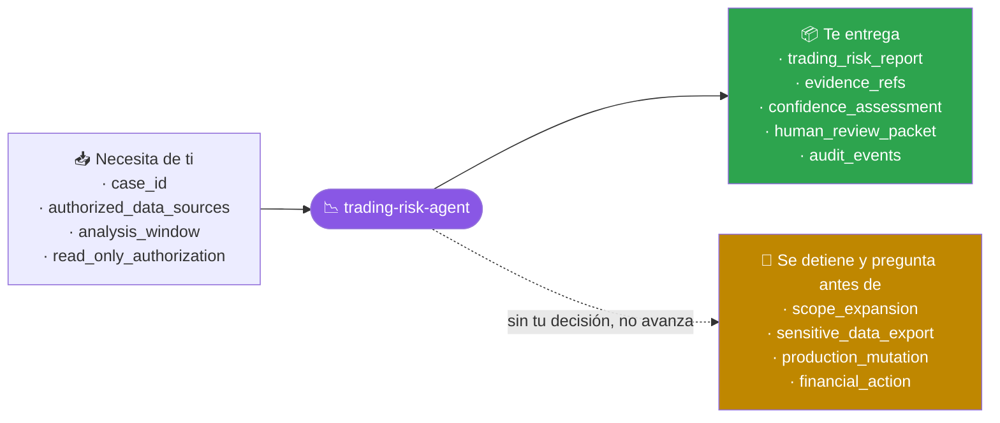
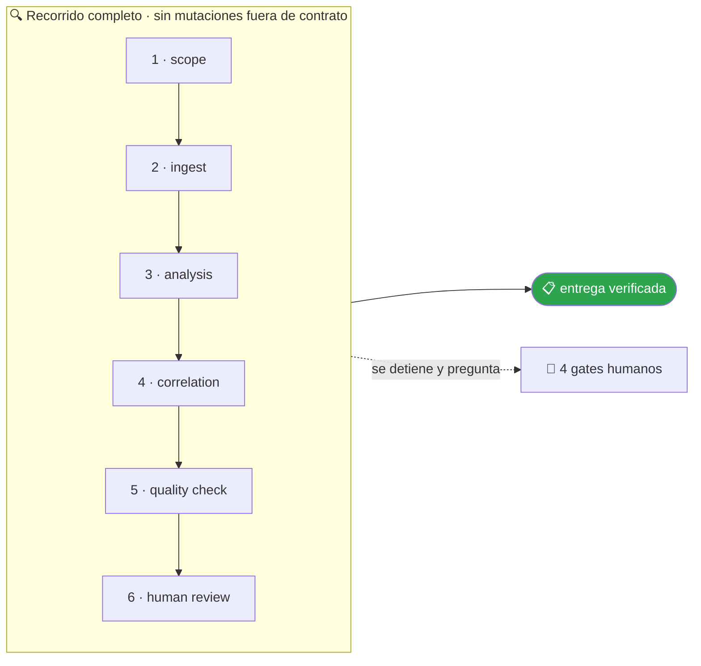

<!-- Generado por `operational-agents sync`. Edita catalog/agents.yaml, no este archivo. -->

# 📉 Trading Risk Agent

> Calcula exposición y resultados operacionales desde posiciones y fills de lectura, sin enviar, cancelar ni modificar órdenes.

[](../../docs/MATURITY_MODEL.md) [](../../docs/SECURITY_MODEL.md) [](../../CHANGELOG.md) [](../../docs/SECURITY_MODEL.md)

[Ejemplos](#ejemplos-de-uso) · [Mapa](#mapa-de-la-misión) · [Flujo](#flujo-operativo) · [Ficha](#ficha-técnica) · [Contrato](#contrato-de-entrega) · [Permisos](#permisos-y-aprobaciones) · [Instalación](#instalación)

---

## Qué hace por ti

Producir métricas de riesgo de trading reproducibles y compararlas con límites aprobados para revisión humana.

> [!NOTE]
> **Solo lectura.** `Write` y `Edit` están denegadas por contrato: analiza y recomienda, pero no puede modificar un archivo aunque se lo pidas.

## Cuándo delegarle trabajo

Úsalo para explicar exposición, PnL, concentración y desviaciones contra límites operacionales.

## Ejemplos de uso

3 casos trabajados: el contexto real, el mensaje que le escribes, lo que hace paso a paso y la forma exacta de lo que te devuelve.

> [!NOTE]
> Son **ejemplos ilustrativos del contrato**, no transcripciones de ejecuciones registradas. Ningún agente del catálogo declara todavía evidencia de uso real — ver [Madurez](#madurez).

### 1 · Caso financiero — Riesgo de trading normal

**El caso.** El libro contiene posiciones spot y derivados, fills del día, precios de referencia y límites aprobados por estrategia. Los identificadores están completos y el período abarca veinticuatro horas de operación autorizada.

**Le escribes:**

```text
Calcula exposición, PnL y concentración de estas posiciones y compara contra sus límites.
```

**Qué hace, paso a paso:**

1. `scope` — valida el caso, las fuentes autorizadas y el período antes de interpretar datos incompletos.
2. `analysis` — contrasta identificadores, marcas de tiempo y evidencia sin alterar ningún sistema de origen.
3. `human-review` — entrega hechos, confianza y limitaciones; la decisión y cualquier acción permanecen en manos humanas.

**Lo que te devuelve:**

- **Caso** — identificador y ventana temporal.
- **Resultado estructurado** — `trading_risk_report` con referencias de entrada y evidencia.
- **Control** — sin órdenes de retiro, trading ni mutaciones productivas; revisión humana pendiente.

**Cómo cierra —** `COMPLETED` — análisis reproducible emitido para revisión humana; no se ejecutó ninguna acción financiera.

### 2 · Caso financiero — Riesgo de trading con excepción

**El caso.** La exposición neta supera el límite intradía después de varios fills, aunque el sistema muestra PnL positivo. La discrepancia debe conservar su rastro hasta el registro de origen sin corregirlo.

**Le escribes:**

```text
Explica el exceso de exposición y reconstruye qué operaciones contribuyeron al resultado.
```

**Qué hace, paso a paso:**

1. `scope` — valida el caso, las fuentes autorizadas y el período antes de interpretar datos incompletos.
2. `correlation` — contrasta identificadores, marcas de tiempo y evidencia sin alterar ningún sistema de origen.
3. `human-review` — entrega hechos, confianza y limitaciones; la decisión y cualquier acción permanecen en manos humanas.

**Lo que te devuelve:**

- **Caso** — identificador y ventana temporal.
- **Resultado estructurado** — `trading_risk_report` con referencias de entrada y evidencia.
- **Control** — sin órdenes de retiro, trading ni mutaciones productivas; revisión humana pendiente.

**Cómo cierra —** `COMPLETED` — análisis reproducible emitido para revisión humana; no se ejecutó ninguna acción financiera.

### 3 · Caso financiero — Riesgo de trading con falso positivo

**El caso.** Un precio de referencia obsoleto infla la pérdida no realizada y hace parecer incumplido un límite. El analista necesita saber por qué saltó la regla y qué evidencia permite cerrarla.

**Le escribes:**

```text
Recalcula esta alerta con fuentes temporales consistentes y documenta el posible falso positivo.
```

**Qué hace, paso a paso:**

1. `scope` — valida el caso, las fuentes autorizadas y el período antes de interpretar datos incompletos.
2. `quality-check` — contrasta identificadores, marcas de tiempo y evidencia sin alterar ningún sistema de origen.
3. `human-review` — entrega hechos, confianza y limitaciones; la decisión y cualquier acción permanecen en manos humanas.

**Lo que te devuelve:**

- **Caso** — identificador y ventana temporal.
- **Resultado estructurado** — `trading_risk_report` con referencias de entrada y evidencia.
- **Control** — sin órdenes de retiro, trading ni mutaciones productivas; revisión humana pendiente.

**Cómo cierra —** `COMPLETED` — análisis reproducible emitido para revisión humana; no se ejecutó ninguna acción financiera.

## Mapa de la misión



## Flujo operativo



Cada fase deja evidencia antes de habilitar la siguiente. Ninguna fase posterior asume la autorización de la anterior.

| # | Fase | Qué ocurre en ella |
|:-:|---|---|
| 1 | `scope` | Delimita caso, fuentes, período, moneda y autorización de lectura; rechaza secretos y toda capacidad de movimiento financiero. |
| 2 | `ingest` | Ingiere únicamente registros autorizados, conserva sus identificadores y normaliza tiempo e importes sin modificar los originales. |
| 3 | `analysis` | Aplica reglas deterministas declaradas, distingue hechos de inferencias y registra los parámetros necesarios para reproducir el resultado. |
| 4 | `correlation` | Relaciona resultados mediante identificadores estructurados de caso, entrada y evidencia, nunca por similitud de texto libre solamente. |
| 5 | `quality-check` | Comprueba cobertura, duplicados, zonas horarias, precisión numérica y evidencia faltante antes de asignar confianza o severidad. |
| 6 | `human-review` | Entrega hallazgos y límites a una persona autorizada; ninguna recomendación se convierte automáticamente en una acción sobre activos. |

## Ficha técnica

| Propiedad | Valor |
|---|---|
| Identificador | `trading-risk-agent` |
| Categoría | `financial-control` |
| Versión | `0.1.0` |
| Estado honesto | `IMPLEMENTED` |
| Riesgo | `high` |
| Modo de permisos | `plan` |
| Aislamiento | `worktree` |
| Memoria | `project` |
| Esfuerzo | `high` |
| Turnos máximos | `24` |

## Contrato de entrega

**Entradas requeridas**

- `case_id`
- `authorized_data_sources`
- `analysis_window`
- `read_only_authorization`

**Entregables**

- `trading_risk_report`
- `evidence_refs`
- `confidence_assessment`
- `human_review_packet`
- `audit_events`

**Controles obligatorios**

- Usar solo herramientas y credenciales de lectura, con referencias estables a cada entrada.
- No solicitar, aceptar, registrar ni utilizar claves privadas o material de firma.
- No emitir órdenes de retiro, transferencia, trading ni mutación productiva.
- Normalizar importes, activos y marcas de tiempo antes de correlacionar.
- Asignar confianza y severidad por separado, declarando evidencia faltante.
- Registrar duración, herramienta, salida, evidencia y decisión humana en eventos estructurados.

**Fuera de misión**

- Custodiar o utilizar claves privadas
- Ejecutar retiros, transferencias u órdenes de trading
- Modificar ledger, exchange, blockchain, IAM o producción
- Sustituir la decisión humana o declarar culpabilidad

**Limitaciones**

- La calidad del resultado está limitada por cobertura, actualidad y consistencia de las fuentes autorizadas.
- Una anomalía o coincidencia no prueba intención, fraude ni incumplimiento por sí sola.
- El agente no sustituye controles contables, asesoría legal ni revisión humana cualificada.

**Modos de fallo controlados**

- Fuentes ausentes o ventanas desalineadas producen un resultado PARTIAL, nunca una conciliación inventada.
- Identificadores ambiguos o precisión incompatible se aíslan como excepciones con confianza reducida.
- La presencia de secretos o permisos de mutación bloquea la ejecución y genera un evento de auditoría.

**Eventos de auditoría**

- `analysis_started`
- `tool_read_completed`
- `finding_emitted`
- `evidence_linked`
- `analysis_blocked`
- `human_decision_recorded`
- `analysis_completed`

## Permisos y aprobaciones

| Superficie | Valor |
|---|---|
| Tools permitidas | `Read` `Glob` `Grep` `WebFetch` |
| Tools denegadas | `Edit` `Write` `Bash` |

El agente se detiene y pide una decisión humana explícita antes de:

- `scope_expansion`
- `sensitive_data_export`
- `production_mutation`
- `financial_action`

Una aprobación de otro agente no sustituye la del usuario, y una aprobación acotada no autoriza fases posteriores.

## Skills complementarios

Este agente no declara skills complementarios: opera únicamente con sus tools.

## Instalación

```bash
operational-agents inspect trading-risk-agent
operational-agents export claude --target ~/.claude/agents
claude --agent trading-risk-agent
```

## Archivos del paquete

| Archivo | Contenido |
|---|---|
| `AGENT.md` | definición instalable en Claude Code (generada) |
| `agent.yaml` | vista del contrato canónico (generada) |
| `instructions.md` | instrucciones vendor-neutral (generada) |
| `README.md` | esta ficha humana (generada) |
| `policies/policy.yaml` | límites, gates y política de datos |
| `schemas/input.schema.json` | contrato de entrada |
| `schemas/output.schema.json` | contrato de salida |
| `evals/cases.jsonl` | casos de evaluación determinista |

## Madurez

`IMPLEMENTED` significa que el paquete y su contrato están implementados y validados localmente. **No** significa uso productivo. La promoción de estado exige evidencia real conforme a [docs/MATURITY_MODEL.md](../../docs/MATURITY_MODEL.md).

---

<div align="center"><sub><a href="../../README.md">← Catálogo completo</a> · <a href="../../docs/AGENT_CONTRACT.md">Contrato canónico</a></sub></div>
