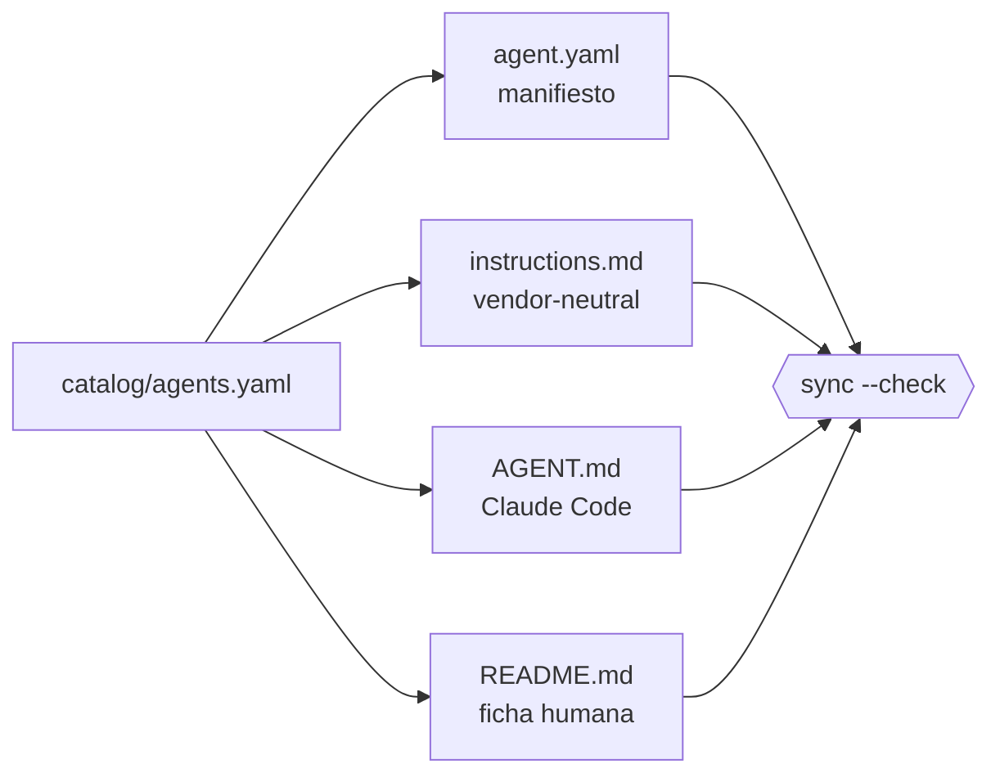

# Contrato de agente

> Qué declara un agente de este catálogo, qué significa cada campo y qué invariantes debe cumplir para poder instalarse.

[← Documentación](README.md) · [Repositorio](../README.md)

---

## Qué es un agente aquí

Un agente **no** es un prompt largo ni un archivo de instrucciones. Es un **contrato declarado** en `catalog/agents.yaml` del que se derivan todas las demás vistas. El contrato responde cinco preguntas antes de que el agente haga nada:

1. ¿De qué resultado responde? → `mission`
2. ¿Cuándo se le delega a él y no a otro? → `delegate_when`
3. ¿Qué puede tocar? → `tools`, `disallowed_tools`, `permission_mode`, `isolation`
4. ¿Dónde se detiene a preguntar? → `approval_points`
5. ¿Qué debe entregar para considerarse terminado? → `deliverables`, `checks`

## Anatomía

### Identidad

| Campo | Responsabilidad |
|---|---|
| `id` | identificador estable en kebab-case; es también el nombre instalable |
| `name` | nombre legible |
| `icon` | emoji de la ficha |
| `version` | versión del contrato del agente, independiente de la del repositorio |
| `category` | dominio de trabajo |
| `color` | color en el runtime |

### Delegación

| Campo | Responsabilidad |
|---|---|
| `description` | qué resuelve, en una frase |
| `delegate_when` | criterio para seleccionar este agente; es lo que lee el runtime al decidir |
| `mission` | el resultado integral del que responde |
| `scenarios` | dos o más casos trabajados. Cada uno lleva `title`, `context` (el caso concreto, con nombres y cifras), `ask` (el mensaje literal), `walkthrough` (tres pasos o más, anclados a fases reales), `returns` (la forma exacta de la salida, en Markdown) y `status` (cómo cierra). El validador rechaza un contexto de menos de 90 caracteres: un ejemplo genérico no enseña cuándo delegarle |

### Frontera operativa

| Campo | Responsabilidad |
|---|---|
| `tools` | allowlist mínima de capacidades técnicas |
| `disallowed_tools` | denegaciones explícitas; obligatorias en agentes de solo lectura |
| `permission_mode` | `default` exige confirmación del runtime; `plan` impide mutar |
| `isolation` | `worktree` aísla los cambios de la copia de trabajo del usuario |
| `memory` | alcance de la memoria entre sesiones |
| `effort`, `max_turns` | presupuesto de razonamiento y de pasos |
| `skill_dependencies` | capacidades **opcionales**; el agente funciona sin ellas |

### Ciclo de trabajo

| Campo | Responsabilidad |
|---|---|
| `phases` | secuencia observable de decisión, mínimo cuatro |
| `phase_details` | **qué ocurre exactamente en cada fase**; una entrada por fase, sin excepción |
| `required_inputs` | qué necesita para empezar |
| `deliverables` | qué entrega al terminar |
| `approval_points` | decisiones reservadas al usuario |
| `checks` | controles de calidad obligatorios |
| `non_goals` | lo que explícitamente no hará |
| `status` | madurez respaldada por evidencia, nunca por validez de Markdown |

> [!IMPORTANT]
> `phase_details` no es documentación decorativa. Una fase sin descripción produce instrucciones que no dicen nada —«completa esta etapa y avanza»— y un agente que no sabe qué se espera de él. El validador rechaza cualquier fase sin explicar y cualquier explicación sin fase.

## Invariantes

Se cumplen siempre, en todos los agentes, y varias están cubiertas por pruebas automatizadas:

1. **Nunca convertir acceso en autorización.** Poder leer no es poder publicar.
2. **Nunca declarar evidencia inexistente.** Sin comando o fuente, es hipótesis.
3. **Nunca autopublicar ni autopromover madurez.** Ningún agente cambia su propio `status`.
4. **Distinguir observado, inferido y recomendado** en toda conclusión.
5. **Mantener una salida útil incluso en estado `BLOCKED`.** Bloquearse no exime de informar.
6. **No modificar antes de comprender** alcance, fuentes de verdad y camino de reversión.
7. **Un agente mutante nunca omite permisos.** Si declara `Write` o `Edit`, su `permission_mode` es `default` y su `isolation` es `worktree`.
8. **Un agente de solo lectura deniega la escritura explícitamente**, no solo por omisión.

## Vistas derivadas

Del contrato se generan cuatro archivos por agente. Ninguno se edita a mano:

Los schemas comunes viven en `shared/contracts`; cada agente mantiene una copia versionada para que su paquete sea portable por sí solo.

## Añadir un agente

El flujo completo, con criterios de aceptación, está en [CONTRIBUTING.md](../CONTRIBUTING.md).

---

<a href="README.md">Documentación</a> · <a href="ARCHITECTURE.md">Arquitectura</a> · <a href="SECURITY_MODEL.md">Modelo de seguridad</a>

