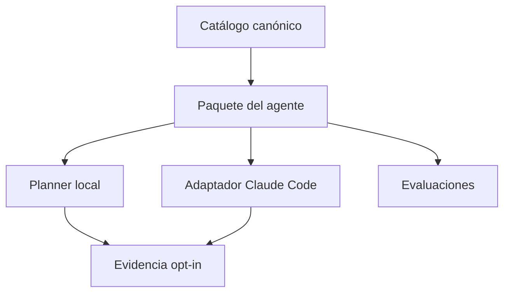
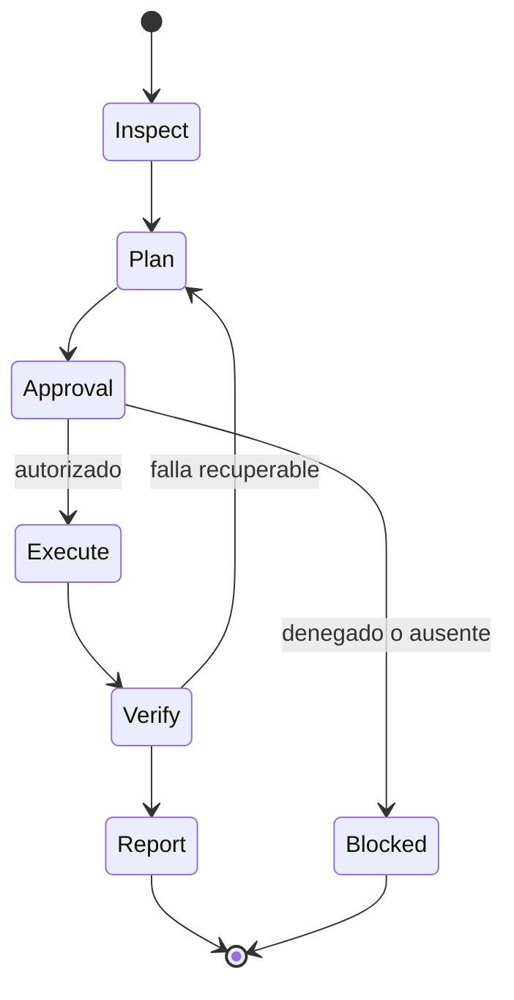

# Arquitectura

## Decisión

El repositorio es una **colección operativa con núcleo contractual**, no un framework de agentes general ni un curso. La unidad de distribución es el agente autocontenido; el catálogo central evita drift y los adaptadores proyectan ese contrato a runtimes concretos.

## Límites

- `catalog/agents.yaml`: identidad, permisos, fases, dependencias y madurez.
- `agents/<id>/instructions.md`: sistema de trabajo vendor-neutral (generado).
- `agents/<id>/AGENT.md`: proyección ejecutable para Claude Code (generado).
- `agents/<id>/README.md`: ficha humana del contrato (generada).
- `src/operational_agents`: tooling de catálogo, no un loop LLM propio.
- `shared`: contratos y formatos comunes.
- `evidence`: solo artefactos sanitizados y consentidos.

## Fuente de verdad

El catálogo es JSON compatible con YAML 1.2 para poder analizarlo con Python stdlib. `operational-agents sync` genera vistas por agente; `sync --check` falla ante drift.

## Flujo de mutación

## Decisiones ADR

- Núcleo stdlib para instalación simple y superficie de supply chain pequeña.
- Sin API obligatoria: los contratos y evals deben funcionar offline.
- Primer adaptador Claude Code porque soporta subagentes con contexto separado, tools, permisos, memoria, skills e aislamiento.
- Skills opcionales: el agente no deja de existir si el toolkit no está instalado.
