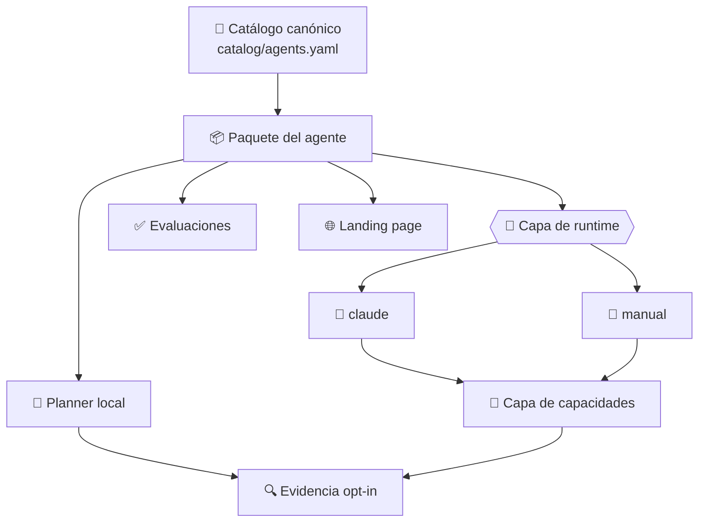
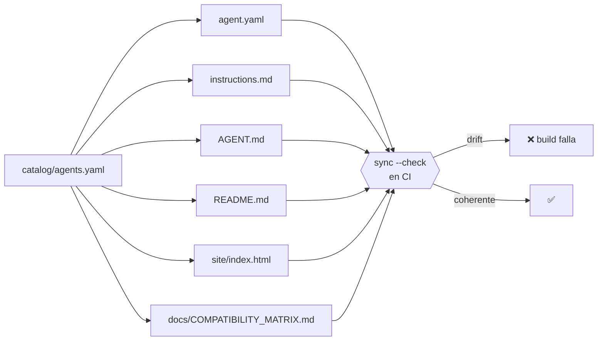
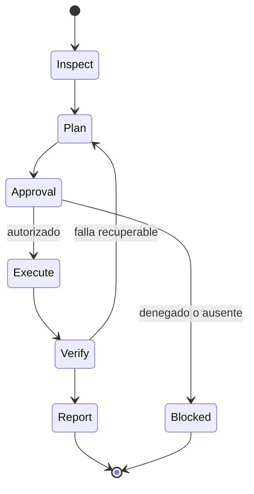

# Arquitectura

> Qué es este repositorio, dónde están sus límites y por qué una sola fuente de verdad alimenta todo lo demás.

[← Documentación](README.md) · [Repositorio](../README.md)

---

## La decisión de fondo

Este repositorio es una **colección operativa con núcleo contractual**. No es un framework de agentes de propósito general ni un curso.

- La **unidad de distribución** es el paquete de agente, autocontenido.
- El **catálogo central** evita que las copias diverjan.
- Los **adaptadores** proyectan ese contrato a runtimes concretos.

Entre el paquete y el runtime hay dos capas nuevas desde v0.3.0, y ninguna cambia el contrato: la **capa de runtime** decide *quién* ejecuta, la **capa de capacidades** decide *qué está autorizado a hacer*. Detalle en [RUNTIME_CONTRACT.md](RUNTIME_CONTRACT.md) y [CAPABILITY_MODEL.md](CAPABILITY_MODEL.md).

## Límites de cada pieza

| Ruta | Responsabilidad | Frontera |
|---|---|---|
| `catalog/agents.yaml` | identidad, permisos, fases, dependencias y madurez | **única** fuente de verdad |
| `agents/<id>/instructions.md` | sistema de trabajo vendor-neutral (generado) | no depende de proveedor |
| `agents/<id>/AGENT.md` | proyección ejecutable para Claude Code (generado) | específico de runtime |
| `agents/<id>/README.md` | ficha humana del contrato (generada) | documentación, no ejecución |
| `agents/<id>/policies/` | límites, gates y política de datos | escrito a mano |
| `src/operational_agents/` | tooling de catálogo: validar, planificar, exportar, servir | **no** implementa un bucle de LLM |
| `src/operational_agents/runtimes/` | adaptadores: quién ejecuta el contrato | un adaptador no amplía permisos |
| `src/operational_agents/capabilities.py` | capacidades, efectos y resolución | vendor-neutral; no conoce runtimes |
| `docs/COMPATIBILITY_MATRIX.md` | qué agente opera bajo qué runtime (generado) | resolución, no ejecución observada |
| `shared/` | contratos y formatos comunes | reutilizable entre agentes |
| `control-center/` | API y panel local de solo lectura | loopback |
| `site/` | landing page (generada) | solo publicación |
| `evidence/` | artefactos sanitizados y consentidos | nunca secretos |

> [!IMPORTANT]
> `src/operational_agents` **no razona**. Valida contratos, genera vistas y construye planes deterministas. El razonamiento ocurre en el runtime, que es intercambiable. Esa separación es lo que mantiene el núcleo vendor-neutral.

## La fuente de verdad

El catálogo es JSON compatible con YAML 1.2, para poder analizarlo con la biblioteca estándar de Python y sin dependencias.

De él se generan **cuatro archivos por agente**, la landing page y la matriz de compatibilidad:

La matriz añade una segunda fuente a la ecuación: se calcula con el catálogo **y** con los adaptadores del repositorio. Deliberadamente no consulta el entorno, para que dé el mismo resultado en cualquier máquina y en CI.

Editar una vista generada en lugar del catálogo hace fallar la build. Es intencional: impide que la documentación y el contrato cuenten historias distintas.

## Flujo de mutación

Ningún agente pasa de inspeccionar a modificar sin una decisión humana explícita:

`Blocked` es un final legítimo: el agente entrega igualmente lo inspeccionado, lo que propone y qué autorización falta.

## Decisiones de diseño

| Decisión | Motivo | Costo aceptado |
|---|---|---|
| Núcleo con solo la biblioteca estándar | instalación simple y superficie de supply chain mínima | sin comodidades de librerías externas |
| Sin API obligatoria | contratos y evaluaciones deben funcionar offline y sin costo | las capas de modelo quedan fuera de CI |
| Claude Code como primer adaptador | es el runtime que soporta contexto separado, permisos, gates y aislamiento | portabilidad demostrada en un solo runtime autónomo |
| Capacidades derivadas de las tools | añadir la capa no obliga a reescribir trece contratos | la declaración explícita queda como opción, no como norma |
| Resolución ciega al entorno | la matriz de compatibilidad da lo mismo en cualquier máquina | no refleja lo que hay instalado; para eso está `doctor` |
| Sin fallback automático entre runtimes | cambiar en silencio de local a nube enviaría datos fuera sin autorización | quien ejecuta debe elegir el runtime a mano |
| Skills opcionales | el agente no puede depender de un toolkit externo | menos capacidad si no está instalado |
| Catálogo como fuente única | elimina el drift entre documentación y contrato | añadir un agente exige tocar el catálogo, no un archivo suelto |
| Vistas generadas, no editables | la ficha nunca miente sobre el contrato | menos libertad de redacción por agente |

## Qué no está aquí

- Un bucle de agente propio o un motor de inferencia.
- Casos sectoriales de referencia: viven en `langgraph-realworld`.
- Skills reutilizables: viven en `claude-skills-toolkit`.
- Material formativo: vive en el programa de evolución de IA.

---

<a href="README.md">Documentación</a> · <a href="AGENT_CONTRACT.md">Contrato</a> · <a href="SECURITY_MODEL.md">Seguridad</a>

