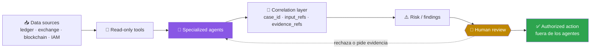
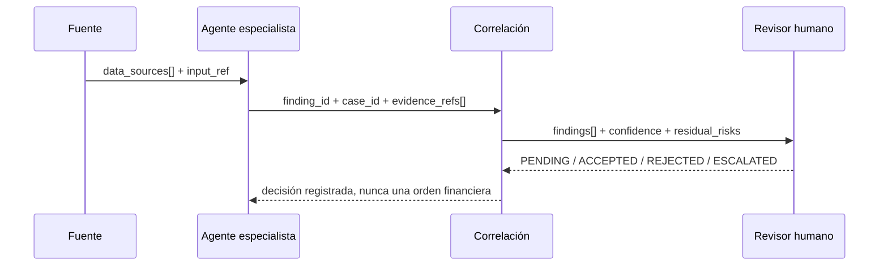

# Agentes de control financiero

> Diez especialistas para conciliación, riesgo, auditoría e investigación sin autoridad autónoma sobre activos.

[← Documentación](README.md) · [Contrato](AGENT_CONTRACT.md) · [Seguridad](SECURITY_MODEL.md)

---

## Frontera de autoridad

Estos agentes observan, correlacionan y explican. No custodian claves privadas, no firman transacciones, no envían ni cancelan órdenes, no retiran fondos y no mutan ledger, exchange, IAM, blockchain o producción. Una recomendación siempre termina en revisión humana.

La última flecha representa un proceso humano o un sistema autorizado externo. No es una capacidad del catálogo financiero.

## Catálogo especializado

| Agente | Responsabilidad | Salida principal |
|---|---|---|
| [Reconciliation Agent](../agents/reconciliation-agent/README.md) | concilia ledger, exchange y blockchain | `reconciliation_report` |
| [IAM Audit Agent](../agents/iam-audit-agent/README.md) | permisos excesivos, cuentas stale, escalada y SoD | `iam_findings` |
| [Wallet Risk Agent](../agents/wallet-risk-agent/README.md) | direcciones nuevas, retiros grandes, velocidad y conducta | `wallet_risk_findings` |
| [Blockchain Monitoring Agent](../agents/blockchain-monitoring-agent/README.md) | estado y confirmaciones on-chain | `onchain_verification` |
| [Trading Risk Agent](../agents/trading-risk-agent/README.md) | exposición, PnL, concentración y límites | `trading_risk_report` |
| [Evidence Agent](../agents/evidence-agent/README.md) | integridad, procedencia y cadena de custodia | `evidence_manifest` |
| [Timeline Agent](../agents/timeline-agent/README.md) | tiempo observado, normalizado y estimado | `normalized_timeline` |
| [Financial Root Cause Agent](../agents/financial-root-cause-agent/README.md) | hipótesis causales y factores contribuyentes | `root_cause_report` |
| [Compliance Evidence Agent](../agents/compliance-evidence-agent/README.md) | cobertura control-evidencia | `control_evidence_matrix` |
| [Executive Reporting Agent](../agents/executive-reporting-agent/README.md) | síntesis trazable para decisión | `executive_risk_brief` |

## Interoperabilidad estructurada

El texto explica; los identificadores correlacionan. Cada mensaje financiero lleva `schema_version`, `message_id`, `case_id`, `agent_id`, referencias de entrada y referencias de evidencia. Los hallazgos reutilizan [finding.schema.json](../shared/contracts/finding.schema.json) y la evidencia reutiliza [evidence-reference.schema.json](../shared/contracts/evidence-reference.schema.json).

La severidad expresa impacto potencial; `confidence` expresa fuerza de la evidencia. Son dimensiones distintas y no deben fusionarse. Una fuente ausente produce `PARTIAL` o `BLOCKED`, no un dato inferido silenciosamente.

## Observabilidad y reproducibilidad

Cada evento cumple [event.schema.json](../shared/observability/event.schema.json) y registra:

- `agent_id`, `tool` y `input_refs`;
- `output`, `duration_ms` y `confidence`;
- `evidence_refs` y `human_decision`;
- `execution_id`, evento, estado y marca temporal.

Para reproducir un resultado se conservan versión del schema, período, fuentes, referencias estables y reglas aplicadas. Los originales permanecen fuera del control del agente; Evidence Agent solo registra referencias y hashes.

## Escenarios de evaluación

Cada especialista incluye tres evaluaciones deterministas. En conjunto cubren operación normal, errores contables o de datos, transacciones faltantes, operaciones no autorizadas, duplicados y falsos positivos. Estas pruebas demuestran que fases, entregables y gates siguen presentes; no demuestran todavía uso productivo.

## Definition of Done

Un especialista financiero está completo cuando su paquete se valida, se puede preparar con `operational-agents run`, sus resultados son estructurados y reproducibles, emite auditoría completa y sus políticas deniegan escritura, shell, claves privadas, mutación productiva y acciones financieras. Toda decisión queda pendiente de revisión humana.

---

<a href="README.md">Documentación</a> · <a href="ARCHITECTURE.md">Arquitectura</a> · <a href="EVALUATION.md">Evaluación</a>

