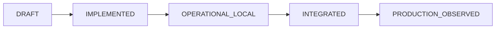

# Modelo de madurez

> Cinco estados y la evidencia concreta que exige cada promoción. Existe para impedir que «el paquete valida» se confunda con «el agente funciona en producción».

[← Documentación](README.md) · [Repositorio](../README.md)

---

## El problema que resuelve

Un agente puede tener Markdown impecable, schemas válidos y CI en verde sin haber resuelto jamás una tarea real. Presentarlo como productivo sería una afirmación sin evidencia — exactamente lo que estos agentes existen para evitar.

Por eso el estado no lo decide la validez del formato, sino lo que se puede demostrar.

## Los cinco estados

| Estado | Significa | Evidencia exigida |
|---|---|---|
| `DRAFT` | definición incompleta | ninguna; **no debe instalarse** |
| `IMPLEMENTED` | el paquete y su contrato están completos y validados | contrato, instrucciones, schemas y evaluaciones deterministas que pasan |
| `OPERATIONAL_LOCAL` | el propietario lo usó en una tarea real | caso sanitizado con objetivo, alcance, autorización, resultado, verificaciones e intervención humana |
| `INTEGRATED` | opera contra herramientas o servicios reales | prueba de extremo a extremo documentada, con sus límites y su comportamiento ante fallo |
| `PRODUCTION_OBSERVED` | uso recurrente y observado | métricas de éxito, duración, costo, intervención humana y retrabajo, más revisión humana periódica |

## Estado actual del catálogo

Todos los agentes declaran **`IMPLEMENTED`**. Esto significa exactamente esto y nada más:

- ✅ el contrato está completo y es coherente con sus vistas generadas;
- ✅ las evaluaciones deterministas pasan;
- ✅ los límites de permisos y los gates humanos están declarados y probados;
- ❌ **no** ha resuelto todavía una misión real registrada con evidencia;
- ❌ **no** hay métricas de adopción, costo ni retrabajo.

## Reglas de promoción

1. **La promoción la decide una persona**, nunca el propio agente ni otro agente.
2. **Sin evidencia sanitizada y revisada, no hay promoción.** Pasar las pruebas mantiene el estado; no lo sube.
3. **Un cambio material del contrato puede degradar el estado.** Si cambian misión, tools o gates, la evidencia anterior deja de aplicar.
4. **La evidencia se registra según [EVIDENCE_GUIDE.md](EVIDENCE_GUIDE.md)**: nunca secretos, datos personales ni rutas locales.
5. **El estado se declara por agente**, no por repositorio. Que uno alcance `INTEGRATED` no arrastra a los demás.

## Qué hace falta para el siguiente escalón

Para que un agente pase a `OPERATIONAL_LOCAL`, el caso debe responder:

- ¿Qué misión concreta se le encargó y con qué autorización?
- ¿Qué hizo y qué decidió por su cuenta?
- ¿Qué se verificó, con qué comando y con qué resultado?
- ¿Dónde intervino un humano y por qué?
- ¿Qué quedó sin resolver o sin comprobar?

La plantilla está en `evidence/templates/case-study.md`.

---

<a href="README.md">Documentación</a> · <a href="EVIDENCE_GUIDE.md">Guía de evidencia</a> · <a href="EVALUATION.md">Evaluación</a>

