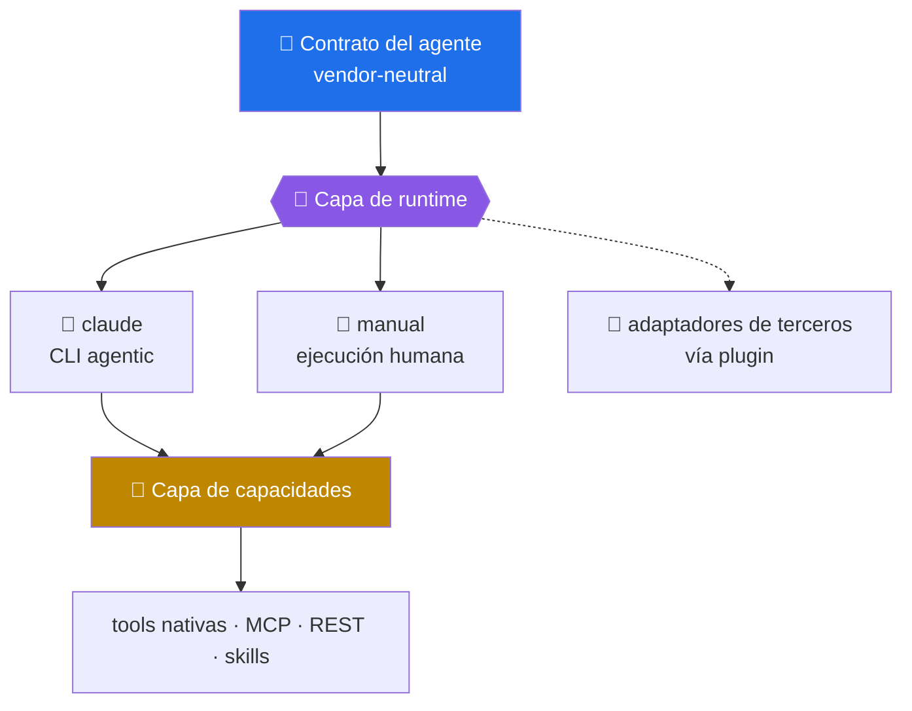

# Contrato de runtime

> Un agente declara una misión; un runtime la ejecuta. Este documento define qué debe cumplir cualquier cosa que quiera ser lo segundo.

[← Documentación](README.md) · [Modelo de capacidades](CAPABILITY_MODEL.md) · [Matriz de compatibilidad](COMPATIBILITY_MATRIX.md)

---

## La separación que sostiene todo

```text
AGENTE ≠ PROVEEDOR ≠ MODELO ≠ API ≠ MCP ≠ RUNTIME ≠ SKILL
```

El contrato del agente —misión, fases, gates, entregables, controles— no menciona a quién lo ejecuta. La infraestructura vive en adaptadores, y cambiar de adaptador no cambia el contrato.



## La interfaz

`src/operational_agents/runtimes/base.py` define `AgentRuntime`. Un adaptador implementa tres métodos y hereda el resto:

| Miembro | Obligatorio | Qué debe hacer |
|---|:-:|---|
| `descriptor` | ✅ | identidad: `id`, tipo, si ejecuta de forma autónoma y madurez del **adaptador** |
| `capabilities()` | ✅ | qué capacidades ofrece y con qué nivel, **sin mirar el entorno** |
| `detect()` | ✅ | si está disponible en esta máquina, ahora |
| `execute()` | ✅ | llevar a cabo una ejecución ya preparada y resuelta |
| `command()` | ⬜ | la invocación concreta, si el runtime la tiene |
| `prepare()` | heredado | plan determinista + paquete portable + resolución de capacidades |
| `run()` | heredado | detectar → validar directorio → preparar → resolver → ejecutar |

> [!IMPORTANT]
> `run()` es un método plantilla cerrado a propósito. Un adaptador **no** decide el orden, así que no puede saltarse la resolución de capacidades ni ejecutar antes de comprobar que lo requerido existe. La seguridad no depende de que cada autor de adaptador se acuerde.

### Declarar no es detectar

Son dos preguntas distintas y se responden por separado:

- `capabilities()` — **qué sé hacer.** Idéntico en cualquier máquina. Es lo que alimenta la [matriz de compatibilidad](COMPATIBILITY_MATRIX.md), y por eso la matriz no cambia según lo que tengas instalado.
- `detect()` — **estoy aquí.** Depende de la máquina. Es lo que informa `doctor` y `runtimes`.

Mezclarlas produciría un documento generado que dice cosas distintas en cada equipo y una CI que falla por lo que el runner tenga instalado.

## Runtimes implementados

| ID | Tipo | Ejecución | Madurez del adaptador | Para qué |
|---|---|---|---|---|
| `claude` | `cli` | autónoma | `IMPLEMENTED` | ejecutar el agente con Claude Code ya instalado |
| `manual` | `human` | asistida | `IMPLEMENTED` | preparar el trabajo para que lo ejecute una persona |

Ninguno declara madurez superior: eso exigiría casos en `evidence/`, y todavía no hay ninguno. Ver [MATURITY_MODEL.md](MATURITY_MODEL.md).

### `claude`

Traduce el contrato a la invocación del CLI:

```bash
claude --agent <agent_id> --print "<tarea>"
```

Sin `shell=True` y sin ninguna bandera que omita permisos. Los gates que el propio runtime pide siguen intactos, y la allowlist del agente sigue filtrando qué tools existen.

### `manual` — ejecución humana asistida

El agente analiza, propone y entrega instrucciones; **la persona ejecuta**. Es la modalidad correcta cuando el entorno es producción, infraestructura crítica, datos regulados, migraciones o rotación de credenciales: ahí la pregunta no es si la herramienta puede actuar sola, sino si debe.

```bash
operational-agents run incident-root-cause-agent \
  --runtime manual \
  --task "Investiga la caída del checkout de anoche"
```

Devuelve el paquete portable —instrucciones completas más el sobre de tarea— y cierra con `NOT_EXECUTED`. No es un fallo: es la descripción honesta de lo que pasó. Todas sus capacidades se declaran `conditional`, porque existen gracias a la persona, no al runtime.

Este adaptador es además la prueba de que la abstracción sirve: no necesita proveedor, clave API, red ni tokens, y recorre el mismo contrato, la misma resolución y la misma evidencia que `claude`.

## Añadir un runtime

1. Implementa `AgentRuntime` en `src/operational_agents/runtimes/<id>.py`.
2. Declara solo las capacidades que el runtime tenga de verdad. Declarar de más no amplía lo que el agente puede hacer: produce ejecuciones que fallan tarde en lugar de negarse temprano.
3. Regístralo en `default_registry()`.
4. Ejecuta `operational-agents sync` — la matriz de compatibilidad se regenera sola.
5. Añade pruebas. **No declares compatibilidad hasta demostrarla:** la matriz dice que el contrato encaja, no que la ejecución cumpla la misión.

Añadir un adaptador **no** obliga a tocar la CLI: los runtimes disponibles salen del registro.

### Desde un paquete de terceros

Un plugin puede aportar el suyo con un entry point:

```toml
[project.entry-points."operational_agents.runtimes"]
mi-runtime = "mi_paquete.runtime:MiRuntime"
```

Si el plugin falla al cargar, se anota y se ignora: la CLI debe seguir listando, validando y planificando aunque el ecosistema de plugins esté roto. Los errores se ven en `operational-agents doctor`.

## Fallback

No hay fallback automático entre runtimes, y es una decisión, no una carencia:

> Cambiar en silencio de un runtime local a uno en la nube enviaría datos fuera sin que nadie lo autorice.

Un runtime desconocido produce un error que nombra los disponibles. La elección de runtime es siempre explícita.

## Degradación controlada

| Situación | Qué hace la CLI |
|---|---|
| falta una capacidad **requerida** | `BLOCKED`, código `1`, y nombra cuál falta. No ejecuta |
| la capacidad existe pero es condicional | ejecuta en `DEGRADED` y lo registra en la evidencia |
| falta una capacidad **opcional** (skills) | ejecuta normal; el agente sigue siendo válido |
| el runtime no está instalado | error de uso, código `2`, sin preparar nada |

Nunca se inventa una capacidad, se simula su resultado ni se declara éxito sobre lo que no ocurrió.

## Evidencia portable

Toda ejecución puede registrar un sobre con la misma forma, venga del runtime que venga:

```bash
operational-agents run <id> --runtime manual --task "…" --evidence evidence/executions/caso.json
```

Contiene agente, runtime, ejecución, capacidades resueltas, aprobaciones, resultado, verificación y riesgo residual. Lo que **no** contiene: credenciales, rutas absolutas del ejecutable ni el prompt completo. Detalle en [EVIDENCE_GUIDE.md](EVIDENCE_GUIDE.md).

---

<div align="center"><sub><a href="README.md">Documentación</a> · <a href="CAPABILITY_MODEL.md">Capacidades</a> · <a href="COMPATIBILITY_MATRIX.md">Compatibilidad</a></sub></div>
